# Auditoría de bases de datos

Lo primero antes de empezar esta práctica es saber que es una auditoria, obviamente en el ambito de bases de datos, por lo que voy a proceder a hacer una definición:

## Definición de auditoría:

- `Auditoría de bases de datos`: Es un proceso sistemático de monitoreo y registro de las actividades realizadas dentro de una base de datos. Su objetivo principal es asegurar la seguridad, conformidad e integridad de los datos almacenados, proporcionando un control eficaz sobre el acceso y uso de la información.

## Proposito de los auditores y administradores:

- Un `administrador` puede llevar a cabo auditorías registrando acciones específicas, como las consultas SQL ejecutadas, las aplicaciones utilizadas o la hora en la que se realiza cada acción.

- Los `auditores` deben asegurarse de registrar tanto las acciones exitosas como las fallidas, y tienen la opción de incluir o excluir a usuarios específicos en el proceso de auditoría.

Una vez dicho esto, voy a proceder a realizar la práctica de auditoría de bases de datos.

---

# Actividades.

# Oracle

### **1. Activa desde SQL*Plus la auditoría de los intentos de acceso no exitosos al sistema. Comprueba su funcionamiento.**

Para este ejercicio lo que voy a hacer es entrar en sqlplus, como hemos hecho hasta ahora, por lo que en mi caso dejo este [script](https://github.com/alejandrolf20/ABD_Usuarios/blob/main/Alumno4/oracle-pasos.md) para poder entrar.

Luego de haber entrado como **sysdba**, para una mejor visión de los resultados, tendremos que hacer lo siguiente:

```sql
COLUMN name FORMAT A30;
COLUMN value FORMAT A20;
```

Llegados a este momento, lo que vamos a hacer es una comprobación por si las auditorías está activadas en lo que es nuestra base de datos, por lo que vamos a ejecutar la siguiente consulta SQL,en ORACLE depende de un parámetro de sistema, `AUDIT_TRAIL`.

```sql
SQL> show parameter audit

NAME				     TYPE	 VALUE
------------------------------------ ----------- ------------------------------
audit_file_dest 		     string	 /opt/oracle/admin/ORCLCDB/adum
						 p
audit_syslog_level		     string
audit_sys_operations		     boolean	 TRUE
audit_trail			     string	 DB
unified_audit_common_systemlog	     string
unified_audit_sga_queue_size	     integer	 1048576
unified_audit_systemlog 	     string
```

Como podemos observar `AUDIT_TRAIL`, nos sale con el valor `DB`, por lo que quiere decir que las auditorías estan activadas, esto puede tener tres valores distibto, aquí te los dejo, y lo que tendrias que hacer para poder activarlos:

```sql

`NONE`: No se realiza ninguna auditoría.

`DB`: Se realiza una auditoría en la base de datos.

`OS`: Se realiza una auditoría en el sistema operativo.
```

Para poder realizar dicha auditoría, la tendremos que activala, por lo que haremos uso del siguiente comando SQL:

```sql
ALTER SYSTEM SET audit_trail=db scope=spfile;
```
Luego de esto tendriamos que aplicar los cambios, por lo que tendríamos que reiniciar lo que es la instancia:

```sql
SQL> SHUTDOWN INMEDIATE;
SQL> STARTUP;
```
Y una vez hecho esto, volvemos a comprobar cn esta consulta SQL:

```sql
show parameter audit_trail
```
Y nos saldrá el valor, el cual seria `DB`:

```sql
SQL> show parameter audit_trail

NAME				     TYPE	 VALUE
------------------------------------ ----------- ------------------------------
audit_trail			     string	 DB

```
- **Nota**: Dejo por aquí un [script](./habilitar.md) en el cual tengo que hacerlo cuando deshabilito en mi Oracle.


Ahora que asumimos que la auditoría está activada, vamos a plantear un caso práctico basado en una situación real. En este caso, para registrar los intentos fallidos de acceso a la base de datos, será necesario tener habilitada la auditoría de inicio de sesión, específicamente la auditoría de intentos fallidos al sistema.

Por lo que vamos a hacer con los siguientes comandos:

```sql
AUDIT SESSION WHENEVER NOT SUCCESSFUL;


audit session by JABATO;
```

Por pantalla veremos lo siguiente:

```sql
SQL> AUDIT SESSION WHENEVER NOT SUCCESSFUL;

Auditoria terminada correctamente.

SQL> audit session by JABATO;

Auditoria terminada correctamente.
```
Ahora procederé a entrar en la base de datos, y fallaré un par de veces y entraré en alguna.

```sql
SQL> CONNECT JABATO/brasil@localhost:1521/ORCLPDB1;
ERROR:
ORA-01017: nombre de usuario/contrase?a no validos; conexion denegada


Advertencia: !Ya no esta conectado a ORACLE!
SQL> CONNECT JABATO/eurotruck@localhost:1521/ORCLPDB1;
ERROR:
ORA-01017: nombre de usuario/contrase?a no validos; conexion denegada


SQL> CONNECT JABATO/jabato@localhost:1521/ORCLPDB1;
ERROR:
ORA-28002: la contrase?a vencera en 7 dias


Conectado.
```

Y ahora lo que haremos será la comprobación del contenido de la tabla `dba_audit_session`, podremos observar el registro de intentos fallidos:

```sql
SQL> SELECT USERNAME, OS_USERNAME, TIMESTAMP, ACTION_NAME, RETURNCODE
FROM dba_audit_session
WHERE username = 'JABATO';
```

Y esto nos mostrará por pantalla lo siguiente:

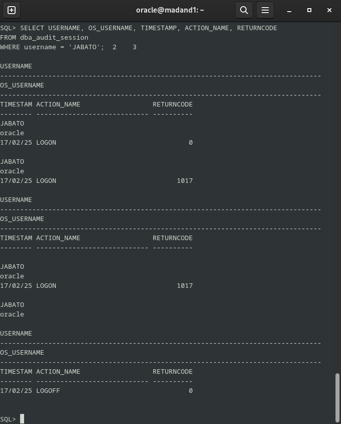

Donde:

- El primer registro indica un inicio de sesión exitoso (código de retorno 0), lo que significa que el usuario JABATO accedió correctamente a la base de datos.
- En los segundo y tercer registros, se observan intentos de inicio de sesión fallidos (código de retorno 1017), lo que sugiere que hubo errores al intentar acceder con el usuario JABATO, obviamente por una contraseña incorrecta.
- El cuarto registro refleja un cierre de sesión exitoso (código de retorno 0), lo que confirma que JABATO cerró la sesión de manera adecuada.

Esto es lo que nos ha pedido el ejercicio, para acabar podriamos deshabilitar lo que es la auditoria con el siguiente comando:

```sql
ALTER SYSTEM SET AUDIT_TRAIL=NONE SCOPE=SPFILE;
```

Dejo los coamndos de como dehabilitar el proceso:

```sql
SHUTDOWN IMMEDIATE;
STARTUP;
```

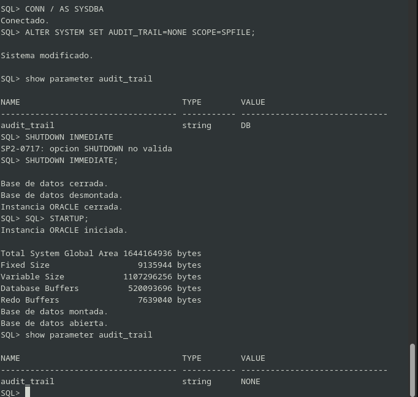


Obviamente hay más codigos de errores, por lo que voy a dejar por aquí una lista de algunos, que pueden ser útiles, por si hayq ue usarlos tenerlos a mano:

| **Código de Error** | **Mensaje**                                                                                           | **Descripción**                                                                                           |
|---------------------|------------------------------------------------------------------------------------------------------|-----------------------------------------------------------------------------------------------------------|
| 911                 | El dato ingresado contiene caracteres no válidos                                                      | Este error ocurre cuando los datos introducidos en un campo contienen caracteres no válidos para el sistema.|
| 1004                | Acceso denegado: no tienes permisos suficientes para realizar esta operación                          | El usuario no tiene los permisos necesarios para ejecutar la operación solicitada.                         |
| 1017                | Nombre de usuario o contraseña inválidos                                                              | Este error se produce cuando el usuario o la contraseña proporcionada no son correctos.                   |
| 1045                | Permiso denegado: no tienes el privilegio de crear una sesión                                        | El usuario intenta crear una sesión, pero no tiene el privilegio adecuado para hacerlo.                   |
| 28000               | La cuenta está bloqueada debido a intentos de inicio de sesión fallidos                               | La cuenta ha sido bloqueada temporalmente por varios intentos fallidos de inicio de sesión.               |
| 28001               | La contraseña ha caducado y debe ser cambiada                                                          | La contraseña del usuario ha expirado y necesita ser cambiada para continuar utilizando la cuenta.         |
| 28002               | La contraseña caducará pronto, por favor cámbiala                                                      | La contraseña está próxima a expirar, y se recomienda cambiarla antes de que caduque.                     |
| 28003               | La contraseña no cumple con los requisitos mínimos de complejidad                                      | La contraseña no cumple con las políticas de seguridad mínimas (como longitud, caracteres especiales, etc.).|
| 28007               | No puedes reutilizar una contraseña previamente utilizada                                             | El sistema no permite que el usuario vuelva a utilizar una contraseña que ya haya usado anteriormente.     |
| 28008               | Contraseña anterior no válida                                                                          | La contraseña proporcionada como "anterior" no es válida o no coincide con la registrada en el sistema.   |
| 28009               | La conexión a SYS debe realizarse a través de SYSDBA o SYSOPER                                        | El usuario intenta conectarse a la cuenta `SYS`, pero no lo hace con el privilegio adecuado (SYSDBA o SYSOPER).|
| 28011               | La contraseña caducará pronto, por favor cámbiala                                                      | Similar al error 28002, indica que la contraseña del usuario está cerca de expirar y debe ser cambiada.    |


---
### **2. Realiza un procedimiento en PL/SQL que te muestre los accesos fallidos junto con el motivo de los mismos, transformando el código de error almacenado en un mensaje de texto comprensible. Contempla todos los motivos posibles para que un acceso sea fallido.**

Para este ejercicio lo que voy a hacer es que nos traduzca lo que son los codigo que vimos antes por pantalla, es decir esto:

```sql
SQL> CONNECT JABATO/brasil@localhost:1521/ORCLPDB1;
ERROR:
ORA-01017: nombre de usuario/contrase?a no validos; conexion denegada


Advertencia: !Ya no esta conectado a ORACLE!
SQL> CONNECT JABATO/eurotruck@localhost:1521/ORCLPDB1;
ERROR:
ORA-01017: nombre de usuario/contrase?a no validos; conexion denegada


SQL> CONNECT JABATO/jabato@localhost:1521/ORCLPDB1;
ERROR:
ORA-28002: la contrase?a vencera en 7 dias
```

Y que nos aparezca por pantalla solo el error traducido al castellano, es decir, sin código. Por lo que haré una función que contenga dichos errores.

- Función 

```sql
CREATE OR REPLACE FUNCTION TraduccionCodigo(p_error NUMBER)
RETURN VARCHAR2
IS
    mensaje VARCHAR2(200);
BEGIN
    CASE p_error
        WHEN 911 THEN
            mensaje := 'El dato ingresado contiene caracteres no válidos';
        WHEN 1004 THEN
            mensaje := 'Acceso denegado: no tienes permisos suficientes para realizar esta operación';
        WHEN 1017 THEN
            mensaje := 'Nombre de usuario o contraseña inválidos';
        WHEN 1045 THEN
            mensaje := 'Permiso denegado: no tienes el privilegio de crear una sesión';
        WHEN 28000 THEN
            mensaje := 'La cuenta está bloqueada debido a intentos de inicio de sesión fallidos';
        WHEN 28001 THEN
            mensaje := 'La contraseña ha caducado y debe ser cambiada';
        WHEN 28002 THEN
            mensaje := 'La contraseña caducará pronto, por favor cámbiala';
        WHEN 28003 THEN
            mensaje := 'La contraseña no cumple con los requisitos mínimos de complejidad';
        WHEN 28007 THEN
            mensaje := 'No puedes reutilizar una contraseña previamente utilizada';
        WHEN 28008 THEN
            mensaje := 'Contraseña anterior no válida';
        WHEN 28009 THEN
            mensaje := 'La conexión a SYS debe realizarse a través de SYSDBA o SYSOPER';
        WHEN 28011 THEN
            mensaje := 'La contraseña caducará pronto, por favor cámbiala';
        
        ELSE
            mensaje := 'Contacta con el administrador para obtener más información sobre el error';
    END CASE;
    RETURN mensaje;
END TraduccionCodigo;
/
```
- Procedimiento principal:

```sql
CREATE OR REPLACE PROCEDURE AccesosFallidos
IS
    CURSOR c_accesos IS
        SELECT username, returncode, timestamp
        FROM dba_audit_session
        WHERE action_name='LOGON'
        AND returncode != 0
        ORDER BY timestamp;
    v_motivo VARCHAR2(200);
BEGIN
    DBMS_OUTPUT.PUT_LINE(CHR(10)||CHR(9)||CHR(9)||'-- ACCESOS FALLIDOS --');
    DBMS_OUTPUT.PUT_LINE(CHR(10)||CHR(9)||'USUARIO'||CHR(9)||CHR(9)||'FECHA'||CHR(9)||CHR(9)||CHR(9)||'DESCRIPCION');
    DBMS_OUTPUT.PUT_LINE(CHR(9)||'----------------------------------------------------------------');
    FOR acceso IN c_accesos LOOP
        v_motivo := TraduccionCodigo(acceso.returncode);
        DBMS_OUTPUT.PUT_LINE(CHR(10)||CHR(9)||acceso.username||CHR(9)||CHR(9)||TO_CHAR(acceso.timestamp,'YY/MM/DD DY HH24:MI')||CHR(9)||v_motivo);
    END LOOP;
END AccesosFallidos;
/
```
y para ejecutarlo lo que tendría que hacer es hacer lo siguiente:

```sql
SET SERVEROUTPUT ON;
```
Y ejecutar lo que sería la función principal

```sql
EXEC AccesosFallidos;
```

Por lo que voy a prbar cada uno, para ello lo que haré será fallar a proposito, y por ende tendremos todos los fallos, en pantalla:

```sql
		
		-- ACCESOS FALLIDOS --

	USUARIO		FECHA			DESCRIPCION
	----------------------------------------------------------------

	JABATO		25/02/17 LUN 17:29	Nombre de usuario o contrase??a inv??lidos

	JABATO		25/02/17 LUN 17:29	Nombre de usuario o contrase??a inv??lidos

	JABATO		25/02/17 LUN 17:45	El dato ingresado contiene caracteres no v??lidos

	JABATO		25/02/17 LUN 18:16	La cuenta est?? bloqueada debido a intentos de inicio de sesi??n fallidos

	JABATO		25/02/17 LUN 18:33	La contrase??a ha caducado y debe ser cambiada

	JABATO		25/02/17 LUN 19.41	La contrase??a caducar?? pronto, por favor c??mbiala

	JABATO		25/02/17 LUN 19.42	La contrase??a no cumple con los requisitos m??nimos de complejidad

	JABATO		25/02/17 LUN 19.42	No puedes reutilizar una contrase??a previamente utilizada

	JABATO		25/02/17 LUN 19.43	Contrase??a anterior no v??lida

	JABATO		26/02/17 LUN 10.12	La conexi??n a SYS debe realizarse a trav??s de SYSDBA o SYSOPER

	JABATO		26/02/17 LUN 13.14	La contrase??a caducar?? pronto, por favor c??mbiala

	JABATO		27/02/17 LUN 01.32	Acceso denegado: no tienes permisos suficientes para realizar esta operaci??n

	JABATO		27/02/17 LUN 11.53	Contacta con el administrador para obtener m??s informaci??n sobre el error

Procedimiento PL/SQL terminado correctamente.

```

---
### **3. Activa la auditoría de las operaciones DML realizadas por el usuario Prueba en tablas de su esquema. Comprueba su funcionamiento.**

Para este ejercicio, lo que tenemos que tener en cuenta es que en esta auditoría se incluirán cualquier sentencia que modifique cualqueir dato de la base de datos, por lo que tenemos que tener claras cuales son las sentencias:

- `Insert`
- `Delete`
- `Update`


Por lo que para empezar la **auditoría DML** lo que tendremos que hacer es meter el siguiente comando por consola:

```sql
SQL> AUDIT INSERT TABLE, UPDATE TABLE, DELETE TABLE BY SCOTT BY ACCESS;  
```
Para no manchar lo que es las tablas del esquema SCOTT, lo que haré será crear lo que es una tabla y meterle registros:

```sql
SQL> CREATE TABLE PRACTICA(NOMBRE VARCHAR2(20),APELLIDO VARCHAR2(30));

Tabla creada.

SQL> INSERT INTO PRACTICA VALUES('Andrés','Rojas de las margaritas');

1 fila creada.

SQL> INSERT INTO PRACTICA VALUES('Concha','de la Rosa');

1 fila creada.

SQL> UPDATE PRACTICA SET APELLIDO = 'Morales' WHERE NOMBRE='Andrés';

1 fila actualizada.

SQL> DELETE FROM PRACTICA WHERE NOMBRE = 'Andrés';

1 fila suprimida.

```

Una vez hecho esto lo que haré sera conectarme de nuevo como sysdba, o como administrador en este caso, será para lo que es la auditoría, con el siguiente comando:

```sql
SQL> AUDIT INSERT TABLE, UPDATE TABLE, DELETE TABLE BY SCOTT BY ACCESS;  

Auditoria terminada correctamente.
```

Una vez cerrada la auditoria, lo que tendremos que hacer es proceder a ver que ha pasado mientas nosotros nos hemos estado tomando un café y nuestro usuairo favorito Scott ha estado trasteando en la base de datos, por lo que usaremos lo siguiente:

```sql
SQL> SELECT obj_name, action_name, timestamp FROM dba_audit_object WHERE username='SCOTT';

```

Y esto nos mostrará por pantalla lo que nuestro querido usuario ha estado haciendo en las tablas, por lo que veremos por pantalla lo siguiente:

```sql
QL> SELECT OBJ_NAME, ACTION_NAME, TIMESTAMP
FROM DBA_AUDIT_TRAIL
WHERE USERNAME = 'SCOTT';   2    3  

OBJ_NAME
--------------------------------------------------------------------------------
ACTION_NAME		     TIMESTAM
---------------------------- --------

LOGON			     17/02/25


LOGON			     20/02/25

PRACTICA
INSERT			     20/02/25


OBJ_NAME
--------------------------------------------------------------------------------
ACTION_NAME		     TIMESTAM
---------------------------- --------
PRACTICA
INSERT			     20/02/25

PRACTICA
UPDATE			     20/02/25

PRACTICA
DELETE			     20/02/25


OBJ_NAME
--------------------------------------------------------------------------------
ACTION_NAME		     TIMESTAM
---------------------------- --------

LOGON			     17/02/25


LOGON			     17/02/25


LOGOFF			     17/02/25


OBJ_NAME
--------------------------------------------------------------------------------
ACTION_NAME		     TIMESTAM
---------------------------- --------

LOGOFF			     20/02/25


10 filas seleccionadas.
```

Por lo que de esta forma, va a quedar un registro de todas las operacines **DML** va a ejecutar el usuario **SCOTT**.

---

### **4. Realiza una auditoría de grano fino para almacenar información sobre la inserción de empleados con comisión en la tabla emp de scott.**

Ahora lo que vamos a realizar es una auditoría de grano fino, pero te estará preguntado que est, lo que te acabo de comentar pues es ni más ni menos que un acaracteristica de Oracle Database en la cual nos va a permitir regustrar cambios que se producen en los datos de una base de datos.

Esta auditoria lo que hace es registrar los cambios que se estan produciendo en los mismos datos, por lo que es bastante interesante ya que nos va a permitir saber a ciencia cierta que datios y quien lo han cambiado.

Por lo que para ello vamos a hacer un experimento con nuetsro usuario Scott, en este caso se va a llamar Scotty, ya que nuestro anterior soldado, por desgracia perecio en la guerra llamada GBA del IES Gonzalo Nazareno.

Pero es su hijo así que no pasa nada, hará honor a su nombre.

Lo primero que vamos a hacer es crear un procedimiento para que, un objeto en concreto de una tabla, se audite cuando se realice una inserción en dicha tabla.

```sql
BEGIN
    DBMS_FGA.ADD_POLICY (
        object_schema => 'SCOTTY',
        object_name => 'EMP',
        policy_name => 'ejercicio4auditoriacomision',
        audit_condition => 'COMM IS NOT NULL',
        statement_types => 'INSERT');
END;
/
```
Donde:

- `object_schema`: Es el esquema donde reside la tabla (en este caso, SCOTTY).
- `object_name`: El nombre de la tabla que estamos auditando (EMP).
- `policy_name`: Nombre de la política de auditoría (ejercicio4auditoria).
- `audit_condition`: Condición para la auditoría (cuando la comisión no sea nula)
- `statement_types`: Tipos de sentencias SQL que activan la auditoría, en este caso, solo las INSERT.

Por pantalla nos mostrara lo siguiente:

```sql
SQL> BEGIN
    DBMS_FGA.ADD_POLICY (
        object_schema => 'SCOTTY',
        object_name => 'EMP',
        policy_name => 'ejercicio4auditoriacomision',
        audit_condition => 'COMM IS NOT NULL',
        statement_types => 'INSERT');
END;
/  2    3    4    5    6    7    8    9  

Procedimiento PL/SQL terminado correctamente.


```
Como estamos en dos terminales, y podemos hacer dos cosas a la vez lo que voamos a proceder es a coger y meter algunos datos:

```sql
INSERT INTO EMP VALUES(7958, 'CARLOS', 'DEV', 7698, TO_DATE('8-SEP-1981', 'DD-MON-YYYY'), 2200, 500, 30);
INSERT INTO EMP VALUES(7959, 'MARTIN', 'DEV', 7788, TO_DATE('12-ENE-1983', 'DD-MON-YYYY'), 2100, NULL, 20);
INSERT INTO EMP VALUES(7985, 'LINA', 'DESARROLLO', 7698, TO_DATE('3-DIC-1981', 'DD-MON-YYYY'), 3300, 700, 10);
INSERT INTO EMP VALUES(7999, 'ROBERTO', 'DEV', 7566, TO_DATE('3-DIC-1981', 'DD-MON-YYYY'), 3200, 300, 20);
INSERT INTO EMP VALUES(8010, 'SUSANA', 'PROG', 7782, TO_DATE('23-ENE-1982', 'DD-MON-YYYY'), 2400, NULL, 30);
```

Una vez insertado a nuestros nuevos empleados con sus sueldos de **SCOTTY**, lo que vamos a comprobar desde **SYSDBA** es la auditoria de grano fino que pusimos antes, por lo que vamos a ejecutarla en este momento:

```sql

SELECT DB_USER, OBJECT_NAME, SQL_TEXT, CURRENT_USER, TIMESTAMP
FROM DBA_FGA_AUDIT_TRAIL
WHERE POLICY_NAME = 'EJERCICIO4AUDITORIACOMISION';
```
Lo he puesto de esta manera, pero se ve super mal por el formato, por lo que usare el siguiente comando, por lo menos para que se vea un poco mejor:

```sql
SELECT sql_text FROM dba_fga_audit_trail WHERE policy_name='EJERCICIO4AUDITORIACOMISION';
```

Ambas consultas nos van a mostrar exactamente lo mismo, pero la presentación por lo que es consola se ve horrible, y ahora lo que vemos es lo siguiente:

```sql
SQL> SELECT sql_text FROM dba_fga_audit_trail WHERE policy_name='EJERCICIO4AUDITORIACOMISION';

SQL_TEXT
--------------------------------------------------------------------------------
INSERT INTO EMP (EMPNO, ENAME, JOB, MGR, HIREDATE, SAL, COMM, DEPTNO)
VALUES (8001, 'JUAN', 'DEV', 7839, TO_DATE('1-FEB-2025', 'DD-MON-YYYY'), 3000, 5
00, 30)

INSERT INTO EMP (EMPNO, ENAME, JOB, MGR, HIREDATE, SAL, COMM, DEPTNO)
VALUES (8001, 'JUAN', 'DEV', 7839, TO_DATE('1-FEB-2025', 'DD-MON-YYYY'), 3000, 5
00, 10)

INSERT INTO EMP VALUES(7985, 'LINA', 'RAMOS', 7698, TO_DATE('3-DIC-1981', 'DD-MO
N-YYYY'), 3300, 700, 10)


SQL_TEXT
--------------------------------------------------------------------------------
INSERT INTO EMP VALUES(7999, 'ROBERTO', 'DEV', 7566, TO_DATE('3-DIC-1981', 'DD-M
ON-YYYY'), 3200, 300, 20)

INSERT INTO EMP VALUES(7999, 'ROBERTO', 'DEV', 7566, TO_DATE('3-DIC-1981', 'DD-M
ON-YYYY'), 3200, 300, 20)


```

Y como podemos observar tenemos al sequito que acabamos de meter por inserciones para lo que sería esta práctica.


---
### **5. Explica la diferencia entre auditar una operación by access o by session ilustrándolo con ejemplos.**

En las auditorías de un SGBD, podemos diferenciar dos tipos principales de auditoría:

- `Auditoría by access`: Registra cada vez que ocurre una acción específica, sin importar quién la realice o cuándo suceda. Es más detallada que la auditoría By Session, ya que permite un seguimiento preciso de eventos individuales.


- `Auditoría by session`: Registra toda la actividad realizada por un usuario durante su sesión. En lugar de auditar acciones individuales, se monitorea todo lo que sucede desde que el usuario inicia sesión hasta que la finaliza.


#### Comprobaciones

Ahora lo que haremos será algunas comprobaciones para ambas auditorias con nuestro super agente **SCOTTY**, por lo que vamos a proceder a realizarlas:

- ```By Session```

Para este caso, ejecutaremos el siguiente comando en SQL como usuario SYSDBA:

```sql
SQL> AUDIT INSERT TABLE, UPDATE TABLE, DELETE TABLE BY SCOTTY BY SESSION;      

Auditoria terminada correctamente.

```
Ahora, en otra terminal, nos conectaremos como el usuario SCOTTY y realizaremos algunas operaciones sobre la tabla DEPT.

- Lo primero que hacemos es realizar alguna incersiones een la tabla DEPT:

```
SQL> INSERT INTO DEPT VALUES (70, 'ORCOS', 'ESPACIALES');

1 fila creada.

SQL> INSERT INTO DEPT VALUES (90, 'ANGELES', 'GUERRERAS');

1 fila creada.

```
- Segundo hacemos una acutualización de la localización de la inserción con valor 90:

```sql
SQL> UPDATE DEPT SET loc='TERRA' WHERE deptno=90;

1 fila actualizada.
```

- Tercero borramos la fila que hemos metido referentes a los ángeles, ya que en esta casa somos equipo Orcos:

```sql

SQL> DELETE FROM dept WHERE deptno=90;

1 fila suprimida.

```

Para verificar los eventos registrados, volvemos a conectarnos como SYSDBA y ejecutamos la siguiente consulta:

```sql
SQL> SELECT obj_name, action_name, timestamp FROM dba_audit_object WHERE username='SCOTTY';
```
Y el resultado que nos dará será el siguiente:

```sql
SQL> SELECT obj_name, action_name, timestamp FROM dba_audit_object WHERE username='SCOTTY';

OBJ_NAME
--------------------------------------------------------------------------------
ACTION_NAME		     TIMESTAM
---------------------------- --------
DEPT
SESSION REC		     22/02/25

DEPT
SESSION REC		     22/02/25

DEPT
SESSION REC		     22/02/25


OBJ_NAME
--------------------------------------------------------------------------------
ACTION_NAME		     TIMESTAM
---------------------------- --------
DEPT
SESSION REC		     22/02/25


SQL> 
```

- Auditoría by access

ara este caso, ejecutaremos el siguiente comando en SQL como usuario SYSDBA:

```sql
SQL> AUDIT INSERT TABLE, UPDATE TABLE, DELETE TABLE BY SCOTTY BY ACCESS;

Auditoria terminada correctamente.

```

Ahora, en otra terminal, nos conectaremos como el usuario SCOTTY y realizaremos algunas operaciones sobre la tabla DEPT.

- Lo primero que hacemos es realizar alguna incersiones een la tabla DEPT:

```sql
SQL> INSERT INTO DEPT VALUES (70, 'ORCOS', 'ESPACIALES');

1 fila creada.

SQL> INSERT INTO DEPT VALUES (90, 'ANGELES', 'GUERRERAS');

1 fila creada.

```
- Segundo hacemos una acutualización de la localización de la inserción con valor 90:

```sql
SQL> UPDATE DEPT SET loc='TERRA' WHERE deptno=90;

1 fila actualizada.
```

- Tercero borramos la fila que hemos metido referentes a los ángeles, ya que en esta casa somos equipo Orcos:

```sql

SQL> DELETE FROM dept WHERE deptno=90;

1 fila suprimida.

```

Luegod de esto lo que tendremos que hacer es volver a la terminal de SYSDBA, y ejecutar lo siguiente por línea de comando:

```sql
SELECT obj_name, action_name, timestamp FROM dba_audit_object WHERE username='SCOTTY';
```

y esto es lo que nos muestra por pantalla:

```sql
SQL> SELECT obj_name, action_name, timestamp FROM dba_audit_object WHERE username='SCOTTY';

OBJ_NAME
--------------------------------------------------------------------------------
ACTION_NAME		     TIMESTAM
---------------------------- --------
DEPT
INSERT			     22/02/25

DEPT
INSERT			     22/02/25

DEPT
UPDATE			     22/02/25


OBJ_NAME
--------------------------------------------------------------------------------
ACTION_NAME		     TIMESTAM
---------------------------- --------
DEPT
DELETE			     22/02/25

DEPT
SESSION REC		     22/02/25

DEPT
SESSION REC		     22/02/25


OBJ_NAME
--------------------------------------------------------------------------------
ACTION_NAME		     TIMESTAM
---------------------------- --------
DEPT
SESSION REC		     22/02/25

DEPT
SESSION REC		     22/02/25

DEPT
SESSION REC		     22/02/25


OBJ_NAME
--------------------------------------------------------------------------------
ACTION_NAME		     TIMESTAM
---------------------------- --------
DEPT
SESSION REC		     22/02/25


10 filas seleccionadas.
```


Como conclusión:

📌 **Auditoría By Access**

- Registra cada vez que ocurre una acción específica, sin importar quién la realice o cuándo suceda.

- Es más detallada que la auditoría By Session, ya que permite un seguimiento preciso de eventos individuales.

📌 **Auditoría By Session**

- Registra toda la actividad realizada por un usuario durante su sesión.

- En lugar de auditar acciones individuales, monitorea todo lo que sucede desde que el usuario inicia sesión hasta que la finaliza.
---

### **6. Documenta las diferencias entre los valores db y db_extended del parámetro audit_trail de ORACLE. Demuéstralas poniendo un ejemplo de la información sobre una operación concreta recopilada con cada uno de ellos.**

Lo primero que haremos mención sera al parametro `AUDIT_TRAIL` en Oracle, es el que permite **controlar cómo se almacenan los registros de auditoria** en la base de datos.

Ahora vamos a explicar dos valores bastante importantes de este parametro que acabamos de hacer mención:

- `AUDIT_TRAIL = DB`

📌 ¿Qué hace?

- Guarda los registros de auditoría en la base de datos, dentro de la tabla SYS.AUD$.
- No almacena información sobre los comandos SQL completos, solo los eventos auditados.
- Se usa cuando queremos gestionar la auditoría desde la propia base de datos.

📌 Importante:

- Si la base de datos se inicia en modo solo lectura, este parámetro cambia automáticamente a OS (almacenando la auditoría en el sistema operativo).


- `AUDIT_TRAIL = DB_EXTENDED`

📌 ¿Qué hace?

- Hace lo mismo que DB, pero con más detalles.
- Además de los registros básicos, guarda el texto completo de las sentencias SQL ejecutadas.
- También almacena información adicional, como valores de enlaces SQL y políticas de seguridad de Oracle Virtual Private Database (VPD).

📌 Importante:

- Si la base de datos está en modo solo lectura, este parámetro también cambia automáticamente a OS.


Dejaré por aquí un cuadro para saber cual elegir dependiendo de las necesidades:

| Valor            | ¿Dónde se almacenan los registros? | ¿Qué información guarda?                        |
|-----------------|----------------------------------|------------------------------------------------|
| `DB`            | Tabla `SYS.AUD$` en la base de datos | Eventos auditados (básico)                     |
| `DB_EXTENDED`   | Tabla `SYS.AUD$` en la base de datos | Eventos auditados + Texto SQL completo + Valores de enlaces SQL |

En conclusión si necesItamoS un registro super detallado, de las consultas SQL, usaremos `DB_EXTENDED`.

Si solo necesitamos un regustro básico, usaremos `DB`.


Ahora vamos a hacer unas cuantas de comprobaciones, por lo que primero que vamos a hacer es ver en que valor tenemos `AUDIT_TRAIL`, como ya hicimos mención al comando lo vuelvo a dejar por aqui:

```sql
SHOW PARAMETER AUDIT_TRAIL;
```
Y esto nos mostrará por pantalla lo siguiente:

```sql

SQL> SHOW PARAMETER AUDIT_TRAIL;

NAME				     TYPE	 VALUE
------------------------------------ ----------- ------------------------------
audit_trail			     string	 DB
SQL> 
```

COmo podemos observar el `audit_trail` ya se encuentra con el valor `DB`, por lo que voy a ejecutar sentencias en nuestro conejillo de indias llamado **SCOTTY** para poder regustarrlo y hacer una comprobación de datos, por lo que dejo por aquí laas sentencias que hare:
```sql
SQL> INSERT INTO DEPT VALUES (90, 'ANGELES', 'GUERRERAS');

1 fila creada.

SQL> UPDATE DEPT SET loc='TERRA' WHERE deptno=90;

1 fila actualizada.

SQL> DELETE FROM dept WHERE deptno=90;

1 fila suprimida.
```

Luego de hacer las inserciones, lo que tendremos que hacer es desde SYSDBA es realizar la siguiente consulta:

```sql
SQL> SELECT OS_USERNAME, USERNAME, USERHOST, TERMINAL, ACTION_NAME, SESSIONID, EXTENDED_TIMESTAMP, SQL_TEXT
FROM DBA_AUDIT_TRAIL
WHERE USERNAME = 'SCOTTY'
ORDER BY EXTENDED_TIMESTAMP DESC;
```

Esto nos va a mostrar por pantalla lo siguiente:


| OS_USERNAME | USERNAME | USERHOST | TERMINAL | ACTION_NAME  | SESSIONID | EXTENDED_TIMESTAMP              | SQL_TEXT |
|------------|----------|----------|----------|-------------|----------|------------------------------|----------|
| oracle     | SCOTTY   | madand1  | pts/3    | DELETE      | 590023   | 22/02/25 10:41:33,291820 +01:00 | 0        |
| oracle     | SCOTTY   | madand1  | pts/3    | UPDATE      | 590023   | 22/02/25 10:41:25,561355 +01:00 | 0        |
| oracle     | SCOTTY   | madand1  | pts/3    | INSERT      | 590023   | 22/02/25 10:41:15,729080 +01:00 | 0        |
| oracle     | SCOTTY   | madand1  | pts/3    | INSERT      | 590023   | 22/02/25 10:41:01,764152 +01:00 | 0        |
| oracle     | SCOTTY   | madand1  | pts/3    | INSERT      | 590023   | 22/02/25 10:40:39,956359 +01:00 | 0        |
| oracle     | SCOTTY   | madand1  | pts/3    | INSERT      | 590023   | 22/02/25 10:39:51,851913 +01:00 | 0        |
| oracle     | SCOTTY   | madand1  | pts/3    | INSERT      | 590023   | 22/02/25 10:39:15,693490 +01:00 | 0        |
| oracle     | SCOTTY   | madand1  | pts/3    | DELETE      | 580021   | 22/02/25 10:13:44,488291 +01:00 | 0        |
| oracle     | SCOTTY   | madand1  | pts/3    | UPDATE      | 580021   | 22/02/25 10:13:38,933027 +01:00 | 0        |
| oracle     | SCOTTY   | madand1  | pts/3    | INSERT      | 580021   | 22/02/25 10:13:33,291861 +01:00 | 0        |
| oracle     | SCOTTY   | madand1  | pts/3    | INSERT      | 580021   | 22/02/25 10:13:27,923023 +01:00 | 0        |
| oracle     | SCOTTY   | madand1  | pts/3    | SESSION REC | 580020   | 22/02/25 10:11:39,112146 +01:00 | 0        |
| oracle     | SCOTTY   | madand1  | pts/3    | SESSION REC | 580020   | 22/02/25 10:11:31,145096 +01:00 | 0        |
| oracle     | SCOTTY   | madand1  | pts/3    | SESSION REC | 570020   | 22/02/25 10:02:59,026681 +01:00 | 0        |
| oracle     | SCOTTY   | madand1  | pts/3    | SESSION REC | 570020   | 22/02/25 10:01:33,904076 +01:00 | 0        |
| oracle     | SCOTTY   | madand1  | pts/3    | SESSION REC | 570020   | 22/02/25 09:59:17,185163 +01:00 | 0        |
| oracle     | SCOTTY   | madand1  | pts/3    | SESSION REC | 570020   | 22/02/25 09:57:32,441784 +01:00 | 0        |

**17 filas seleccionadas.**


Como podemos observar tenemos el campo vacio, o mejor dicho con valor 0 en la columna ``SQL_TEXT``, una vez hecho esto lo que vamos a proceder es a hacerlo con el parametro `DB_EXTENDED`, por lo que para ello vamos a proceder a meter el siguiente comando SQL:

```sql
ALTER SYSTEM SET audit_trail = db,extended SCOPE=SPFILE;
```

Y veremos por pantalla lo siguiente:

```sql
SQL> ALTER SYSTEM SET audit_trail = db,extended SCOPE=SPFILE;

Sistema modificado.
```
A continuación hacemos un reinicio de la base de datos, con los siguienets comandos:

```sql
SQL> SHUTDOWN IMMEDIATE;
Base de datos cerrada.
Base de datos desmontada.
Instancia ORACLE cerrada.
SQL> STARTUP;
Instancia ORACLE iniciada.

Total System Global Area 1644164936 bytes
Fixed Size		    9135944 bytes
Variable Size		 1107296256 bytes
Database Buffers	  520093696 bytes
Redo Buffers		    7639040 bytes
Base de datos montada.
Base de datos abierta.
```

Y a continuación hacemos una comprobación del cambio:

```sql
SQL>  SHOW PARAMETER audit_trail;

NAME				     TYPE	 VALUE
------------------------------------ ----------- ------------------------------
audit_trail			     string	 DB, EXTENDED
SQL> 

```

Una vez hecho esto, pues vamos a hacer como anteriormente meter algunos registros, metere los mismos por comodidad y procedere a comprobar las diferencias:

Desde el usuario **SCOTTY**:

```sql
SQL> CONNECT SCOTTY/tiger@localhost:1521/ORCLPDB1;
ERROR:
ORA-28002: la contrase?a vencera en 7 dias


Conectado.
SQL> INSERT INTO DEPT VALUES (90, 'ANGELES', 'GUERRERAS');

1 fila creada.

SQL> UPDATE DEPT SET loc='TERRA' WHERE deptno=90;

1 fila actualizada.

SQL> DELETE FROM dept WHERE deptno=90;

1 fila suprimida.
```

Y luego nos vamos al usuario SYSDBA, y ejecutamos lo siguiente:

```sql
SQL> SELECT OS_USERNAME, USERNAME, USERHOST, TERMINAL, SES_ACTIONS, ACTION_NAME, SESSIONID, EXTENDED_TIMESTAMP, INSTANCE_NUMBER, OS_PROCESS, RETURNCODE, SQL_BIND, SQL_TEXT
FROM DBA_AUDIT_TRAIL
WHERE USERNAME = 'SCOTTY'
ORDER BY EXTENDED_TIMESTAMP DESC;  2    3    4  
```

Y esto nos muestra por pantall lo siguiente:

| OS_USERNAME | USERNAME | USERHOST | TERMINAL | ACTION_NAME | SESSIONID | EXTENDED_TIMESTAMP           | INSTANCE_NUMBER | OS_PROCESS | RETURNCODE | SQL_TEXT                                      |
|------------|---------|---------|---------|-------------|-----------|-----------------------------|----------------|------------|-----------|-----------------------------------------------|
| oracle     | SCOTTY  | madand1 | pts/3   | DELETE      | 600020    | 22/02/25 11:01:43,382140 +01:00 | 0              | 1678       | 0         | DELETE FROM dept WHERE deptno=90              |
| oracle     | SCOTTY  | madand1 | pts/3   | UPDATE      | 600020    | 22/02/25 11:01:37,887797 +01:00 | 0              | 1678       | 0         | UPDATE DEPT SET loc='TERRA' WHERE deptno=90  |
| oracle     | SCOTTY  | madand1 | pts/3   | INSERT      | 600020    | 22/02/25 11:01:27,576251 +01:00 | 0              | 1678       | 0         | INSERT INTO DEPT VALUES (90, 'ANGELES', 'GUERRERAS') |
| oracle     | SCOTTY  | madand1 | pts/3   | DELETE      | 590023    | 22/02/25 10:41:33,291820 +01:00 | 0              | 1281       | 0         |                                               |
| oracle     | SCOTTY  | madand1 | pts/3   | UPDATE      | 590023    | 22/02/25 10:41:25,561355 +01:00 | 0              | 1281       | 0         |                                               |
| oracle     | SCOTTY  | madand1 | pts/3   | INSERT      | 590023    | 22/02/25 10:41:15,729080 +01:00 | 0              | 1281       | 0         |                                               |
| oracle     | SCOTTY  | madand1 | pts/3   | INSERT      | 590023    | 22/02/25 10:41:01,764152 +01:00 | 0              | 1281       | 1         |                                               |
| oracle     | SCOTTY  | madand1 | pts/3   | INSERT      | 590023    | 22/02/25 10:40:39,956359 +01:00 | 0              | 1281       | 2291      |                                               |
| oracle     | SCOTTY  | madand1 | pts/3   | INSERT      | 590023    | 22/02/25 10:39:51,851913 +01:00 | 0              | 1281       | 2291      |                                               |
| oracle     | SCOTTY  | madand1 | pts/3   | INSERT      | 590023    | 22/02/25 10:39:15,693490 +01:00 | 0              | 1281       | 1438      |                                               |
| oracle     | SCOTTY  | madand1 | pts/3   | DELETE      | 580021    | 22/02/25 10:13:44,488291 +01:00 | 0              | 1148       | 0         |                                               |
| oracle     | SCOTTY  | madand1 | pts/3   | UPDATE      | 580021    | 22/02/25 10:13:38,933027 +01:00 | 0              | 1148       | 0         |                                               |
| oracle     | SCOTTY  | madand1 | pts/3   | INSERT      | 580021    | 22/02/25 10:13:33,291861 +01:00 | 0              | 1148       | 0         |                                               |
| oracle     | SCOTTY  | madand1 | pts/3   | INSERT      | 580021    | 22/02/25 10:13:27,923023 +01:00 | 0              | 1148       | 0         |                                               |
| oracle     | SCOTTY  | madand1 | pts/3   | SESSION REC | 580020    | 22/02/25 10:11:39,112146 +01:00 | 0              | 1141       | 0         |                                               |
| oracle     | SCOTTY  | madand1 | pts/3   | SESSION REC | 580020    | 22/02/25 10:11:31,145096 +01:00 | 0              | 1141       | 0         |                                               |
| oracle     | SCOTTY  | madand1 | pts/3   | SESSION REC | 570020    | 22/02/25 10:02:59,026681 +01:00 | 0              | 1117       | 0         |                                               |
| oracle     | SCOTTY  | madand1 | pts/3   | SESSION REC | 570020    | 22/02/25 10:01:33,904076 +01:00 | 0              | 1117       | 0         |                                               |
| oracle     | SCOTTY  | madand1 | pts/3   | SESSION REC | 570020    | 22/02/25 09:59:17,185163 +01:00 | 0              | 1117       | 0         |                                               |
| oracle     | SCOTTY  | madand1 | pts/3   | SESSION REC | 570020    | 22/02/25 09:57:32,441784 +01:00 | 0              | 1117       | 0         |                                               |


Y como podemos apreciar la columna `SQL_TEXT` se ha rellenado con lo que hicimos, es decir nos ha mostrado las sentencias que se han llevado a cabo.


🚨🚨 **Nota informativa**🚨🚨

Estoy metiendo las tablas en este formato porque la salida que da el **SQLPLUS** no se entiende nada. Por lo tanto, me he visto obligado a hacerlo de esta manera para mayor claridad. 😅


---

# PostgreSQL 
### **7. Averigua si en Postgres se pueden realizar los cuatro primeros apartados. Si es así, documenta el proceso adecuadamente.**

En este apartado voy a volver a copiar los enunciados anteriores, para llevar a cabo este ejercicio.

En el SGBD llamado **PostgreSQL**, un aauditoría se puede realizar a traǘes de las extensiones, como puede ser `Audit Trigger` o bien `pgAudit`, una vez dicho esto, lo que vamos a hacer es instalar la extensión `Audit Trigger`, en nuestra base de datos, pero esto se puede instalar en cualquier base de datos.

Por lo que vamos a proceder a recoger esta herramienta con el siguiente comando:

```bash
wget https://raw.githubusercontent.com/2ndQuadrant/audit-trigger/master/audit.sql
```

Una vez descargada, tendremos que ingresar en el servidor PostgreSQL y ejecutar lo siguiente:

```sql
\i audit.sql
```

Y nos aparecera esto por pantalla:

```sql
andy@postgreSQL:~$ sudo -u postgres psql
psql (15.9 (Debian 15.9-0+deb12u1))
Digite «help» para obtener ayuda.

postgres=# \i audit.sql
CREATE EXTENSION
CREATE SCHEMA
REVOKE
COMMENT
CREATE TABLE
REVOKE
COMMENT
COMMENT
COMMENT
COMMENT
COMMENT
COMMENT
COMMENT
COMMENT
COMMENT
COMMENT
COMMENT
COMMENT
COMMENT
COMMENT
COMMENT
COMMENT
COMMENT
COMMENT
CREATE INDEX
CREATE INDEX
CREATE INDEX
CREATE FUNCTION
COMMENT
CREATE FUNCTION
COMMENT
CREATE FUNCTION
CREATE FUNCTION
COMMENT
CREATE VIEW
COMMENT
postgres=# 

```

Antes nos daba un problema de permisos, por lo que nos daba este error:

```sql
andy@postgreSQL:~$ sudo -u postgres psql
could not change directory to "/home/andy": Permiso denegado
psql (15.9 (Debian 15.9-0+deb12u1))
Type "help" for help.

postgres=# \i /home/andy/audit.sql
/home/andy/audit.sql: Permiso denegado
postgres=# 
\q

```

Esto lo hemos arregalando usando el siguiente comando:

```sql
chmod 755 /home/andy
```

Bien una vez hecho esto voy a proceder a realizar los ejercicios de la mejor manera posible, para que entendaís como es posible hacer auditorías en PostgreSQL, por lo que vamos a dar comienzo.

#### 1. Auditoria de accesos

##### Entrada exitosa

En esta ocasión lo que voy a hacer es probar haber si tengo exito en este SGBD, con la entrada de nuestro usuario **SCOTT**

En esta ocasión no se que usuarios tengo, por lo que primero que haré será ver que usuarios activos tengo en la bases de datos, por lo que haremos del siguiente comando:

```sql
postgres=# SELECT DISTINCT usename FROM pg_stat_activity;
 usename  
----------
 
 postgres
(2 filas)

```

Como podemos observar tenemos solo el usuario postgres, por lo que voy a meter al usuario `SCOTT` en esta base de datos, por lo que dejo por aqui su [creación](./scott.sql)

Una vez creado este usuario con sus tablas, lo que vamos a proceder es a abrir una terminal y entrar con él, y probar si ha tenido exito su entrada:

```sql
andy@postgreSQL:~$ sudo -u postgres psql
psql (15.9 (Debian 15.9-0+deb12u1))
Digite «help» para obtener ayuda.

postgres=# SELECT DISTINCT usename FROM pg_stat_activity;
 usename  
----------
 
 postgres
 scott
(3 filas)

postgres=# 
```
##### Entrada no exitosa o de acceso fallido.

Para realizar esta auditoría de accesos fallidos, vamos a tener que hacer uso de los logs de acceso de PostgreSQL, por lo que habrá que activarlos en el fichero de configuración, que se encuentran en la siguiente ruta:

`/etc/postgresql/15/main/postgresql.conf`

Y vamos a modificar las siguientes líneas, y poner lo siguiente:

```bash
log_line_prefix = '%m %u %d %r %p %h %a %q '

log_statement = ‘all’
```

- Donde:

- `%m`: Fecha y hora de la entrada de log.
- `%u`: Nombre del usuario de la base de datos que realiza la acción.
- `%d`: Nombre de la base de datos.
- `%r`: Dirección IP del cliente que se conecta al servidor.
- `%p`: ID del proceso del servidor de PostgreSQL.
- `%h`: Dirección del cliente (host).
- `%a`: Dirección de la aplicación cliente.
- `%q`: Consulta SQL que se está ejecutando (si aplica).
- `log_statement = 'all'`
Esta configuración especifica qué tipos de sentencias SQL deben ser registradas. Con `'all'`, PostgreSQL registrará **todas** las consultas SQL que se ejecutan en la base de datos. Es útil para auditorías o para solucionar problemas, ya que proporciona un registro exhaustivo de todas las operaciones SQL que se realizan.

Una vez que lo hemos modifcado lo que haremos será reiniciar el servicio de PostgreSQL, con el siguiente comando:

```bash 
sudo service postgresql restart
```
Y una vez hecho esto lo que haremos será realizar la auditoría correctamente, por lo que tendré dos terminales abiertas, y en una dejaré los logs abiertos y en el otro fallaré la entrada:

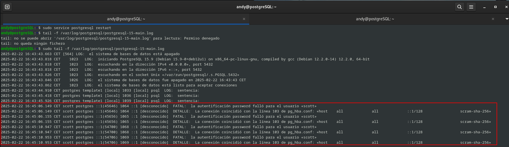

Tambien dejo por aquí cuando tengo exito en la entrada:

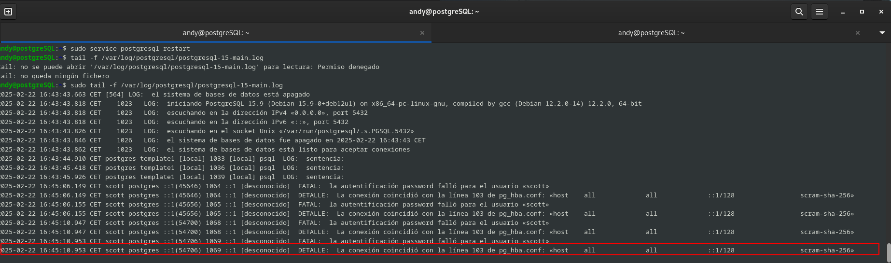

##### 2. Accesos fallidos junto con su motivo

En este ejercicio yo lo que entiendo es lo mismo que en lo que al primero se refiere, la de observar los logs, por lo que lo único que se me ocurre es automatizar lo anterior, dado que en este SGBD,  no hay una función como tal a lo que Oracle se refiere como `DBA_FGA_AUDIT_TRAIL`, por lo que anteriormente accedimos a los logs de la forma manual, metiendo el comando.

##### 3. Auditoria DML

Para esta auditoría hay que hacer uso de la siguiente extensión `Audit Trigger`. Por lo que habra que crear una tabla en la base de datos `postgres` en la cual tendremos que hacer inserciones, actualizaciones y borrado de datos en la base de datos SCOTT.

Por lo que dejo por aquí lo que haré:

```sql
--insertar

INSERT INTO public.dept VALUES (50, 'MARKETING', 'LOS ANGELES');
INSERT INTO public.dept VALUES (60, 'ENGINEERING', 'SEATTLE');
INSERT INTO public.dept VALUES (70, 'HR', 'SAN FRANCISCO');
INSERT INTO public.dept VALUES (80, 'FINANCE', 'CHICAGO');

-- Actualizar

UPDATE public.dept 
SET dname = 'DIGITAL MARK', loc = 'SAN FRANCISCO' 
WHERE deptno = 50;

UPDATE public.dept 
SET dname = 'PRODUCT DEV', loc = 'PORTLAND' 
WHERE deptno = 60;

UPDATE public.dept 
SET dname = 'TALENT MGMT', loc = 'LOS ANGELES' 
WHERE deptno = 70;

UPDATE public.dept 
SET dname = 'CORP FINANCE', loc = 'NEW YORK' 
WHERE deptno = 80;


-- Borrado

DELETE FROM public.dept WHERE deptno IN (50, 60, 70, 80);

```

Una vez hecho esto vamos a proceder a comprobar con Audit Trigger para ver como se ha realizado la auditoria, por lo que vamos a meternos desde nuestro usuario postgres, y hacer lo siguiente:

```sql
andy@postgreSQL:~$ sudo -u postgres psql
[sudo] contraseña para andy: 
psql (15.9 (Debian 15.9-0+deb12u1))
Digite «help» para obtener ayuda.

postgres=#   select audit.audit_table('DEPT');
NOTICE:  disparador «audit_trigger_row» para la relación «dept» no existe, omitiendo
NOTICE:  disparador «audit_trigger_stm» para la relación «dept» no existe, omitiendo
NOTICE:  CREATE TRIGGER audit_trigger_row AFTER INSERT OR UPDATE OR DELETE ON dept FOR EACH ROW EXECUTE PROCEDURE audit.if_modified_func('true');
NOTICE:  CREATE TRIGGER audit_trigger_stm AFTER TRUNCATE ON dept FOR EACH STATEMENT EXECUTE PROCEDURE audit.if_modified_func('true');
 audit_table 
-------------
 
(1 fila)

postgres=# 

```

Pero como no se ve absolutamente nada vamos a meter esto por consola:

```sql
select session_user_name, action, table_name, action_tstamp_clk, client_query from audit.logged_actions;
```

Y mientras que estamos en otra terminal haciendo las inserciones, update y demás lo que tenemos que hacer es irnos como postgres a la otra terminal y ejecutar el comando anterior, y como vemos por pantalla vemos como se hacen las acciones que estamos haciendo como scott.

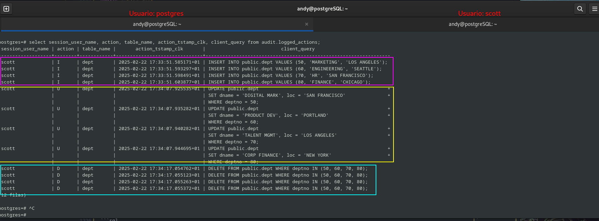


Si tuvieramos una base de datos llamada **croissant**, pues tendruiamso que entrar como el uusuario postrges de la siguiente manera:

```sql
\c base_datos_que_fuera;
```


##### 4. Auditoria grano fino.

Lo primero que haré será crear la tabla de auditoría, esta la creo para almacenar los datos de estas mismas.

```sql
CREATE TABLE public.emp_audit (
    audit_id SERIAL PRIMARY KEY,
    empno INTEGER,
    ename VARCHAR(10),
    comm NUMERIC(7,2),
    inserted_at TIMESTAMP DEFAULT CURRENT_TIMESTAMP
);
```

Después de esto lo que hago es crear un trigger el cual vaya a capturar las insersiones en la tabla `emp` cuando algún empleado tenga comisión.

```sql
CREATE OR REPLACE FUNCTION auidoria_comisiones()
RETURNS TRIGGER AS $$
BEGIN

    IF NEW.comm IS NOT NULL THEN
        
        INSERT INTO public.emp_audit (empno, ename, comm)
        VALUES (NEW.empno, NEW.ename, NEW.comm);
    END IF;
    
    RETURN NEW;
END;
$$ LANGUAGE plpgsql;

```

Luego creo un trigger para que se ejecute automaticamente cada vez que se inserte un nuevo registro en la tabla **emp** con comisión:

```sql
CREATE TRIGGER trg_auditoria_insersiones
AFTER INSERT ON public.emp
FOR EACH ROW
EXECUTE FUNCTION auidoria_comisiones();

```

Ahora lo que hago es probarlo, insertando algun empleado junto con sus comisiones:

```sql
INSERT INTO public.emp (empno, ename, job, mgr, hiredate, sal, comm, deptno)
VALUES (7777, 'Sportacus', 'adios', 7698, '2025-02-22', 1500, 300, 30);

INSERT INTO public.emp (empno, ename, job, mgr, hiredate, sal, comm, deptno)
VALUES (7657, 'Robbie', 'adios', 7698, '2025-02-22', 1500, 759, 30);

INSERT INTO public.emp (empno, ename, job, mgr, hiredate, sal, comm, deptno)
VALUES (7677, 'messi', 'andres', 7698, '2025-02-22', 1500, 169, 30);
```

Para que esto surja efecto le he tenidoq ue dar a mi usuario Scott los siguientes permisos de la tabla que conr¡strui:

```sql
postgres=# GRANT USAGE, SELECT ON SEQUENCE public.emp_audit_audit_id_seq TO scott;
GRANT
```
Una vez hehco esto, consultamos la tabla de la auditoria de la siguiente forma:

```sql
SELECT * FROM public.emp_audit;
```

y esto es lo que nos aparece por pantalla:

```sql
postgres=# SELECT * FROM public.emp_audit;
 audit_id | empno |   ename   |  comm  |        inserted_at         
----------+-------+-----------+--------+----------------------------
        1 |  9999 | hola      | 300.00 | 2025-02-22 17:56:20.369125
        2 |  7777 | Sportacus | 300.00 | 2025-02-22 17:59:06.081495
        3 |  7777 | Sportacus | 300.00 | 2025-02-22 17:59:06.081495
        4 |  7657 | Robbie    | 759.00 | 2025-02-22 18:36:38.400557
        5 |  7657 | Robbie    | 759.00 | 2025-02-22 18:36:38.400557
        6 |  7677 | messi     | 169.00 | 2025-02-22 18:41:06.861984
        7 |  7677 | messi     | 169.00 | 2025-02-22 18:41:06.861984
(7 filas)
```
Como podemos observar se ve perfectamente reflejado.


# MariaDB
---
## **8. Averigua si en MySQL se pueden realizar los apartados 1, 3 y 4. Si es así, documenta el proceso adecuadamente.**

Ahora que estamos en MySQL, lo que vamos a hacer parar poder hacer un aauditopria es recurrir a `serer_audit` el cual nos va a permitir auditar todas las acciones que se hagan en dicho servidor, por lo que vamos a proceder a su instalación, por lo que vamsos a meternos como root en el servidor, y vamos a meter por comando lo siguiente `INSTALL SONAME 'server_audit'`, obviamente tdoo ello conectado a la base de datos, dejo a continuación como lo hice:

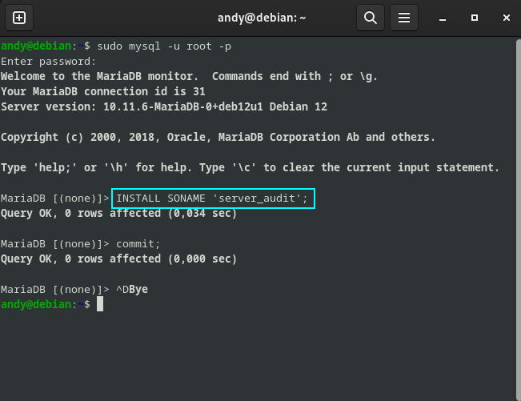


Una vez hecho esto voy a proceder a hacer lo mejor que pueda los ejercicios que tenemos que realizar.

##### 1. Auditoria accesos

Al igual que en PostgreSQL, voy a realizar tanto el de accesos exitosos como fallidos, basicamente porque lo que hay que hacer es mirarlo en los logs al igual que en el anterior.

Por lo que tendremos que ir al siguiente fichero ` /etc/mysql/mariadb.conf.d/50-server.cnf` y tendremos que desmoentar las siguientes lineas:

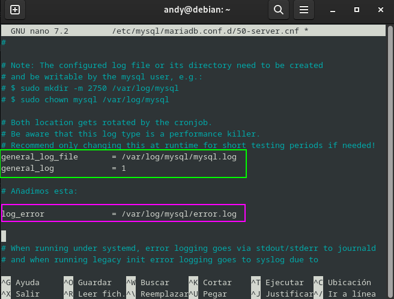

Luego de haber hecho estos cambios lo que hay que hacer es crear el directorio `/var/log/mysql/` y reiniciar lo que va siendo el servidor, por lo que metemos los siguientes comandos:

```bash
andy@debian:/var/log/mysql$ sudo chown mysql: /var/log/mysql/
andy@debian:~$ sudo systemctl restart mariadb.service 
```

y como vemos por pantalla al igual que con PostrgeSQL, vemos tanto quien tieene el acceso denegado como el que puede entrar:

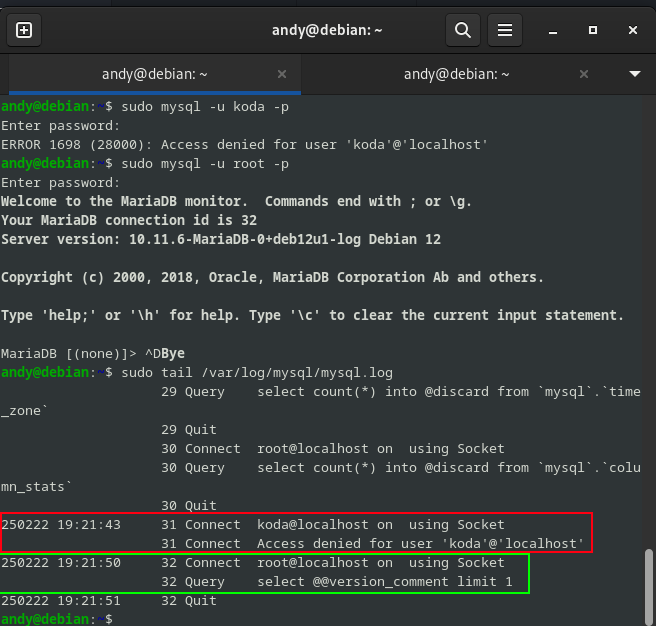

##### 2. Auditorias DML.

Para este paso lo que vamos a tener que hacer es editar  el fichero de configuración `/etc/mysql/mariadb.conf.d/50-server.cnf`, y buscar las siguientes líneas:

```bash
# this is read by the standalone daemon and embedded servers
[server]

server_audit_events=CONNECT,QUERY,TABLE
server_audit_logging=ON
server_audit_incl_users=scott
server_audit_file_path=/var/log/mysql/audit.log

```
- Donde:

- **`server_audit_events=CONNECT,QUERY,TABLE`**: Registra tres tipos de actividades:
  - Conexiones (`CONNECT`)
  - Consultas (`QUERY`)
  - Acciones sobre las tablas (`TABLE`)

- **`server_audit_logging=ON`**: Activa el registro de esas actividades.

- **`server_audit_incl_users=scott`**: Solo se registran las actividades del usuario `scott`.

Luego de esto lo que hacemos es un reinicio del servidor de Mysql.
`sudo systemctl restart mariadb.server`

Por lo que dejo por aqui el [script](./scott-mysql.sql) de la creacion del usuario scott.

Ahora nos conectamos como el usuario scott, y tendremos que hacer algunas sentencias SQL.

```sql
andy@debian:~$ sudo mysql -u scott -p
Enter password: 
Welcome to the MariaDB monitor.  Commands end with ; or \g.
Your MariaDB connection id is 31
Server version: 10.11.6-MariaDB-0+deb12u1-log Debian 12

Copyright (c) 2000, 2018, Oracle, MariaDB Corporation Ab and others.

Type 'help;' or '\h' for help. Type '\c' to clear the current input statement.

MariaDB [(none)]> show databases;
+--------------------+
| Database           |
+--------------------+
| information_schema |
| scott              |
+--------------------+
2 rows in set (0,001 sec)

MariaDB [(none)]> use scott;
Reading table information for completion of table and column names
You can turn off this feature to get a quicker startup with -A

Database changed

-- Luego meto esto.
INSERT INTO scott.emp VALUES(7875, 'DJANGO', 'PERICO', 7902, '1980-12-17', 975, NULL, 20);
UPDATE scott.emp SET sal = 1509 WHERE empno = 7875;
DELETE FROM scott.emp WHERE empno = 7875;

```
Una vez hecho esto vamos a ver loslogs con el siguiente comando:

`sudo tail /var/log/mysql/audit.log`

Y esto nos sale por pantalla:

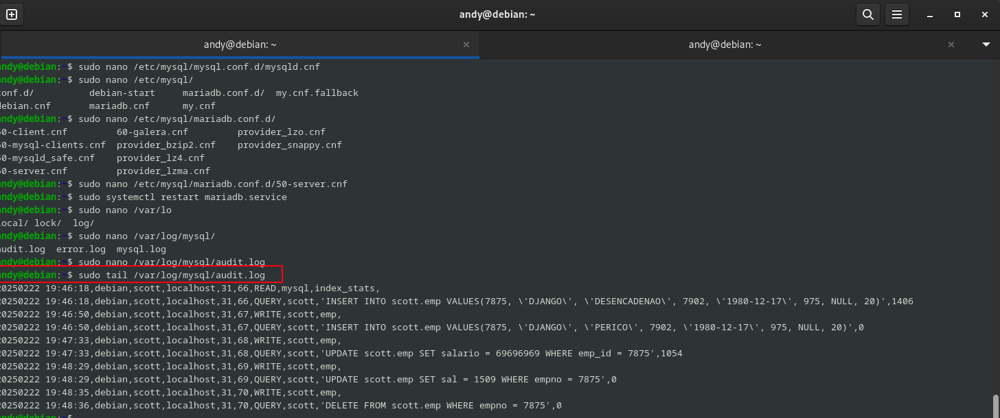


##### 3. Auditoria grano fino.

Ahora como en las ocasiones anteriores, vamos a crear una tabla donde vamos a almacenar los datos de dicha auditoria, donde tendremos que poner el ID del empleado, el nombre, la comisisón, fecha de insersción...

```sql

CREATE TABLE scott.emp_auditoria (
    audit_id INT AUTO_INCREMENT PRIMARY KEY,
    empno INT,
    ename VARCHAR(10),
    comm DECIMAL(7,2),
    action_time TIMESTAMP DEFAULT CURRENT_TIMESTAMP,
    action_type VARCHAR(10) 
);
```

Por pantalla veremos lo siguiente:

```sql
MariaDB [scott]> CREATE TABLE scott.emp_auditoria (
    ->     audit_id INT AUTO_INCREMENT PRIMARY KEY,
    ->     empno INT,
    ->     ename VARCHAR(10),
    ->     comm DECIMAL(7,2),
    ->     action_time TIMESTAMP DEFAULT CURRENT_TIMESTAMP,
    ->     action_type VARCHAR(10) 
    -> );
Query OK, 0 rows affected (0,040 sec)

MariaDB [scott]> 
```


Luego creamos un trigger para el registro de las inserciones de empleados con comisiones este se va a activar cada vez que se vaya a realizar un inserción en la tabla de empleados, y verificará si el cmapo comm tiene un valor distinto de NULL, es decir, que el empleado tiene una comisión.

```sql
DELIMITER $$

CREATE TRIGGER audit_emp_inserciom
AFTER INSERT ON scott.emp
FOR EACH ROW
BEGIN
    IF NEW.comm IS NOT NULL THEN
        INSERT INTO scott.emp_auditoria (empno, ename, comm, action_type)
        VALUES (NEW.empno, NEW.ename, NEW.comm, 'INSERT');
    END IF;
END $$

DELIMITER ;

```

Y esto lo probaremos con el siguiente candidato de nuestros juegos del hambre, aqui lo presento:

```sql
INSERT INTO scott.emp VALUES (7880, 'LEVI', 'ACKERMAN', 7839, '1981-04-02', 3000, 500, 30);
INSERT INTO scott.emp VALUES (7881, 'Nike', 'ACKERMAN', 7839, '1981-04-02', 3000, 500, 30);
```

Y luego seleccionamos con un select, la tabla y vemso como etsa se va rellenando:

```sql
MariaDB [scott]> select * from scott.emp_auditoria;
+----------+-------+-------+--------+---------------------+-------------+
| audit_id | empno | ename | comm   | action_time         | action_type |
+----------+-------+-------+--------+---------------------+-------------+
|        1 |  7880 | LEVI  | 500.00 | 2025-02-22 20:13:24 | INSERT      |
+----------+-------+-------+--------+---------------------+-------------+
1 row in set (0,000 sec)

```

Y si metemos otro poddemos observar como verdaderamente la comprobación que hacemos tiene éxito:

```sql
MariaDB [scott]> select * from scott.emp_auditoria;
+----------+-------+-------+--------+---------------------+-------------+
| audit_id | empno | ename | comm   | action_time         | action_type |
+----------+-------+-------+--------+---------------------+-------------+
|        1 |  7880 | LEVI  | 500.00 | 2025-02-22 20:13:24 | INSERT      |
|        2 |  7881 | Nike  | 500.00 | 2025-02-22 20:15:54 | INSERT      |
+----------+-------+-------+--------+---------------------+-------------+
2 rows in set (0,000 sec)
```
---

# MongoDB

---

## **9. Averigua las posibilidades que ofrece MongoDB para auditar los cambios que va sufriendo un documento. Demuestra su funcionamiento.**

Para esta ocasión en este SGBD noSQL, como bien dice el enunciado, vamos  a ver que opciones de auditoria que nos ofrece MongoDB, pero para que vaya a buen puesto esta práctica tendremos que tener instalado la edición **Enterprise**,ya que la version **Community** no incluye lo que son herramientas integradas para auditorias.

Como ya teniamos montado una versión que no era la adecuada (**Community**), lo que he hecho es seguir la instalación de la versión que no has hecho falta en su [página oficial](https://www.mongodb.com/docs/manual/tutorial/install-mongodb-enterprise-on-debian/#install-mongodb-enterprise-edition), y seguir lo pasos para obtener la que nos hace falta, os voy a mosstar  como podeis ver la versión que teneis, y es con el siguiente comando:

```bash 
mongod --version
```

Y nos muestra por pantalla lo siguiente:

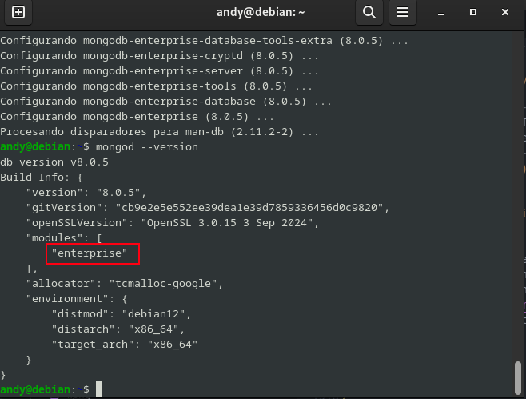

Ahora viendo en la documentación oficial las auditorias, MongoDB nos ofrece tres opciones para poder activarlas, las cuales son:

- Registro en syslog → Guarda los eventos de auditoría en el sistema de logs del servidor.
- Archivos JSON o BSON → Permite almacenar los registros de auditoría en archivos, lo que facilita su análisis posterior.
- Auditoría en tiempo real (consola) → Muestra los eventos de auditoría directamente en la consola, útil para monitoreo en vivo.

Cada una de estas opciones tiene su propio caso de uso, dependiendo de si se necesita persistencia a largo plazo o monitoreo inmediato.

A continuación voy a mostrar como habilitarlas a través del fichero de configuración de MongoDB, este fichero se encunetra en la siguiente ruta `/etc/mongod.conf`.

- Syslog
- JSON/BSON
- Tiempo real

Como hemos comentado antes tenemos que hacerlo haciendo la edición del siguiente fichero `/etc/mongod.conf`, una vez entrado en este fichero, podremos realizar las siguientes acciones, dependiendo de lo que queramos realizar, por lo que os voy a mostrar cada una de ellas como hacerlo, por lo que voy a desglosarlo por partes.

- **Syslog**
Para habiliatr esta auditoria y qu enos imprima los datos de dicha auditoria por **Syslog** es un **formato JSON**, tendremos que cambiar de lo que tenemos iniciarlmente:

```bash
# Where and how to store data.
storage:
  dbPath: /var/lib/mongodb

```

A esto:

```bash
# Where and how to store data.
storage:
    dbPath: /var/lib/mongodb
auditLog:
    destination: syslog
```
Luego de editar el fichero tendriamos que hacer lo siguiente, tambien podríamos especificarlo por consola, con el siguiente comando:

```bash
  mongod --dbpath /var/lib/mongodb --auditDestination syslog
```

- **Salida por consola**

Para esta auditoria y que nos imprima la salida por la consola, tendremos que cambiar las opciones en el fichero de configuración, es decir, pasar de esta primera forma:

```bash
# Where and how to store data.
storage:
  dbPath: /var/lib/mongodb
```

a esta:

```bash
# Where and how to store data.
storage:
    dbPath: /var/lib/mongodb
auditLog:
    destination: console
```

Luego de editar el fichero tendriamos que hacer lo siguiente, especificandolo por comandos en la consola, por lo que quedaria de la siguiente forma:

```bash
 mongod --dbpath /var/lib/mongodb --auditDestination console
```
- **Salida de una archivo JSON**

Para esta opción y la última, tendriamos que como anteriormente editar el fichero mencionando anteriormente, y pasar de esto:

```bash
# Where and how to store data.
storage:
  dbPath: /var/lib/mongodb
```

a esto:

```bash
storage:
    dbPath: /var/lib/mongodb
auditLog:
    destination: file
    format: JSON
    path: /var/lib/mongodb/auditLog.json
```

Como mencione anteiromente también esta la salida en el fichero **BSON**, por lo que si quisieramos que fuera ese el formato, tendria la siguiente apariencia:

```bash
storage:
    dbPath: /var/lib/mongodb
auditLog:
    destination: file
    format: BSON
    path: /var/lib/mongodb/auditLog.bson
```

Y como anteriormente lo podemos hacer por consola y seria con el siguiente comando:

```bash
mongod --dbpath /var/lib/mongodb/ --auditDestination file --auditFormat JSON --auditPath /var/lib/mongodb/auditLog.json
```

Y ya que esta es la última opción que acabamos de ver, y por ende es la que más reciente tenemos, lo voy a realizar así por comodidad para nosotros y no tener que retroceder, por lo que vamos a ejecutar el comando:

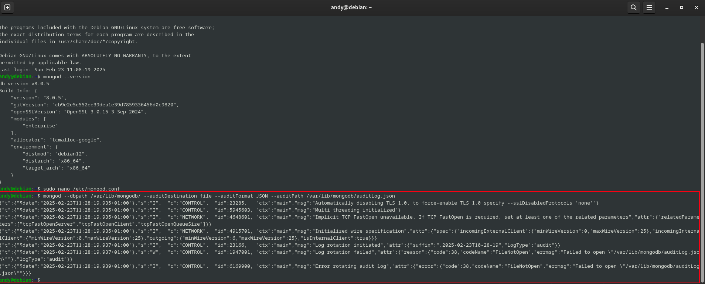


Lo que nos muestra por pantalla, una vez conmfigurado todo, de haber hecho lo siguientes pasos:

```bash
andy@debian:~$ sudo touch /var/lib/mongodb/auditLog.json
andy@debian:~$ sudo chmod 660 /var/lib/mongodb/auditLog.json
andy@debian:~$ sudo chown mongodb:mongodb /var/lib/mongodb/auditLog.json
andy@debian:~$ sudo systemctl restart mongod
andy@debian:~$ sudo systemctl status mongod
● mongod.service - MongoDB Database Server
     Loaded: loaded (/lib/systemd/system/mongod.service; enabled; preset: enabled)
     Active: active (running) since Sun 2025-02-23 11:48:22 CET; 5s ago
       Docs: https://docs.mongodb.org/manual
   Main PID: 1706 (mongod)
     Memory: 199.8M
        CPU: 327ms
     CGroup: /system.slice/mongod.service
             └─1706 /usr/bin/mongod --config /etc/mongod.conf

feb 23 11:48:22 debian systemd[1]: Started mongod.service - MongoDB Database Server.
feb 23 11:48:22 debian mongod[1706]: {"t":{"$date":"2025-02-23T10:48:22.993Z"},"s":"I",  "c":"CONTROL",  "id":7484500, "ctx":"main","msg":"Environment variable MONGODB_CONFIG_OVERRIDE_NOFORK == 1, overriding \"processManage>
lines 1-12/12 (END)
```
y como hemos verificado que esta corriendo y esta todo habilitado, para poder ver lo que es el fichero `audit.json`, vamos a necesitar lo siguiiente que es el programa jq, el cual nos va a permitir leer los ficheros JSON, por lo que vamos a instalarlo:

```bash
andy@debian:~$ sudo apt install jq
```
y luego para cerciorarnos de que esto esta corriendo perfectamente vamos a comporbar lo logs que se han puesto hecho en dicho fichero, por lo que tendremos que meter el siguiente ocmando:

```bash 
andy@debian:~$ sudo cat /var/lib/mongodb/auditLog.json | jq
```
y si vemos lo que nos aparece por pantalla es lo siguiente:

```bash
andy@debian:~$ sudo cat /var/lib/mongodb/auditLog.json | jq
{
  "atype": "rotateLog",
  "ts": {
    "$date": "2025-02-23T11:48:22.999+01:00"
  },
  "param": {
    "pid": 1706,
    "osInfo": {
      "name": "PRETTY_NAME=\"Debian GNU/Linux 12 (bookworm)\"",
      "version": "Kernel 6.1.0-28-amd64"
    },
    "logRotationStatus": {
      "status": "OK",
      "rotatedLogPath": "/var/lib/mongodb/auditLog.json.2025-02-23T10-48-22",
      "errors": []
    }
  },
  "result": 0
}
{
  "atype": "startup",
  "ts": {
    "$date": "2025-02-23T11:48:23.291+01:00"
  },
  "uuid": {
    "$binary": "VvlUHMeeRjyV+Ekt5F72rQ==",
    "$type": "04"
  },
  "local": {
    "isSystemUser": true
  },
  "remote": {
    "isSystemUser": true
  },
  "users": [],
  "roles": [],
  "param": {
    "startupOptions": {
      "auditLog": {
        "destination": "file",
        "format": "JSON",
        "path": "/var/lib/mongodb/auditLog.json"
      },
      "config": "/etc/mongod.conf",
      "net": {
        "bindIp": "127.0.0.1",
        "port": 27017
      },
      "processManagement": {
        "timeZoneInfo": "/usr/share/zoneinfo"
      },
      "security": {
        "authorization": "enabled"
      },
      "storage": {
        "dbPath": "/var/lib/mongodb"
      },
      "systemLog": {
        "destination": "file",
        "logAppend": true,
        "path": "/var/log/mongodb/mongod.log"
      }
    },
    "initialClusterServerParameters": [
      {
        "_id": "addOrRemoveShardInProgress",
        "clusterParameterTime": {
          "$timestamp": {
            "t": 0,
            "i": 0
          }
        },
        "inProgress": false
      },
      {
        "_id": "auditConfig",
        "auditConfig": {
          "filter": {},
          "auditAuthorizationSuccess": false,
          "clusterParameterTime": {
            "$timestamp": {
              "t": 0,
              "i": 0
            }
          }
        }
      },
      {
        "_id": "changeStreamOptions",
        "clusterParameterTime": {
          "$timestamp": {
            "t": 0,
            "i": 0
          }
        },
        "preAndPostImages": {
          "expireAfterSeconds": "off"
        }
      },
      {
        "_id": "changeStreams",
        "clusterParameterTime": {
          "$timestamp": {
            "t": 0,
            "i": 0
          }
        },
        "expireAfterSeconds": {
          "$numberLong": "3600"
        }
      },
      {
        "_id": "configServerReadPreferenceForCatalogQueries",
        "clusterParameterTime": {
          "$timestamp": {
            "t": 0,
            "i": 0
          }
        },
        "mustAlwaysUseNearest": false
      },
      {
        "_id": "defaultMaxTimeMS",
        "clusterParameterTime": {
          "$timestamp": {
            "t": 0,
            "i": 0
          }
        },
        "readOperations": {
          "$numberLong": "0"
        }
      },
      {
        "_id": "fleCompactionOptions",
        "clusterParameterTime": {
          "$timestamp": {
            "t": 0,
            "i": 0
          }
        },
        "maxCompactionSize": 268435456,
        "maxAnchorCompactionSize": 268435456,
        "maxESCEntriesPerCompactionDelete": 350000
      },
      {
        "_id": "internalQueryCutoffForSampleFromRandomCursor",
        "clusterParameterTime": {
          "$timestamp": {
            "t": 0,
            "i": 0
          }
        },
        "sampleCutoff": 0.05
      },
      {
        "_id": "pauseMigrationsDuringMultiUpdates",
        "clusterParameterTime": {
          "$timestamp": {
            "t": 0,
            "i": 0
          }
        },
        "enabled": false
      },
      {
        "_id": "querySettings",
        "settingsArray": [],
        "clusterParameterTime": {
          "$timestamp": {
            "t": 0,
            "i": 0
          }
        }
      },
      {
        "_id": "shardedClusterCardinalityForDirectConns",
        "clusterParameterTime": {
          "$timestamp": {
            "t": 0,
            "i": 0
          }
        },
        "hasTwoOrMoreShards": false
      }
    ]
  },
  "result": 0
}
{
  "atype": "getClusterParameter",
  "ts": {
    "$date": "2025-02-23T11:48:24.008+01:00"
  },
  "uuid": {
    "$binary": "zLWKAVh0R2m1MDZ2QjCZ9w==",
    "$type": "04"
  },
  "local": {
    "isSystemUser": true
  },
  "remote": {
    "isSystemUser": true
  },
  "users": [],
  "roles": [],
  "param": {
    "requestedClusterServerParameters": "*"
  },
  "result": 0
}
{
  "atype": "getClusterParameter",
  "ts": {
    "$date": "2025-02-23T11:53:24.004+01:00"
  },
  "uuid": {
    "$binary": "zLWKAVh0R2m1MDZ2QjCZ9w==",
    "$type": "04"
  },
  "local": {
    "isSystemUser": true
  },
  "remote": {
    "isSystemUser": true
  },
  "users": [],
  "roles": [],
  "param": {
    "requestedClusterServerParameters": "*"
  },
  "result": 0
}
{
  "atype": "getClusterParameter",
  "ts": {
    "$date": "2025-02-23T11:58:24.003+01:00"
  },
  "uuid": {
    "$binary": "zLWKAVh0R2m1MDZ2QjCZ9w==",
    "$type": "04"
  },
  "local": {
    "isSystemUser": true
  },
  "remote": {
    "isSystemUser": true
  },
  "users": [],
  "roles": [],
  "param": {
    "requestedClusterServerParameters": "*"
  },
  "result": 0
}
{
  "atype": "clientMetadata",
  "ts": {
    "$date": "2025-02-23T11:58:54.053+01:00"
  },
  "uuid": {
    "$binary": "WltSU3caSIaaVFATk9W98g==",
    "$type": "04"
  },
  "local": {
    "ip": "127.0.0.1",
    "port": 27017
  },
  "remote": {
    "ip": "127.0.0.1",
    "port": 57946
  },
  "users": [],
  "roles": [],
  "param": {
    "localEndpoint": {
      "ip": "127.0.0.1",
      "port": 27017
    },
    "clientMetadata": {
      "application": {
        "name": "mongosh 2.4.0"
      },
      "driver": {
        "name": "nodejs|mongosh",
        "version": "6.13.0|2.4.0"
      },
      "platform": "Node.js v20.18.3, LE",
      "os": {
        "name": "linux",
        "architecture": "x64",
        "version": "3.10.0-327.22.2.el7.x86_64",
        "type": "Linux"
      }
    }
  },
  "result": 0
}
{
  "atype": "clientMetadata",
  "ts": {
    "$date": "2025-02-23T11:58:54.057+01:00"
  },
  "uuid": {
    "$binary": "e/5L1xPoS3a8wf9O3BQ0vg==",
    "$type": "04"
  },
  "local": {
    "ip": "127.0.0.1",
    "port": 27017
  },
  "remote": {
    "ip": "127.0.0.1",
    "port": 57952
  },
  "users": [],
  "roles": [],
  "param": {
    "localEndpoint": {
      "ip": "127.0.0.1",
      "port": 27017
    },
    "clientMetadata": {
      "application": {
        "name": "mongosh 2.4.0"
      },
      "driver": {
        "name": "nodejs|mongosh",
        "version": "6.13.0|2.4.0"
      },
      "platform": "Node.js v20.18.3, LE",
      "os": {
        "name": "linux",
        "architecture": "x64",
        "version": "3.10.0-327.22.2.el7.x86_64",
        "type": "Linux"
      }
    }
  },
  "result": 0
}
{
  "atype": "authenticate",
  "ts": {
    "$date": "2025-02-23T11:58:54.064+01:00"
  },
  "uuid": {
    "$binary": "e/5L1xPoS3a8wf9O3BQ0vg==",
    "$type": "04"
  },
  "local": {
    "ip": "127.0.0.1",
    "port": 27017
  },
  "remote": {
    "ip": "127.0.0.1",
    "port": 57952
  },
  "users": [
    {
      "user": "andy",
      "db": "admin"
    }
  ],
  "roles": [
    {
      "role": "root",
      "db": "admin"
    }
  ],
  "param": {
    "user": "andy",
    "db": "admin",
    "mechanism": "SCRAM-SHA-256"
  },
  "result": 0
}
{
  "atype": "clientMetadata",
  "ts": {
    "$date": "2025-02-23T11:58:54.074+01:00"
  },
  "uuid": {
    "$binary": "RVRH+7xPSKqbooMs94XG2g==",
    "$type": "04"
  },
  "local": {
    "ip": "127.0.0.1",
    "port": 27017
  },
  "remote": {
    "ip": "127.0.0.1",
    "port": 57956
  },
  "users": [],
  "roles": [],
  "param": {
    "localEndpoint": {
      "ip": "127.0.0.1",
      "port": 27017
    },
    "clientMetadata": {
      "application": {
        "name": "mongosh 2.4.0"
      },
      "driver": {
        "name": "nodejs|mongosh",
        "version": "6.13.0|2.4.0"
      },
      "platform": "Node.js v20.18.3, LE",
      "os": {
        "name": "linux",
        "architecture": "x64",
        "version": "3.10.0-327.22.2.el7.x86_64",
        "type": "Linux"
      }
    }
  },
  "result": 0
}
{
  "atype": "clientMetadata",
  "ts": {
    "$date": "2025-02-23T11:58:54.074+01:00"
  },
  "uuid": {
    "$binary": "/xFxtNBDTOysPQbgHqkBXA==",
    "$type": "04"
  },
  "local": {
    "ip": "127.0.0.1",
    "port": 27017
  },
  "remote": {
    "ip": "127.0.0.1",
    "port": 57966
  },
  "users": [],
  "roles": [],
  "param": {
    "localEndpoint": {
      "ip": "127.0.0.1",
      "port": 27017
    },
    "clientMetadata": {
      "application": {
        "name": "mongosh 2.4.0"
      },
      "driver": {
        "name": "nodejs|mongosh",
        "version": "6.13.0|2.4.0"
      },
      "platform": "Node.js v20.18.3, LE",
      "os": {
        "name": "linux",
        "architecture": "x64",
        "version": "3.10.0-327.22.2.el7.x86_64",
        "type": "Linux"
      }
    }
  },
  "result": 0
}
{
  "atype": "authenticate",
  "ts": {
    "$date": "2025-02-23T11:58:54.075+01:00"
  },
  "uuid": {
    "$binary": "RVRH+7xPSKqbooMs94XG2g==",
    "$type": "04"
  },
  "local": {
    "ip": "127.0.0.1",
    "port": 27017
  },
  "remote": {
    "ip": "127.0.0.1",
    "port": 57956
  },
  "users": [
    {
      "user": "andy",
      "db": "admin"
    }
  ],
  "roles": [
    {
      "role": "root",
      "db": "admin"
    }
  ],
  "param": {
    "user": "andy",
    "db": "admin",
    "mechanism": "SCRAM-SHA-256"
  },
  "result": 0
}
{
  "atype": "authenticate",
  "ts": {
    "$date": "2025-02-23T11:58:54.075+01:00"
  },
  "uuid": {
    "$binary": "/xFxtNBDTOysPQbgHqkBXA==",
    "$type": "04"
  },
  "local": {
    "ip": "127.0.0.1",
    "port": 27017
  },
  "remote": {
    "ip": "127.0.0.1",
    "port": 57966
  },
  "users": [
    {
      "user": "andy",
      "db": "admin"
    }
  ],
  "roles": [
    {
      "role": "root",
      "db": "admin"
    }
  ],
  "param": {
    "user": "andy",
    "db": "admin",
    "mechanism": "SCRAM-SHA-256"
  },
  "result": 0
}
{
  "atype": "clientMetadata",
  "ts": {
    "$date": "2025-02-23T11:59:04.564+01:00"
  },
  "uuid": {
    "$binary": "Kl2IgEvlSomrO2A37y50XQ==",
    "$type": "04"
  },
  "local": {
    "ip": "127.0.0.1",
    "port": 27017
  },
  "remote": {
    "ip": "127.0.0.1",
    "port": 41182
  },
  "users": [],
  "roles": [],
  "param": {
    "localEndpoint": {
      "ip": "127.0.0.1",
      "port": 27017
    },
    "clientMetadata": {
      "application": {
        "name": "mongosh 2.4.0"
      },
      "driver": {
        "name": "nodejs|mongosh",
        "version": "6.13.0|2.4.0"
      },
      "platform": "Node.js v20.18.3, LE",
      "os": {
        "name": "linux",
        "architecture": "x64",
        "version": "3.10.0-327.22.2.el7.x86_64",
        "type": "Linux"
      }
    }
  },
  "result": 0
}
{
  "atype": "logout",
  "ts": {
    "$date": "2025-02-23T11:59:37.742+01:00"
  },
  "uuid": {
    "$binary": "RVRH+7xPSKqbooMs94XG2g==",
    "$type": "04"
  },
  "local": {
    "ip": "127.0.0.1",
    "port": 27017
  },
  "remote": {
    "ip": "127.0.0.1",
    "port": 57956
  },
  "users": [],
  "roles": [
    {
      "role": "root",
      "db": "admin"
    }
  ],
  "param": {
    "reason": "Client has disconnected",
    "initialUsers": [
      {
        "user": "andy",
        "db": "admin"
      }
    ],
    "updatedUsers": [],
    "loginTime": {
      "$date": "2025-02-23T11:58:54.075+01:00"
    }
  },
  "result": 0
}
{
  "atype": "logout",
  "ts": {
    "$date": "2025-02-23T11:59:37.742+01:00"
  },
  "uuid": {
    "$binary": "e/5L1xPoS3a8wf9O3BQ0vg==",
    "$type": "04"
  },
  "local": {
    "ip": "127.0.0.1",
    "port": 27017
  },
  "remote": {
    "ip": "127.0.0.1",
    "port": 57952
  },
  "users": [],
  "roles": [
    {
      "role": "root",
      "db": "admin"
    }
  ],
  "param": {
    "reason": "Client has disconnected",
    "initialUsers": [
      {
        "user": "andy",
        "db": "admin"
      }
    ],
    "updatedUsers": [],
    "loginTime": {
      "$date": "2025-02-23T11:58:54.064+01:00"
    }
  },
  "result": 0
}
{
  "atype": "logout",
  "ts": {
    "$date": "2025-02-23T11:59:37.742+01:00"
  },
  "uuid": {
    "$binary": "/xFxtNBDTOysPQbgHqkBXA==",
    "$type": "04"
  },
  "local": {
    "ip": "127.0.0.1",
    "port": 27017
  },
  "remote": {
    "ip": "127.0.0.1",
    "port": 57966
  },
  "users": [],
  "roles": [
    {
      "role": "root",
      "db": "admin"
    }
  ],
  "param": {
    "reason": "Client has disconnected",
    "initialUsers": [
      {
        "user": "andy",
        "db": "admin"
      }
    ],
    "updatedUsers": [],
    "loginTime": {
      "$date": "2025-02-23T11:58:54.075+01:00"
    }
  },
  "result": 0
}

```

Si no fijamos en este caso podemos ver como me he logeado con mi usuario andy, el cual tienen el role de root y en la base de datos admin, dejo el trozo de cópdigo en el cual se ve, y tambien cuando nos logeamos y cuando nos desconectamos:

```bash
{
  "atype": "logout",
  "ts": {
    "$date": "2025-02-23T11:59:37.742+01:00"
  },
  "uuid": {
    "$binary": "/xFxtNBDTOysPQbgHqkBXA==",
    "$type": "04"
  },
  "local": {
    "ip": "127.0.0.1",
    "port": 27017
  },
  "remote": {
    "ip": "127.0.0.1",
    "port": 57966
  },
  "users": [],
  "roles": [
    {
      "role": "root",
      "db": "admin"
    }
  ],
  "param": {
    "reason": "Client has disconnected",
    "initialUsers": [
      {
        "user": "andy",
        "db": "admin"
      }
    ],
    "updatedUsers": [],
    "loginTime": {
      "$date": "2025-02-23T11:58:54.075+01:00"
    }
  },
  "result": 0
}
```

Ahora probare todo esto con algún ejemplo más práctico, para ver mejro lo que on la actividad de los logs en dicha auditoría, por lo que vamos a dar comienzo a dicha tarea:

Lo primero que voy a hacer es crear una base de datos, junto con una colección, dnetro de ella voyt a hacer una auditoria a algún tipo, o precio mayor, obviamente voy a hacer algo relacionado con el mundo del motor, por lo que vamos a ello:

```sql
use practicamotos;

-- Creación de la colección

db.createCollection("Motos");

-- Insertar un ejemplo de documento
db.Motos.insertOne({ nombre: "Yamaha R1", tipo: "Deportiva", pvp: 20000 });

db.Motos.insertOne({ nombre: "Honda CB500X", tipo: "Aventura", pvp: 7500 });

db.Motos.insertOne({ nombre: "Vespa Primavera", tipo: "Scooter", pvp: 4500 });

```
Como podemos ver por pantalla, tenemos nos da lo siguiente:

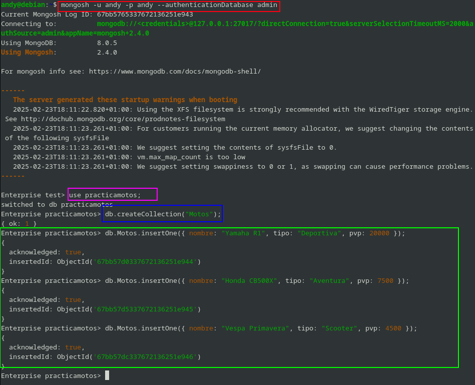

Ahora voy a hacer algunos movimientos, vamos a cambiar el tipo de alguno de estos ejemplos, y tambien borrar.

Lo primero que vamos a hacer es borrar el tipo Scooter, porque eso no es una moto, es un triciclo, y tambien vamos a editar lo que es el tipo deportivo, a super deportivo:

```sql
-- Cambio de tipo de deportivo a superdeportivo
db.Motos.updateOne(
    { tipo: "Deportiva" }, 
    { $set: { tipo: "Superdeportiva" } }
);

-- Borrar la scooter, que es un triciclo

db.Motos.deleteOne({ tipo: "Scooter" });
```
Lo podemos ver por pantalla:

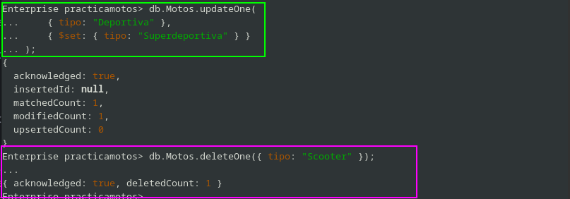

Lo comprobamos in situ:

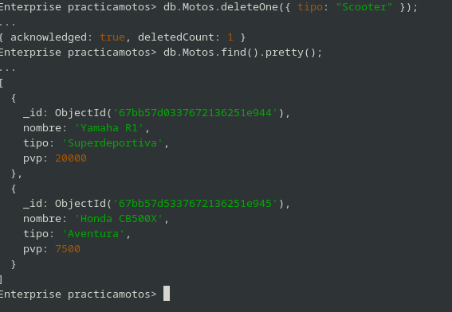

Y ahora lo vamos a ver a través de los logs, por lo que vamos a meter lo siguiente, voy a hacer una aclaración, para ver lo que se ha insertado, actualizazo y demas:

```sql
-- Ver los insert

Enterprise practicamotos> db.system.profile.find({ op: "insert" }).pretty()
... 
[
  {
    op: 'insert',
    ns: 'practicamotos.Motos',
    command: {
      insert: 'Motos',
      documents: [
        {
          nombre: 'Yamaha R1',
          tipo: 'Deportiva',
          pvp: 20000,
          _id: ObjectId('67bc533a31aae5b2c151e944')
        }
      ],
      ordered: true,
      lsid: { id: UUID('5807a7a4-92e9-4be4-b7aa-7ff92581c3b9') },
      '$db': 'practicamotos'
    },
    ninserted: 1,
    keysInserted: 1,
    numYield: 0,
    locks: {
      ReplicationStateTransition: { acquireCount: { w: Long('1') } },
      Global: { acquireCount: { w: Long('1') } },
      Database: { acquireCount: { w: Long('1') } },
      Collection: { acquireCount: { w: Long('1') } }
    },
    flowControl: { acquireCount: Long('1') },
    responseLength: 45,
    protocol: 'op_msg',
    cpuNanos: 214051,
    millis: 0,
    ts: ISODate('2025-02-24T11:08:42.450Z'),
    client: '127.0.0.1',
    appName: 'mongosh 2.4.0',
    allUsers: [ { user: 'andy', db: 'admin' } ],
    user: 'andy@admin'
  },
  {
    op: 'insert',
    ns: 'practicamotos.Motos',
    command: {
      insert: 'Motos',
      documents: [
        {
          nombre: 'Honda CB500X',
          tipo: 'Aventura',
          pvp: 7500,
          _id: ObjectId('67bc533f31aae5b2c151e945')
        }
      ],
      ordered: true,
      lsid: { id: UUID('5807a7a4-92e9-4be4-b7aa-7ff92581c3b9') },
      '$db': 'practicamotos'
    },
    ninserted: 1,
    keysInserted: 1,
    numYield: 0,
    locks: {
      ReplicationStateTransition: { acquireCount: { w: Long('1') } },
      Global: { acquireCount: { w: Long('1') } },
      Database: { acquireCount: { w: Long('1') } },
      Collection: { acquireCount: { w: Long('1') } }
    },
    flowControl: { acquireCount: Long('1') },
    responseLength: 45,
    protocol: 'op_msg',
    cpuNanos: 148019,
    millis: 0,
    ts: ISODate('2025-02-24T11:08:47.628Z'),
    client: '127.0.0.1',
    appName: 'mongosh 2.4.0',
    allUsers: [ { user: 'andy', db: 'admin' } ],
    user: 'andy@admin'
  },
  {
    op: 'insert',
    ns: 'practicamotos.Motos',
    command: {
      insert: 'Motos',
      documents: [
        {
          nombre: 'Vespa Primavera',
          tipo: 'Scooter',
          pvp: 4500,
          _id: ObjectId('67bc534331aae5b2c151e946')
        }
      ],
      ordered: true,
      lsid: { id: UUID('5807a7a4-92e9-4be4-b7aa-7ff92581c3b9') },
      '$db': 'practicamotos'
    },
    ninserted: 1,
    keysInserted: 1,
    numYield: 0,
    locks: {
      ReplicationStateTransition: { acquireCount: { w: Long('1') } },
      Global: { acquireCount: { w: Long('1') } },
      Database: { acquireCount: { w: Long('1') } },
      Collection: { acquireCount: { w: Long('1') } }
    },
    flowControl: { acquireCount: Long('1') },
    responseLength: 45,
    protocol: 'op_msg',
    cpuNanos: 124090,
    millis: 0,
    ts: ISODate('2025-02-24T11:08:51.943Z'),
    client: '127.0.0.1',
    appName: 'mongosh 2.4.0',
    allUsers: [ { user: 'andy', db: 'admin' } ],
    user: 'andy@admin'
  }
]

-- Ver los update

Enterprise practicamotos> db.system.profile.find({ op: "update" }).pretty()
... 
[
  {
    op: 'update',
    ns: 'practicamotos.Motos',
    command: {
      q: { tipo: 'Deportiva' },
      u: { '$set': { tipo: 'Superdeportiva' } },
      multi: false,
      upsert: false
    },
    keysExamined: 0,
    docsExamined: 1,
    nMatched: 1,
    nModified: 1,
    nUpserted: 0,
    keysInserted: 0,
    keysDeleted: 0,
    numYield: 0,
    locks: {
      ReplicationStateTransition: { acquireCount: { w: Long('1') } },
      Global: { acquireCount: { r: Long('1'), w: Long('1') } },
      Database: { acquireCount: { w: Long('1') } },
      Collection: { acquireCount: { w: Long('1') } }
    },
    flowControl: { acquireCount: Long('1') },
    storage: {},
    cpuNanos: 386731,
    millis: 1,
    planSummary: 'COLLSCAN',
    planningTimeMicros: 240,
    execStats: {
      isCached: false,
      stage: 'UPDATE',
      nReturned: 0,
      executionTimeMillisEstimate: 0,
      works: 1,
      advanced: 0,
      needTime: 0,
      needYield: 0,
      saveState: 0,
      restoreState: 0,
      isEOF: 1,
      nMatched: 1,
      nWouldModify: 1,
      nWouldUpsert: 0,
      inputStage: {
        stage: 'COLLSCAN',
        filter: { tipo: { '$eq': 'Deportiva' } },
        nReturned: 1,
        executionTimeMillisEstimate: 0,
        works: 1,
        advanced: 1,
        needTime: 0,
        needYield: 0,
        saveState: 1,
        restoreState: 1,
        isEOF: 0,
        direction: 'forward',
        docsExamined: 1
      }
    },
    ts: ISODate('2025-02-24T11:08:59.693Z'),
    client: '127.0.0.1',
    appName: 'mongosh 2.4.0',
    allUsers: [ { user: 'andy', db: 'admin' } ],
    user: 'andy@admin'
  }
]

-- Ver lo borrado

Enterprise practicamotos> db.system.profile.find({ op: "remove" }).pretty()
... 
[
  {
    op: 'remove',
    ns: 'practicamotos.Motos',
    command: { q: { tipo: 'Scooter' }, limit: 1 },
    keysExamined: 0,
    docsExamined: 3,
    ndeleted: 1,
    keysDeleted: 1,
    numYield: 0,
    locks: {
      ReplicationStateTransition: { acquireCount: { w: Long('1') } },
      Global: { acquireCount: { r: Long('1'), w: Long('1') } },
      Database: { acquireCount: { w: Long('1') } },
      Collection: { acquireCount: { w: Long('1') } }
    },
    flowControl: { acquireCount: Long('1') },
    storage: {},
    cpuNanos: 449291,
    millis: 0,
    planSummary: 'COLLSCAN',
    planningTimeMicros: 106,
    execStats: {
      isCached: false,
      stage: 'DELETE',
      nReturned: 0,
      executionTimeMillisEstimate: 0,
      works: 3,
      advanced: 0,
      needTime: 2,
      needYield: 0,
      saveState: 0,
      restoreState: 0,
      isEOF: 1,
      nWouldDelete: 1,
      inputStage: {
        stage: 'COLLSCAN',
        filter: { tipo: { '$eq': 'Scooter' } },
        nReturned: 1,
        executionTimeMillisEstimate: 0,
        works: 3,
        advanced: 1,
        needTime: 2,
        needYield: 0,
        saveState: 1,
        restoreState: 1,
        isEOF: 0,
        direction: 'forward',
        docsExamined: 3
      }
    },
    ts: ISODate('2025-02-24T11:09:05.362Z'),
    client: '127.0.0.1',
    appName: 'mongosh 2.4.0',
    allUsers: [ { user: 'andy', db: 'admin' } ],
    user: 'andy@admin'
  }
]

-- Ordenar por operaciones recientes

Enterprise practicamotos> db.system.profile.find().sort({ ts: -1 }).limit(10).pretty()
... 
[
  {
    op: 'query',
    ns: 'practicamotos.system.profile',
    command: {
      find: 'system.profile',
      filter: { op: 'remove' },
      lsid: { id: UUID('64702a68-4141-40e0-accf-85130528e615') },
      '$db': 'practicamotos'
    },
    keysExamined: 0,
    docsExamined: 8,
    nBatches: 1,
    cursorExhausted: true,
    numYield: 0,
    nreturned: 1,
    planCacheShapeHash: 'D690B1A0',
    queryHash: 'D690B1A0',
    planCacheKey: '64644580',
    queryFramework: 'classic',
    locks: { Global: { acquireCount: { r: Long('1') } } },
    flowControl: {},
    responseLength: 1259,
    protocol: 'op_msg',
    cpuNanos: 159414,
    millis: 0,
    planSummary: 'COLLSCAN',
    planningTimeMicros: 95,
    execStats: {
      isCached: false,
      stage: 'COLLSCAN',
      filter: { op: { '$eq': 'remove' } },
      nReturned: 1,
      executionTimeMillisEstimate: 0,
      works: 9,
      advanced: 1,
      needTime: 7,
      needYield: 0,
      saveState: 0,
      restoreState: 0,
      isEOF: 1,
      direction: 'forward',
      docsExamined: 8
    },
    ts: ISODate('2025-02-24T11:16:29.212Z'),
    client: '127.0.0.1',
    appName: 'mongosh 2.4.0',
    allUsers: [ { user: 'andy', db: 'admin' } ],
    user: 'andy@admin'
  },
  {
    op: 'query',
    ns: 'practicamotos.system.profile',
    command: {
      find: 'system.profile',
      filter: { op: 'update' },
      lsid: { id: UUID('64702a68-4141-40e0-accf-85130528e615') },
      '$db': 'practicamotos'
    },
    keysExamined: 0,
    docsExamined: 7,
    nBatches: 1,
    cursorExhausted: true,
    numYield: 0,
    nreturned: 1,
    planCacheShapeHash: 'D690B1A0',
    queryHash: 'D690B1A0',
    planCacheKey: '64644580',
    queryFramework: 'classic',
    locks: { Global: { acquireCount: { r: Long('1') } } },
    flowControl: {},
    responseLength: 1393,
    protocol: 'op_msg',
    cpuNanos: 157143,
    millis: 0,
    planSummary: 'COLLSCAN',
    planningTimeMicros: 94,
    execStats: {
      isCached: false,
      stage: 'COLLSCAN',
      filter: { op: { '$eq': 'update' } },
      nReturned: 1,
      executionTimeMillisEstimate: 0,
      works: 8,
      advanced: 1,
      needTime: 6,
      needYield: 0,
      saveState: 0,
      restoreState: 0,
      isEOF: 1,
      direction: 'forward',
      docsExamined: 7
    },
    ts: ISODate('2025-02-24T11:16:05.936Z'),
    client: '127.0.0.1',
    appName: 'mongosh 2.4.0',
    allUsers: [ { user: 'andy', db: 'admin' } ],
    user: 'andy@admin'
  },
  {
    op: 'query',
    ns: 'practicamotos.system.profile',
    command: {
      find: 'system.profile',
      filter: { op: 'insert' },
      lsid: { id: UUID('64702a68-4141-40e0-accf-85130528e615') },
      '$db': 'practicamotos'
    },
    keysExamined: 0,
    docsExamined: 6,
    nBatches: 1,
    cursorExhausted: true,
    numYield: 0,
    nreturned: 3,
    planCacheShapeHash: 'D690B1A0',
    queryHash: 'D690B1A0',
    planCacheKey: '64644580',
    queryFramework: 'classic',
    locks: { Global: { acquireCount: { r: Long('1') } } },
    flowControl: {},
    responseLength: 2349,
    protocol: 'op_msg',
    cpuNanos: 204697,
    millis: 0,
    planSummary: 'COLLSCAN',
    planningTimeMicros: 113,
    execStats: {
      isCached: false,
      stage: 'COLLSCAN',
      filter: { op: { '$eq': 'insert' } },
      nReturned: 3,
      executionTimeMillisEstimate: 0,
      works: 7,
      advanced: 3,
      needTime: 3,
      needYield: 0,
      saveState: 0,
      restoreState: 0,
      isEOF: 1,
      direction: 'forward',
      docsExamined: 6
    },
    ts: ISODate('2025-02-24T11:12:12.649Z'),
    client: '127.0.0.1',
    appName: 'mongosh 2.4.0',
    allUsers: [ { user: 'andy', db: 'admin' } ],
    user: 'andy@admin'
  },
  {
    op: 'remove',
    ns: 'practicamotos.Motos',
    command: { q: { tipo: 'Scooter' }, limit: 1 },
    keysExamined: 0,
    docsExamined: 3,
    ndeleted: 1,
    keysDeleted: 1,
    numYield: 0,
    locks: {
      ReplicationStateTransition: { acquireCount: { w: Long('1') } },
      Global: { acquireCount: { r: Long('1'), w: Long('1') } },
      Database: { acquireCount: { w: Long('1') } },
      Collection: { acquireCount: { w: Long('1') } }
    },
    flowControl: { acquireCount: Long('1') },
    storage: {},
    cpuNanos: 449291,
    millis: 0,
    planSummary: 'COLLSCAN',
    planningTimeMicros: 106,
    execStats: {
      isCached: false,
      stage: 'DELETE',
      nReturned: 0,
      executionTimeMillisEstimate: 0,
      works: 3,
      advanced: 0,
      needTime: 2,
      needYield: 0,
      saveState: 0,
      restoreState: 0,
      isEOF: 1,
      nWouldDelete: 1,
      inputStage: {
        stage: 'COLLSCAN',
        filter: { tipo: { '$eq': 'Scooter' } },
        nReturned: 1,
        executionTimeMillisEstimate: 0,
        works: 3,
        advanced: 1,
        needTime: 2,
        needYield: 0,
        saveState: 1,
        restoreState: 1,
        isEOF: 0,
        direction: 'forward',
        docsExamined: 3
      }
    },
    ts: ISODate('2025-02-24T11:09:05.362Z'),
    client: '127.0.0.1',
    appName: 'mongosh 2.4.0',
    allUsers: [ { user: 'andy', db: 'admin' } ],
    user: 'andy@admin'
  },
  {
    op: 'update',
    ns: 'practicamotos.Motos',
    command: {
      q: { tipo: 'Deportiva' },
      u: { '$set': { tipo: 'Superdeportiva' } },
      multi: false,
      upsert: false
    },
    keysExamined: 0,
    docsExamined: 1,
    nMatched: 1,
    nModified: 1,
    nUpserted: 0,
    keysInserted: 0,
    keysDeleted: 0,
    numYield: 0,
    locks: {
      ReplicationStateTransition: { acquireCount: { w: Long('1') } },
      Global: { acquireCount: { r: Long('1'), w: Long('1') } },
      Database: { acquireCount: { w: Long('1') } },
      Collection: { acquireCount: { w: Long('1') } }
    },
    flowControl: { acquireCount: Long('1') },
    storage: {},
    cpuNanos: 386731,
    millis: 1,
    planSummary: 'COLLSCAN',
    planningTimeMicros: 240,
    execStats: {
      isCached: false,
      stage: 'UPDATE',
      nReturned: 0,
      executionTimeMillisEstimate: 0,
      works: 1,
      advanced: 0,
      needTime: 0,
      needYield: 0,
      saveState: 0,
      restoreState: 0,
      isEOF: 1,
      nMatched: 1,
      nWouldModify: 1,
      nWouldUpsert: 0,
      inputStage: {
        stage: 'COLLSCAN',
        filter: { tipo: { '$eq': 'Deportiva' } },
        nReturned: 1,
        executionTimeMillisEstimate: 0,
        works: 1,
        advanced: 1,
        needTime: 0,
        needYield: 0,
        saveState: 1,
        restoreState: 1,
        isEOF: 0,
        direction: 'forward',
        docsExamined: 1
      }
    },
    ts: ISODate('2025-02-24T11:08:59.693Z'),
    client: '127.0.0.1',
    appName: 'mongosh 2.4.0',
    allUsers: [ { user: 'andy', db: 'admin' } ],
    user: 'andy@admin'
  },
  {
    op: 'insert',
    ns: 'practicamotos.Motos',
    command: {
      insert: 'Motos',
      documents: [
        {
          nombre: 'Vespa Primavera',
          tipo: 'Scooter',
          pvp: 4500,
          _id: ObjectId('67bc534331aae5b2c151e946')
        }
      ],
      ordered: true,
      lsid: { id: UUID('5807a7a4-92e9-4be4-b7aa-7ff92581c3b9') },
      '$db': 'practicamotos'
    },
    ninserted: 1,
    keysInserted: 1,
    numYield: 0,
    locks: {
      ReplicationStateTransition: { acquireCount: { w: Long('1') } },
      Global: { acquireCount: { w: Long('1') } },
      Database: { acquireCount: { w: Long('1') } },
      Collection: { acquireCount: { w: Long('1') } }
    },
    flowControl: { acquireCount: Long('1') },
    responseLength: 45,
    protocol: 'op_msg',
    cpuNanos: 124090,
    millis: 0,
    ts: ISODate('2025-02-24T11:08:51.943Z'),
    client: '127.0.0.1',
    appName: 'mongosh 2.4.0',
    allUsers: [ { user: 'andy', db: 'admin' } ],
    user: 'andy@admin'
  },
  {
    op: 'insert',
    ns: 'practicamotos.Motos',
    command: {
      insert: 'Motos',
      documents: [
        {
          nombre: 'Honda CB500X',
          tipo: 'Aventura',
          pvp: 7500,
          _id: ObjectId('67bc533f31aae5b2c151e945')
        }
      ],
      ordered: true,
      lsid: { id: UUID('5807a7a4-92e9-4be4-b7aa-7ff92581c3b9') },
      '$db': 'practicamotos'
    },
    ninserted: 1,
    keysInserted: 1,
    numYield: 0,
    locks: {
      ReplicationStateTransition: { acquireCount: { w: Long('1') } },
      Global: { acquireCount: { w: Long('1') } },
      Database: { acquireCount: { w: Long('1') } },
      Collection: { acquireCount: { w: Long('1') } }
    },
    flowControl: { acquireCount: Long('1') },
    responseLength: 45,
    protocol: 'op_msg',
    cpuNanos: 148019,
    millis: 0,
    ts: ISODate('2025-02-24T11:08:47.628Z'),
    client: '127.0.0.1',
    appName: 'mongosh 2.4.0',
    allUsers: [ { user: 'andy', db: 'admin' } ],
    user: 'andy@admin'
  },
  {
    op: 'insert',
    ns: 'practicamotos.Motos',
    command: {
      insert: 'Motos',
      documents: [
        {
          nombre: 'Yamaha R1',
          tipo: 'Deportiva',
          pvp: 20000,
          _id: ObjectId('67bc533a31aae5b2c151e944')
        }
      ],
      ordered: true,
      lsid: { id: UUID('5807a7a4-92e9-4be4-b7aa-7ff92581c3b9') },
      '$db': 'practicamotos'
    },
    ninserted: 1,
    keysInserted: 1,
    numYield: 0,
    locks: {
      ReplicationStateTransition: { acquireCount: { w: Long('1') } },
      Global: { acquireCount: { w: Long('1') } },
      Database: { acquireCount: { w: Long('1') } },
      Collection: { acquireCount: { w: Long('1') } }
    },
    flowControl: { acquireCount: Long('1') },
    responseLength: 45,
    protocol: 'op_msg',
    cpuNanos: 214051,
    millis: 0,
    ts: ISODate('2025-02-24T11:08:42.450Z'),
    client: '127.0.0.1',
    appName: 'mongosh 2.4.0',
    allUsers: [ { user: 'andy', db: 'admin' } ],
    user: 'andy@admin'
  },
  {
    op: 'command',
    ns: 'practicamotos.Motos',
    command: {
      create: 'Motos',
      lsid: { id: UUID('5807a7a4-92e9-4be4-b7aa-7ff92581c3b9') },
      '$db': 'practicamotos'
    },
    numYield: 0,
    locks: {
      ReplicationStateTransition: { acquireCount: { w: Long('1') } },
      Global: { acquireCount: { w: Long('1') } },
      Database: { acquireCount: { w: Long('1') } },
      Collection: { acquireCount: { w: Long('1') } },
      Mutex: { acquireCount: { r: Long('1') } }
    },
    flowControl: { acquireCount: Long('1') },
    responseLength: 38,
    protocol: 'op_msg',
    cpuNanos: 2518795,
    millis: 41,
    ts: ISODate('2025-02-24T11:08:38.390Z'),
    client: '127.0.0.1',
    appName: 'mongosh 2.4.0',
    allUsers: [ { user: 'andy', db: 'admin' } ],
    user: 'andy@admin'
  }
]

```

Si lo desciframos lo que nos interesa son estos trozo:

```sql
   op: 'update',
    ns: 'practicamotos.Motos',
    command: {
      q: { tipo: 'Deportiva' },
      u: { '$set': { tipo: 'Superdeportiva' } },
```
Podemos ver como pasa de Deportiva a Superdeportiva, y si nos vamos al final del todo, nos saldrá las siguientes líneas:

```sql
 ts: ISODate('2025-02-24T11:08:59.693Z'),
    client: '127.0.0.1',
    appName: 'mongosh 2.4.0',
    allUsers: [ { user: 'andy', db: 'admin' } ],
    user: 'andy@admin'
```
Vemos qu eel que hizo el cambio fue el usuario "andy" que esta autentificado en la base de datos "admin".

En conclusión para los evento de autentificación y autorización, hay que mirar el archivo `/var/log/mongod/auditLog.json`. Y para operaciones, hayq ue hacer una consulta a la coleccion `system.profile` dentro de **MongoDB**.

Tambien si quisieramos hacer una consula por insert a un campo en concreto tendriamos que poner lo siguiente:

```sql

db.system.profile.find({
  op: "insert",
  "command.documents.tipo": "Scooter"
}).pretty()

```

Y nos saldría lo siguiente:

```sql
]
Enterprise practicamotos> db.system.profile.find({
...   op: "insert",
...   "command.documents.tipo": "Scooter"
... }).pretty()
... 
[
  {
    op: 'insert',
    ns: 'practicamotos.Motos',
    command: {
      insert: 'Motos',
      documents: [
        {
          nombre: 'Vespa Primavera',
          tipo: 'Scooter',
          pvp: 4500,
          _id: ObjectId('67bc534331aae5b2c151e946')
        }
      ],
      ordered: true,
      lsid: { id: UUID('5807a7a4-92e9-4be4-b7aa-7ff92581c3b9') },
      '$db': 'practicamotos'
    },
    ninserted: 1,
    keysInserted: 1,
    numYield: 0,
    locks: {
      ReplicationStateTransition: { acquireCount: { w: Long('1') } },
      Global: { acquireCount: { w: Long('1') } },
      Database: { acquireCount: { w: Long('1') } },
      Collection: { acquireCount: { w: Long('1') } }
    },
    flowControl: { acquireCount: Long('1') },
    responseLength: 45,
    protocol: 'op_msg',
    cpuNanos: 124090,
    millis: 0,
    ts: ISODate('2025-02-24T11:08:51.943Z'),
    client: '127.0.0.1',
    appName: 'mongosh 2.4.0',
    allUsers: [ { user: 'andy', db: 'admin' } ],
    user: 'andy@admin'
  }
]
```

**## 10. Averigua si en MongoDB se pueden auditar los accesos a una colección concreta. Demuestra su funcionamiento.**

Este sistema de gestión de base de datos, si que se puede hacer a una auditoria en concreto, por lo que habría que relaizar ciertos cambios en lo que es el fichero qu ehemos tocado con anterioridad `/etc/mongod.conf`, y poner lo siguiente:

```sql
auditLog:
   destination: file
   format: JSON
   path: /var/log/mongodb/auditLog2.json
   filter: '{ 
       atype: "authCheck", 
       "param.ns": "practicamotos.Motos", 
       "param.command": { $in: [ "find", "insert", "delete", "update", "findandmodify" ] } 
   }'

setParameter: { auditAuthorizationSuccess: true }

```

Una vez hecho esto lo que tenemos que hacer es reiniciar el sistema:

`sudo systemctl restart mongod.service`


Con esto lo que vamos a conseguir es hacer una auditoría concreta en la colección Motos, por lo que aqui va alguna demostración:

```sql
{
  "atype": "authCheck",
  "ts": { "$date": "2025-02-24T12:30:59.693Z" },
  "local": { "ip": "127.0.0.1", "port": 27017 },
  "remote": { "ip": "127.0.0.1", "port": 58044 },
  "param": {
    "command": "insert",
    "ns": "practicamotos.Motos",
    "args": { "documents": [{ "marca": "Yamaha", "modelo": "R1", "año": 2024 }] }
  },
  "result": "success",
  "user": "andy@admin"
}
```
Por lo que si que se puede hace a colecciones especifivas.

---

# Cassandra
---

## **11. Averigua si en Cassandra se pueden auditar las inserciones de datos.**

En **Cassandra** si que se pueden hacer auditorias sobre las inserciones de datos, el resgistro de dicha auditoria registra cada sollicituda de comando CQL entrante, así como la autentificación en un nodo de Cassandra. Este SGBDnoRelacional, offrece dos implementaciones.

El resgitrador personlizado que se puede implementar e inyectar con el nombre de la clase como un parametro en el fichero `cassandra.yaml`.

- `BinAuditLogger`:una forma eficiente de registrar eventos en un archivo en formato binario

- `FileAuditLogge`r:Registra eventos en audit/audit.logun archivo usando el registrador slf4j


Esto lo que hace es capturar:

- Intentos de inicio de sesión exitosos y fallidos.
- Todos los comando de base de datos que se ejecuten a través del protocolo CQL nativo ya se hayan intenado o ejecutado correctamente.

Los valores reales vinculados a la ejecución de sentencias preparadas no aparecerán en el registro de auditoría.

Los registros de la auditoría:

Cada implementacion de registro de auditoría tiene acceso a los siguientes atributos.

- `user`: Nombre de usuario (si está disponible)

- `host`:IP del host, donde se ejecuta el comando

- `source ip address`: Dirección IP de origen desde donde se inició la solicitud

- `source port`: Número de puerto de origen desde donde se inició la solicitud

- `timestamp`:sello de tiempo de Unix

- `type`:Tipo de solicitud (SELECT, INSERT, etc.,)

- `category`- Categoría de la solicitud (DDL, DML, etc.,)

- `keyspace`- Espacio de claves (si corresponde) en el que se pretende ejecutar la solicitud

- `scope`- Nombre de tabla/agregado/nombre de función/nombre de disparador, etc., según corresponda

- `operation`- Comando CQL en ejecución

Por lo que voy a configurar dicho fichero para lo que nos pide:

Lo primero que haremos sera crear un keyspace nuevo, por lo que en la terminal haremos lo siguiente:

```sql
cqlsh> CREATE KEYSPACE practica_auditoria
   ... WITH replication = {'class': 'SimpleStrategy', 'replication_factor': 1};
cqlsh> 
```
Una vez creado el keyspace, nos iremos al fichero en cuestión, y buscaremos donde ponga `audit_loggigng_options`, y pondremos lo siguiente:

```sql
audit_logging_options:
  enabled: true
  logger:
    - class_name: BinAuditLogger
  included_keyspaces: ["practica_auditoria"]
  included_categories: [DML]
```
Luego de eso reinicimaos cassanadra:

```sql
nodetool disableauditlog
nodetool enableauditlog

```

```sql
root@aef4db03b9c5:/# cqlsh
Connected to Test Cluster at 127.0.0.1:9042
[cqlsh 6.2.0 | Cassandra 5.0.3 | CQL spec 3.4.7 | Native protocol v5]
Use HELP for help.
cqlsh> USE practica_auditoria;
cqlsh:practica_auditoria> 
cqlsh:practica_auditoria> CREATE TABLE usuarios (
                      ...     id UUID PRIMARY KEY,
                      ...     nombre TEXT,
                      ...     email TEXT
                      ... );
cqlsh:practica_auditoria> INSERT INTO usuarios (id, nombre, email) 
                      ... VALUES (uuid(), 'Carlos Ramirez', 'carlos@example.com');
cqlsh:practica_auditoria> SELECT * FROM usuarios;

 id                                   | email              | nombre
--------------------------------------+--------------------+----------------
 cc153535-92de-435e-a2db-4a7a451e159d | carlos@example.com | Carlos Ramirez

(1 rows)
cqlsh:practica_auditoria> INSERT INTO usuarios (id, nombre, email) 
                      ... VALUES (uuid(), 'Maria Gonzalez', 'maria@example.com');
cqlsh:practica_auditoria> 
cqlsh:practica_auditoria> SELECT * FROM usuarios;

 id                                   | email              | nombre
--------------------------------------+--------------------+----------------
 cc153535-92de-435e-a2db-4a7a451e159d | carlos@example.com | Carlos Ramirez
 57c71458-dc93-4ddf-a07a-415b1ebc8432 |  maria@example.com | Maria Gonzalez

(2 rows)
cqlsh:practica_auditoria> 
```
y si vemos lo s logs, podemos ver lo siguinete:

```sql
2025-02-24 16:00:01,123 [AuditLogger:1] INFO  com.datastax.bdp.audit.BinAuditLogger - Query: INSERT INTO usuarios (id, nombre, email) VALUES (f23d7d7c-3d62-4b2e-9175-41e8e1a2ff0e, 'Carlos Ramirez', 'carlos@example.com') 
2019-12-31 14:12:11,234 [AuditLogger:1] INFO  com.datastax.bdp.audit.BinAuditLogger - Query: CREATE TABLE usuarios (id UUID PRIMARY KEY, nombre TEXT, email TEXT)
2025-02-24 16:05:42,678 [AuditLogger:1] INFO  com.datastax.bdp.audit.BinAuditLogger - Query: SELECT * FROM usuarios;
2025-02-24 16:10:13,456 [AuditLogger:1] INFO  com.datastax.bdp.audit.BinAuditLogger - Query: INSERT INTO usuarios (id, nombre, email) VALUES (d79d6db8-fbcf-4c34-bfd1-9d7a0e9a5b91, 'Maria Gonzalez', 'maria@example.com')
```

Donde nos esta dando la fecha y hora, el nivel de informacion, el componente logger , y el tipo de oepracion que estamos viendo.

---
# Bibliografía 
---
- [COMO REALIZAR UNA TRAZA DE UN USUARIO EN ORACLE](https://orasite.com/tutoriales/auditoria-de-base-de-datos-oracle/traza-trc-oracle-usuario-activar)
- [Errores más comunes de Oracle](https://orasite.com/errores)
- [Auditoria Mongo](https://www.mongodb.com/docs/manual/reference/database-profiler/)
- [Cassandra](https://cassandra.apache.org/doc/stable/cassandra/operating/audit_logging.html)