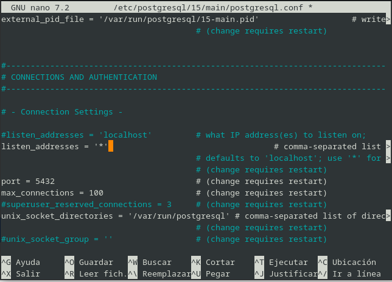
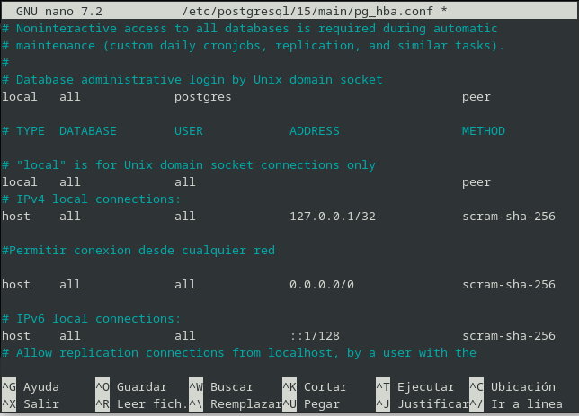
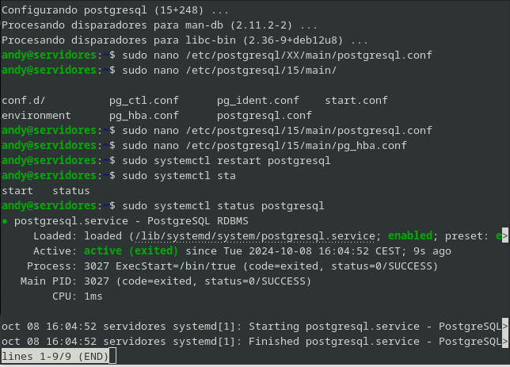

# Instalacion de servidor Postgres en Debian12

Para ello lo primero que haremos sera la creación de una maquina debian, sin entorno gráfico.

Una vez realizada procedermos a la instalación por comandos de dicho servidor:

# Instalación y configuracion de PostgreSQL

## 1. Instalar PostgreSQL

Para ello tendremos que meter los siguientes comandos:

Este coamndo que meteremos a continuación será para actualizar lo que sera el sistema:

```sudo apt update```

Este comando sera para la instalación de nuestro servidor:

```sudo apt install postgresql postgresql-contrib -y```


## 2. Configuracion para el acceso remoto

### Paso a:

Modificamso el archivo de configuración postgresql.conf para permitir conexiones desde la red local:

```sudo nano /etc/postgresql/15/main/postgresql.conf```

Tenemos que buscar la linea *listen_addresses* y le añadiremso la siguiente linea:

```listen_addresses = '*'```



### Paso b:

Ahora editamos el control de acceso *pg_hba.conf* para añadir permisos en nuetsra red local:

```sudo nano /etc/postgresql/15/main/pg_hba.conf```

En este caso en el fichero si indagamos un poco hacia abajo, lo que podemos ver es la siguiente linea:

```
# IPv4 local connections:
host    all             all             127.0.0.1/32            scram-sha-256
```

y yo en este caso voy a permitir la conexión desde cualquier red, ya que trabajamos tanto en clase, como en casa, asi que pondremos lo siguiente:

```

# Permitir conexiones desde cualquier red
host    all             all             0.0.0.0/0               scram-sha-256
```

Con lo que quedaria asi:



### Paso c:

Reiniciamos el servicio PostgreSQL:

```sudo systemctl restart postgresql```

y una vez reiniciado vemos su estado con el comando:

```sudo systemctl status postgresql```



