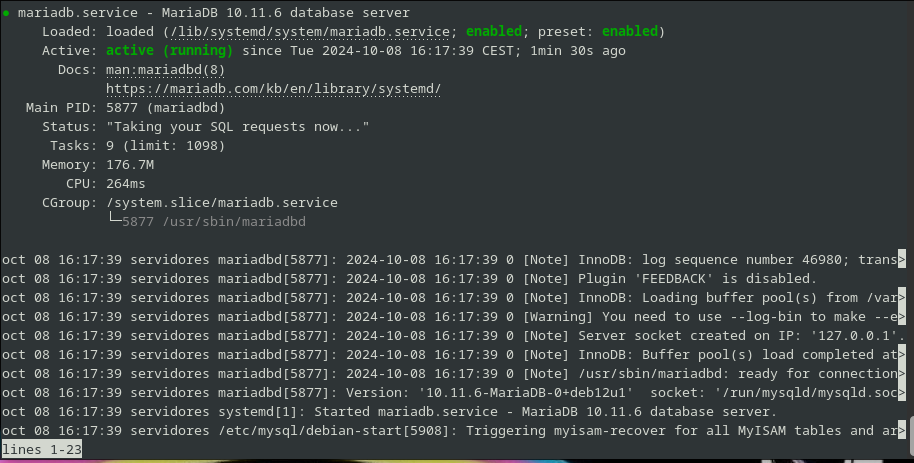
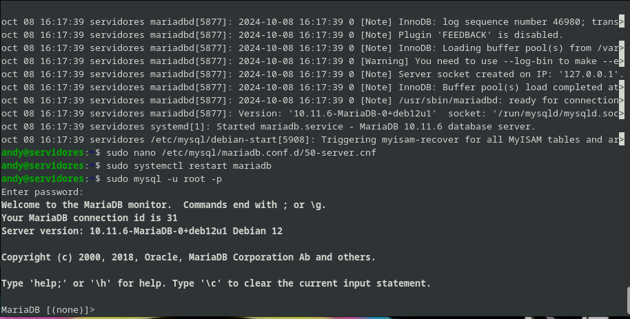
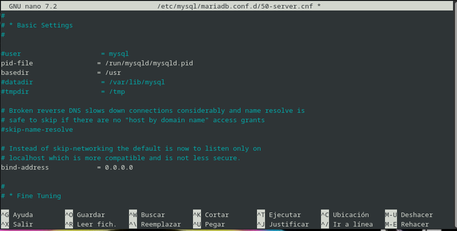

# Instalacion de servidor mysql en Debian12

Para ello lo primero que haremos sera la creación de una maquina debian, sin entorno gráfico.

Una vez realizada procedermos a la instalación por comandos de dicho servidor:

# Instalación y configuracion de PostgreSQL

## 1. Instalar PostgreSQL

Para ello tendremos que meter los siguientes comandos:

Este coamndo que meteremos a continuación será para actualizar lo que sera el sistema:

```sudo apt update```

```sudo apt upgrade```

Este comando sera para la instalación de nuestro servidor:

```sudo apt install mariadb-server -y```

## 2. Iniciamos el servido de MariaDB

Despues de la instalación, iniciarmeos MariaDB y euq este sea habilitado para que se inicie de manera *automatica*:

``` 
sudo systemctl start mariadb
sudo systemctl enable mariadb
```



## 3. Acceder a la consola de MariaDB

Cuando ya hemos instaldo podemos entrar a lo que sera la consola de MariaDB con el siguiente comando:

```sudo mysql -u root -p```



## 4. Configuracion para el acceso remoto

### Paso a:

Modificamso el archivo de configuración postgresql.conf para permitir conexiones desde la red local:

```sudo nano /etc/mysql/mariadb.conf.d/50-server.cnf```

Tenemos que buscar la linea *bind-address* y le añadiremso la siguiente linea:

```blind-address = 0.0.0.0```




### Paso b:

Reiniciamos el servicio MariaDB:

```sudo systemctl restart mariadb```

### Paso c:

Crear un usuario para el acceso remoto, tendremos que acceder a la consola de MariaDB y crear un usuario como acceso remoto.

```
CREATE USER 'andy'@'%' IDENTIFIED BY 'usuario';
GRANT ALL PRIVILEGES ON *.* TO 'andy'@'%' WITH GRANT OPTION;
FLUSH PRIVILEGES;


```

