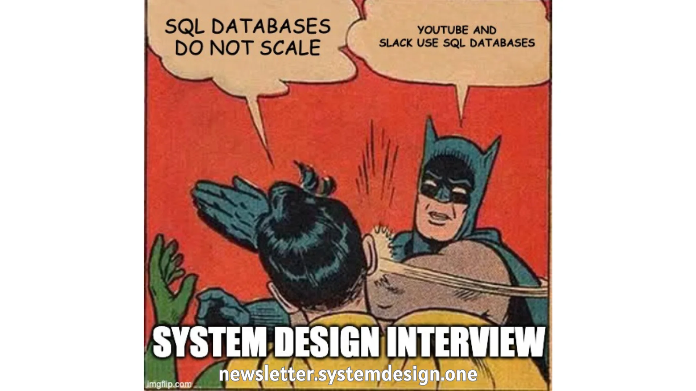
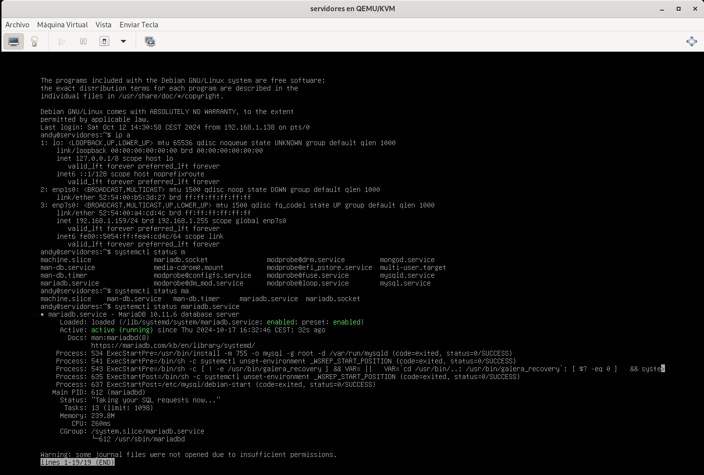
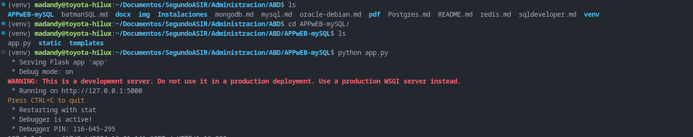
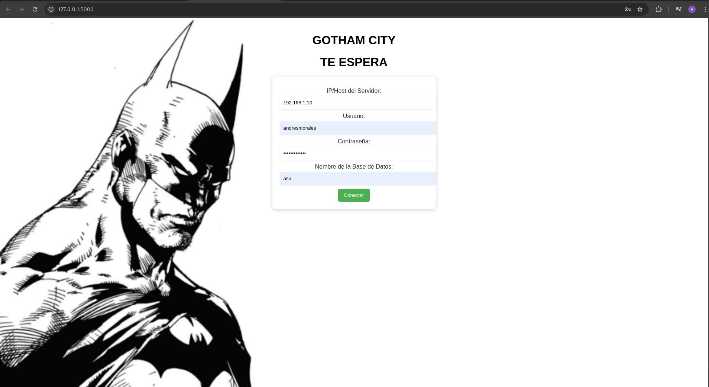
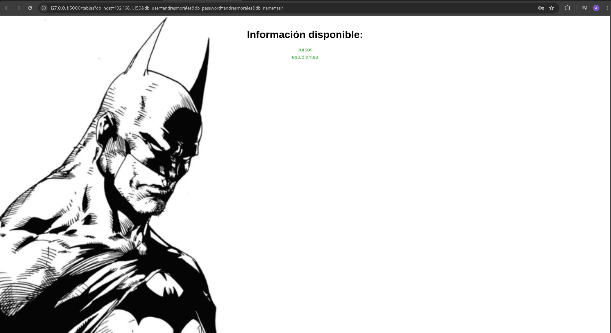
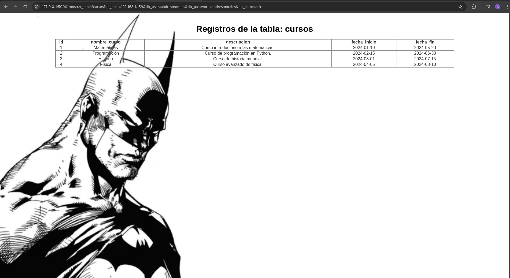

# Vistas de aplicación web de mySQL

## Autor :computer:
* Andrés Morales González
* :school:I.E.S. Gonzalo Nazareno :round_pushpin:(Dos Hermanas, Sevilla).

En este documento veremos como se ejecuta la app de mysql (mariadb):

En primer lugar lo que tendremos que hacer es ver que tenemos el servidor conectado:

Una vez comprobado que lo tenemos, lo que tendremos que hacer iniciar la app uqe realizamos:

Una vez arrancada la vista que nos mostrara será la siguiente:

Ya una vez dentro podemos observar que nos salen las tablas que tenemos:

Y si pinchamos en al guna de las dos tablas que vemos, estas nos mostrara la información:

