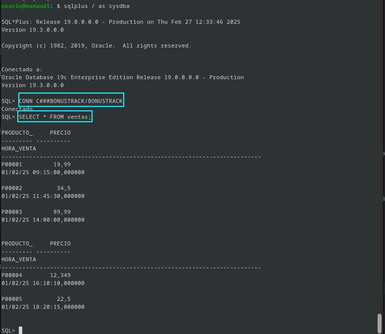

# Movimiento de datos

## Introducción 

Los sistemas de gestión de bases de datos (SGBD) permiten almacenar y administrar grandes volúmenes de datos de manera eficiente. Es crucial que los administradores conozcan las herramientas para importar y exportar datos, así como sus distintas opciones. 

En esta práctica, vamos a enfocaremos en la transferencia de datos entre bases de datos relacionales y las herramientas disponibles para ello.

Para esta práctica, hay que usar el usuario scott, pero en mi caso scott ha muerto por lo que en su lugar voy a usar a **Byron**, el cual tiene las mismas cosas que Scott, por lo que usare a Byron para realizar las operaciones tantos de exportación com de importación.

Aquí dejo el como conectarnos:

```sql
oracle@madand1:~$ sqlplus / as sysdba

SQL*Plus: Release 19.0.0.0.0 - Production on Tue Feb 25 17:14:42 2025
Version 19.3.0.0.0

Copyright (c) 1982, 2019, Oracle.  All rights reserved.


Conectado a:
Oracle Database 19c Enterprise Edition Release 19.0.0.0.0 - Production
Version 19.3.0.0.0

SQL> connect C###BYRON/BYRON
Conectado.

```

Y vemos sus tablas:

```sql
SQL> SELECT TABLE_NAME FROM ALL_TABLES WHERE OWNER = 'C###BYRON';

TABLE_NAME
--------------------------------------------------------------------------------
DEPT
EMP
SALGRADE
BONUS
DEPT_VIEW
EMP_VIEW

6 filas seleccionadas.
```
Una vez que tenemos esto, podemos seguir con la finalidad de dicha práctica.

---
## Ejercicio 1

### Realiza una exportación del esquema de C###BYRON usando Oracle Data Pump con las siguientes condiciones:
#### • Exporta tanto la estructura de las tablas como los datos de las mismas.
#### • Excluye la tabla BONUS y los departamentos con menos de dos empleados.
#### • Realiza una estimación previa del tamaño necesario para el fichero de exportación.
#### • Programa la operación para dentro de 2 minutos.
#### • Genera un archivo de log en el directorio raíz.

Antes de poder realizar una exportación, lo que debemos de hacer es concederle al dueño de la bade de datos los permisos pertinentes para dicha exportación.

Por lo que para esta exportación, lo que debo de hacer es crear un directorio donde se almacenarán los archivos de exportación.


Ahora una vez creado lo que tenemos que hacer es ponerlo para que nuestro usuario `oracle` pueda acceder a este directorio que acabamos de crear.

` chown oracle:oinstall /opt/oracle/export`


AHora lo que tenemos que hacer e sconectarnos aa la base de datos y crerar lo que será el directorio en el que se van a almacenar todos los archivos de la exportación, a este le vamos a asiganr todo los permisos para que se puedan acceder a él.

Por lo que quedaría así:

```sql
CREATE DIRECTORY EXPORT_DB AS '/opt/oracle/export/';
GRANT READ, WRITE ON DIRECTORY EXPORT_DB TO C###BYRON;
```


AHora lo que haremos sera otorgarle permisos al usuario `C###BYRON` de que puedan exportar los datos.

```sql
GRANT DATAPUMP_EXP_FULL_DATABASE TO C###BYRON;
```


Ahora lo que deberia de pasar es esportar lo que es todo de `C###BYRON` usando lo que sería Oracle Data Pump con todo lo que ha dicho el en el enunciadO por lo que vamos a usar el siguiente comando, obviamente esto se hara desde la terminal de Oracle:


```bash 
    expdp C###BYRON/BYRON DIRECTORY=EXPORT_DB SCHEMAS=C###BYRON EXCLUDE=TABLE:\"=\'BONUS\'\"  QUERY=dept:'"WHERE deptno IN \(SELECT deptno FROM EMP GROUP BY deptno HAVING COUNT\(*\)>2\)"'
```

Donde:

- `C###BYRON/BYRON`: Son las credenciales
- `DIRECTORY=EXPORT_DB`: Directorio donde debe apuntar a la ubicación en el sistema de archivos donde el usuario pueda escribir los archivos exportados.
- `SCHEMAS=C###BYRON`: Especifivo que voy a aexportar.
- `EXCLUDE=TABLE:\"=\'BONUS\'\":`estp es que estoy exluyendo lo la tabla bonus de esta exportación, por la condición del enunciado.
- `QUERY`: Es la clausula para filtrar los datos de la tabla `DEPT`.

Si lo vemos por pantalla, veriamos lo siguiente:


Lo que no hice fue la condicion de que la exportación sea tra cierto tiempo en este caso 2 minutos, pero eso tiene cierto arreglo, ya que se podríamos hacerlo modificando lo que pusimos, o bien a través de un script, pero yo os voy a dejar lo que es el comando:

```bash

sleep 120 && rm -f /opt/oracle/export/expdat.dmp && expdp C###BYRON/BYRON DIRECTORY=EXPORT_DB SCHEMAS=C###BYRON EXCLUDE=TABLE:\"=\'BONUS\'\"  QUERY=dept:'"WHERE deptno IN \(SELECT deptno FROM EMP GROUP BY deptno HAVING COUNT\(*\)>2\)"'
```

Donde:

- `sleep 120`: Es la suma de todos los segundos de dos minutos, si quisieramos tardar 5 min seria sleep 300.


POr lo que voy a demostarr que se puede por timepo, ya que si hacemos de nuevo la exportación esta se va a sobreescribir, por lo que os dejo por aqui la demostración, pero tenemos uno que es el mismo nomre, podriamos borrarlo antes:


---
## Ejercicio 2

### Importa el fichero obtenido anteriormente usando Oracle Data Pump pero en un usuario distinto de la misma base de datos.

Para hacer realidad la importación, lo que debemos de hacer es darle permisos de lectura y escritura al usuario al que vamos a improatr la base de datos, al directorio donde se almacenán los archivos de importación.

Nuestro conejillo de indias será `C###ZEUS`, este tiene esta contraseña:

```sql
CREATE USER C###ZEUS IDENTIFIED BY ZEUS;

```

Por lo que lo acabamos de crear, y este esta vacío, por lo que muestro por pantalla que no tiene nada:


Ahora como estamos como `SYSDBA` vamos como dije antes a darle permisos de lectura y escritura a `C###ZEUS`, y permisos para la importación.

```sql
GRANT READ, WRITE ON DIRECTORY EXPORT_DB TO C###ZEUS;
GRANT IMP_FULL_DATABASE TO C###ZEUS;
```


Y ahoa lo qu ehacenos es importar la base de datos, que anteriormente exportamos, al igual que antes lo debemos de hacer en el usuario oracle.


```bash
impdp C###ZEUS/ZEUS schemas=C###BYRONdirectory=EXPORT_DB dumpfile=expdat.dmp logfile=impdat.log table_exists_action=replace
```

Antes de ejecutar esto, lo que he tenido que hacer es otorgar permisos correctos a lo que es el fichero `expdat.dmp`, por lo que ejecute esto:

```bash
chmod 644 /opt/oracle/export/expdat.dmp
```
Y luego ejecute esto, para verificar los permisos:

```bash
ls -l /opt/oracle/export/expdat.dmp
```
Y ahora si a ejecutar:


COmo podemos ver ha ido de locos, y se realizo correctamente, pero ahora vamos una vez hecho esto, lo que voy a hacer es entrar como `C###ZEUS`, y hacer unas consultas.


Para comprobar que se hizo todo correcto podemos ver los logs que se han hecho, que son los de exportación como los de importación:

- Logs de importación:

```bash
oracle@madand1:/opt/oracle/export$ cat impdat.log 
;;; 
Import: Release 19.0.0.0.0 - Production on Tue Feb 25 18:34:53 2025
Version 19.3.0.0.0

Copyright (c) 1982, 2019, Oracle and/or its affiliates.  All rights reserved.
;;; 
Connected to: Oracle Database 19c Enterprise Edition Release 19.0.0.0.0 - Production
La tabla maestra "C###ZEUS"."SYS_IMPORT_SCHEMA_01" se ha cargado/descargado correctamente
Iniciando "C###ZEUS"."SYS_IMPORT_SCHEMA_01":  C###ZEUS/******** schemas=C###BYRON directory=EXPORT_DB dumpfile=expdat.dmp logfile=impdat.log table_exists_action=replace 
Procesando el tipo de objeto SCHEMA_EXPORT/SYSTEM_GRANT
Procesando el tipo de objeto SCHEMA_EXPORT/ROLE_GRANT
Procesando el tipo de objeto SCHEMA_EXPORT/DEFAULT_ROLE
Procesando el tipo de objeto SCHEMA_EXPORT/TABLESPACE_QUOTA
Procesando el tipo de objeto SCHEMA_EXPORT/PRE_SCHEMA/PROCACT_SCHEMA
Procesando el tipo de objeto SCHEMA_EXPORT/TABLE/TABLE
Procesando el tipo de objeto SCHEMA_EXPORT/TABLE/TABLE_DATA
. . "C###BYRON"."DEPT"                          6.007 KB       3 filas importadas
. . "C###BYRON"."DEPT_VIEW"                         0 KB       0 filas importadas
. . "C###BYRON"."EMP"                           8.781 KB      14 filas importadas
. . "C###BYRON"."EMP_VIEW"                          0 KB       0 filas importadas
. . "C###BYRON"."SALGRADE"                      6.101 KB       5 filas importadas
Procesando el tipo de objeto SCHEMA_EXPORT/TABLE/CONSTRAINT/CONSTRAINT
Procesando el tipo de objeto SCHEMA_EXPORT/TABLE/INDEX/STATISTICS/INDEX_STATISTICS
Procesando el tipo de objeto SCHEMA_EXPORT/TABLE/CONSTRAINT/REF_CONSTRAINT
Procesando el tipo de objeto SCHEMA_EXPORT/TABLE/STATISTICS/TABLE_STATISTICS
Procesando el tipo de objeto SCHEMA_EXPORT/STATISTICS/MARKER
El trabajo "C###ZEUS"."SYS_IMPORT_SCHEMA_01" ha terminado correctamente en Mar Feb 25 18:35:03 2025 elapsed 0 00:00:09
```

- Logs de exportación:

```bash
oracle@madand1:/opt/oracle/export$ cat export.log 
;;; 
Export: Release 19.0.0.0.0 - Production on Tue Feb 25 18:05:32 2025
Version 19.3.0.0.0

Copyright (c) 1982, 2019, Oracle and/or its affiliates.  All rights reserved.
;;; 
Connected to: Oracle Database 19c Enterprise Edition Release 19.0.0.0.0 - Production
Iniciando "C###BYRON"."SYS_EXPORT_SCHEMA_01":  C###BYRON/******** DIRECTORY=EXPORT_DB SCHEMAS=C###BYRON EXCLUDE=TABLE:"='BONUS'" QUERY=dept:"WHERE deptno IN \(SELECT deptno FROM EMP GROUP BY deptno HAVING COUNT\(*\)>2\)" 
Procesando el tipo de objeto SCHEMA_EXPORT/TABLE/TABLE_DATA
Procesando el tipo de objeto SCHEMA_EXPORT/TABLE/INDEX/STATISTICS/INDEX_STATISTICS
Procesando el tipo de objeto SCHEMA_EXPORT/TABLE/STATISTICS/TABLE_STATISTICS
Procesando el tipo de objeto SCHEMA_EXPORT/STATISTICS/MARKER
Procesando el tipo de objeto SCHEMA_EXPORT/SYSTEM_GRANT
Procesando el tipo de objeto SCHEMA_EXPORT/ROLE_GRANT
Procesando el tipo de objeto SCHEMA_EXPORT/DEFAULT_ROLE
Procesando el tipo de objeto SCHEMA_EXPORT/TABLESPACE_QUOTA
Procesando el tipo de objeto SCHEMA_EXPORT/PRE_SCHEMA/PROCACT_SCHEMA
Procesando el tipo de objeto SCHEMA_EXPORT/TABLE/TABLE
Procesando el tipo de objeto SCHEMA_EXPORT/TABLE/COMMENT
Procesando el tipo de objeto SCHEMA_EXPORT/TABLE/INDEX/INDEX
Procesando el tipo de objeto SCHEMA_EXPORT/TABLE/CONSTRAINT/CONSTRAINT
Procesando el tipo de objeto SCHEMA_EXPORT/TABLE/CONSTRAINT/REF_CONSTRAINT
. . "C###BYRON"."DEPT"                          6.007 KB       3 filas exportadas
. . "C###BYRON"."DEPT_VIEW"                         0 KB       0 filas exportadas
. . "C###BYRON"."EMP"                           8.781 KB      14 filas exportadas
. . "C###BYRON"."EMP_VIEW"                          0 KB       0 filas exportadas
. . "C###BYRON"."SALGRADE"                      6.101 KB       5 filas exportadas
La tabla maestra "C###BYRON"."SYS_EXPORT_SCHEMA_01" se ha cargado/descargado correctamente
******************************************************************************
El juego de archivos de volcado para C###BYRON.SYS_EXPORT_SCHEMA_01 es:
  /opt/oracle/export/expdat.dmp
El trabajo "C###BYRON"."SYS_EXPORT_SCHEMA_01" ha terminado correctamente en Mar Feb 25 18:05:53 2025 elapsed 0 00:00:20
```
Como no quiero tener que poner `C###BYRON` delante de los objetos loq ue he hecho ha sido lo siguinete:

```bash 
impdp C###ZEUS/ZEUS schemas=C###BYRON directory=EXPORT_DB dumpfile=expdat.dmp logfile=impdat.log table_exists_action=replace remap_schema=C###BYRON:C###ZEUS
```

Que lo que hace es sustituir el esquema `C###BYRON` por `C###ZEUS`, aqui lo demuestro:


Y si hacemos la consulta, y comporbamos esto que estoy diciendo:


---

## Ejercicio 3
###  Realiza una exportación de la estructura de todas las tablas de la base de datos usando el comando expdp de Oracle Data Pump probando al menos cinco de las posibles opciones que ofrece dicho comando y documentándolas adecuadamente.

En este ejercicio lo que nos pide es una exportación completa, por lo que voy a proceder a realizarlo hacinedolo de la sigueinte manera:

```bash 
expdp C###BYRON/BYRON schemas=De-donde-sale dumpfile=nombre.dmp logfile=nombre.log directory=variable-entorno CONTENT=contenido-espectacular
```

Donde:

- `C###BYRON/BYRON`: Especifica las credenciales para la conexión (usuario/contraseña) de la base de datos a la que se va a acceder.
- `schemas=De-donde-sale`: Especifica el esquema de la base de datos que se va a exportar.
- `dumpfile=nombre.dmp`: Especifica el nombre del fichero de exportación.
- `logfile=nombre.log`: Especifica el nombre del fichero de log.
- `directory=variable-entorno`: Especifica el directorio donde se almacenarán los archivos de exportación.
- `content=ALL`: Especifica el contenido que se va a exportar.
  - Hay opciones, las cuales las voy a exponer y explicar.
    - `ALL`: Exporta todo el contenido (tablas, vistas, índices, etc.) del esquema.
    - `DATA_ONLY`: Exporta solo los datos de las tablas.
    - `METADATA_ONLY`: Exporta solo la estructura (definición de tablas, vistas, índices, etc.), sin los datos.
    - `NONE`: No exporta nada.


```bash
expdp C###BYRON/BYRON schemas=C###BYRON dumpfile=byronfullequip.dmp logfile=byronfullequip.log directory=EXPORT_DB CONTENT=METADATA_ONLY
```


## Ejercicio 4

### Intenta realizar operaciones similares de importación y exportación con las herramientas proporcionadas con MySQL desde línea de comandos, documentando el proceso.

En esta ocasión lo que voy a hacer es crear una base de datos con los datos anteriores, esta pase de datos se va a llamar byron, y voy a meter las tablas y datos que necesitamos, por lo que dejo por aquí dichos datos 

- Creación de base de datos que vamos a exportar:


- Inserción de tablas y datos.

 

 

 


Una vez hecho esto, lo que tenemos que hacer es lo siguiente, que será hacer una exportación de la base de datos, por lo que vamos a usar el siguiente comando, desde la terminal fuera de la consola de MariaDB, y es el siguiente comando:

`sudo mysqldump -u root byron > byronexport.sql`

Donde: 

- `mysqldump` → Es la herramienta que se usa para hacer copias de seguridad (exportaciones) de bases de datos en MySQL.
- `-u root` → Indica que el usuario que ejecuta el comando es root (el administrador de MySQL).
- `byron` → Es el nombre de la base de datos que quieres exportar.
- `> byronexport.sql` → Guarda el contenido exportado en un archivo llamado byronexport.sql.

Esto es para este caso en concreto, pero dejo por aqui el caso generico por si nos hiciera falta:

`mysqldump -u [usuario] -p [nombre_base_datos] > [archivo_salida.sql]`

Una vez dicho esto, lo que tendremos que hacer es ejecutarlo y ver si se hizo lo que es el fichero:


Y como podemos observar esta todo listo y perfecto, ya tenemos la exportación realizada, ahora procederemos con la importación, por lo que voy a hacer una base de datos virgen, en este caso se va a llamar zeus, dejo por aquí su creación:


Y ahora procedemos a la importación por lo que esta vez, usaremos lo que es el comando para la exportación pero con unos pequeños ajustes, el cual lo dejare por aquí:

`sudo mysql -u root zeus < byronexport.sql`

Donde:

- `mysql` → Se usa para importar datos.
- `-u root` → Se ejecuta como el usuario root.
- `zeus` → Es la base de datos donde se restaurarán los datos.
- `< byronexport.sql` → Importa el contenido del archivo SQL a la base de datos zeus.

Esto es para este caso en concreto, pero dejo por aqui el caso generico por si nos hiciera falta:

`sudo mysql -u [usuario] -p [nombre_base_datos_que_queremos_importar] < [archivo_a_importar.sql]`

Y ahora comprobamos por pantalla lo siguiente que nos ha dado y nos metemos dentro y hacemos ciertas comprobaciones:


---

## Ejercicio 5

### Intenta realizar operaciones similares de importación y exportación con las herramientas proporcionadas con Postgres desde línea de comandos, documentando el proceso.

Para este ejercicio vamos a volver a usar lo que la base de datos de Scott, pero al igual que antes usaremos una base de datos llamada byron y otra llamazada zeus, por lo que vamos a crear primero las bases de datos:


Y como podemos ver ya tenemos todo listo en lo que será nuestra base de datos byron, para poder exportarla:


Ahora procedemos a exportar lo que es la base de datos, por lo que vamos a usar el siguinete comando:

`sudo -u postgres pg_dump byron > byronexportado.sql`

Donde:

- `sudo -u postgres` → Ejecuta el comando como el usuario postgres, que es el usuario administrador por defecto en PostgreSQL.
- `pg_dump byron` → Exporta la base de datos byron.
- `> byronexportado.sql` → Guarda la exportación en el archivo byronexportado.sql.

Y en terminos generales, el comando quedaria de la siguiente manera:


`sudo -u [nombre_del_usuario] pg_dump [base_de_datos_a_exportar] > [archivo_salida] `


Y como ya creamos con anterioridad la base de datos de zeus, la muestro para que se vea que esta vacía:


Ahora lo que vamos a proceder es a importar dicha base de datos, anteriormente la cual era `byronexportado.sql`, con el siguiente comando:

`sudo -u postgres psql -d zeus -f byronexportado.sql`

Donde:

- `sudo -u postgres` → Ejecuta el comando como el usuario postgres (usuario administrador de PostgreSQL).
- `psql` → Es la herramienta de línea de comandos para interactuar con PostgreSQL.
- `-d zeus` → Indica que la base de datos a la que se conectará es zeus.
- `-f byronexportado.sql` → Especifica el archivo SQL que se importará.

Y veremos lo siguiente por pantalla:


Y ahora nos metemos dentro y hacemos las comprobaciones para ver si se han hecho perfectamente:


---

## Ejercicio 6

### Exporta los documentos de una colección de MongoDB que cumplan una determinada condición e impórtalos en otra base de datos.

Para este ejercicio voy a crear en mi SGBD no relacional, una base de datos llamada `aprobare` y donde tendre una colección llaamda `articulos`, de los cuales solo vamos a exportar los documentos donde sean de tipo `Libros`.

Por lo que para exportar en mongo tendremos que usar el siguiente comando:

`mongoexport -u andy -p andy --authenticationDatabase admin --db aprobare --collection articulos --query "{\"tipo\":\"Libros\"}" --out exportacion-accesorios.json`

Donde: 

- `mongoexport`: Herramienta de línea de comandos utilizada para exportar datos desde MongoDB hacia un archivo (puede ser JSON o CSV)
- `-u andy`: Nombre de usuario que se usará para la autenticación en MongoDB
- `-p andy`: Contraseña del usuario andy.
- `--authenticationDatabase admin`: Define la base de datos que se utiliza para autenticar al usuario.
- `--db aprobare`: La base de datos en la que se encuentra la colección de la cual se exportarán los datos
- `--collection articulos`: Es el nombre de la colección de la cual se exportarán los datos.
- `--query "{\"tipo\":\"Libros\"}"`: Es el filtro en formato JSON
- `--out exportacion-accesorios.json`: Es el archivo donde se guardarán los datos exportados.

Por pantalla nos aparece lo siguiente:


Lo que acabamos de ver en la captura de arriba, es como ha codigo con el filtro que le pusimos el cual es Librosm y este lo qu eha hecho es pasarlo al fichero con extension .json, y en el cual como se puede ver, estan almacenados, por lo que ahora con la exportación realizada, vamos a proceder a hacer la importación.

Como tengo de anteriores pruebas varias bases de datos, voy a meterlo en `pratcicamotos`, muestro en pantalla las colecciones que tengo:


Por lo que procedere a importar lo que es el json que hicimos con anterioridad.

`mongoimport -u andy -p andy --authenticationDatabase admin --db pratcicamotos --collection articulos --file exportacion-accesorios.json`

Donde:

- `mongoimport`: Es la herramienta utilizada para importar datos en MongoDB desde un archivo (JSON, CSV, TSV).
- `-u andy`: Identidad de nuetsro usuario.
- `-p andy`: Contraseña de nuetsro usuario.
- `--authenticationDatabase admin`: Especifica la base de datos para la autenticación. 
- `--db pratcicamotos`: Especifica la base de datos de destino donde se importarán los datos.
- `--collection articulos`: Especifica la colección en la que se van a importar los datos. 
- `--file exportacion-accesorios.json`: Define el archivo que se va a importar.
Como podemos ver por pantalla se han importado:


Pero para asegurarnos lo que vamos a hacer es entrar en la base de datos de `pratcicamotos` y ver las colecciones y ver que hay dentro:


---

## Ejercicio 7

### SQL*Loader es una herramienta que sirve para cargar grandes volúmenes de datos en una instancia de ORACLE. Exportad los datos de una base de datos completa desde MariaDB a texto plano con delimitadores y emplead SQL*Loader para realizar el proceso de carga de dichos datos a una instancia ORACLE. Debéis documentar todo el proceso, explicando los distintos ficheros de configuración y de log que tiene SQL*Loader.

Este ejercicio pide el SGBD MariaDB, yo haré tanto este como el SGBD Postgres, ya que me parecen ambos un poco diferentes según he visto en lo que va a la hora de la escritura de las bases, por lo que me voy a tomar el lujo de empezar por MariaDB, y acabar por Postgres.

#### - MariaDB


Por lo que voy a empezar con ello, dejaremos los pasos, por aquí, hares dos ejercicios, uno con decimales y otro sin decimales.

### Ejercicio 1

Ejercicio con decimales, como forofo del mundo del motor, lo que hare será una tabla de motos.

1. Entrar en nuestro sistema:

```bash
sudo mysql -u root 
```
2. Crear la base de datos en la que vamos a trabajar.

```sql
CREATE DATABASE motor_db;;
```
3. Usar dicha base y meter la tabla y sus inserciones:
```sql
use motor_db;

CREATE TABLE motos (
    modelo VARCHAR(50),           
    precio DECIMAL(10, 2),       
    fecha_fabricacion DATE        
);

-- Insertar algunos registros de ejemplo
INSERT INTO motos (modelo, precio, fecha_fabricacion) VALUES
('Harley Davidson Sportster', 8999.99, '2022-05-15'),
('Yamaha YZF-R3', 4999.50, '2021-08-10'),
('Kawasaki Ninja 400', 5799.99, '2022-03-22'),
('BMW S1000RR', 18999.99, '2023-01-30');
```

4. Ahora lo que hacemos es lo siguiente en forma de consulta:

```sql
SELECT * 
INTO OUTFILE '/tmp/motos.csv' 
FIELDS TERMINATED BY ';' 
ENCLOSED BY '"' 
LINES TERMINATED BY '\n'
FROM motos;
```
Donde:

- `SELECT *` → Selecciona todos los registros de la tabla motos.
- `INTO OUTFILE '/tmp/motos.csv'` → Guarda los resultados en /tmp/motos.csv.
- `FIELDS TERMINATED BY ';'` → Separa los valores con ;.
- `ENCLOSED BY '"'` → Encierra los valores entre " para manejar espacios o caracteres especiales.
- `LINES TERMINATED BY '\n'` → Cada fila termina con un salto de línea.
- `FROM motos;` → Especifica la tabla motos como fuente de los datos.

También he usado esto, ya que en Mariadb, no puedo usar funciones por lo que hay que meterlo a mano, y hacerlo con una consulta me ha resultado mucho más sencillo que hacerlo a través de un script.

Y comprobamos que esta en el directorio:


Ahora nos lo pasamos a nuestro SGBD Oracle, a través de SCP.


Y ahora si que si entramos en juego en SGBD Oracle.

Vamos a usar el mismo usuario `C###LOKI`.

Por lo que ahroa vamos a crear la tabla:

```sql
CREATE TABLE motos (
    modelo VARCHAR2(50),          
    precio NUMBER(10, 2),         
    fecha_fabricacion DATE       
);
```

Luego de esto tendremos que hacer el fichero `.ctl`, que quedaria asi:

```bash

oracle@madand1:~$ cat motos.ctl 
LOAD DATA
INFILE '/home/oracle/motos.csv'
INTO TABLE motos
FIELDS TERMINATED BY ';'
OPTIONALLY ENCLOSED BY '"'
TRAILING NULLCOLS
(
    modelo,
    precio DECIMAL EXTERNAL,
    fecha_fabricacion DATE "YYYY-MM-DD"
)
```
Donde:

- `FIELDS TERMINATED BY ';'` → Los valores están separados por ;.
- `OPTIONALLY ENCLOSED BY '"'` → Los valores pueden estar entre " (opcionalmente).
- `TRAILING NULLCOLS` → Si un campo está vacío en el archivo, se inserta como NULL.
- `precio DECIMAL EXTERNAL` → Convierte el valor de precio desde texto a decimal.
- `fecha_fabricacion DATE "YYYY-MM-DD"` → Interpreta las fechas en formato "YYYY-MM-DD".

Si lo cargamos tal como esta el .csv, este dará fallo, por lo que tendremos que cambiar los puntos pos la comas, y entonces saldra bien.


Y si entramos veremos como esta todo ready to fitgh.


Y con esto ya estaria.


### Ejercicio 2

Para este ejercicio voy a crear una tabla de empleados, basandome en la de Scott, y sin decimales.

Estos pasos los voy a hacer en el **SGBD relacional MariaDB**.

1. Entrar en nuestro sistema:

```bash
sudo mysql -u root 
```
2. Crear la base de datos en la que vamos a trabajar.

```sql
CREATE DATABASE empresa;
```
3. Usar dicha base y meter la tabla y sus inserciones:
```sql
use empresa;

CREATE TABLE empleados (
    nombre VARCHAR(100),
    edad INT,
    fecha_ingreso DATE
);

-- Insertar algunos registros de ejemplo
INSERT INTO empleados (nombre, edad, fecha_ingreso) VALUES 
('Carlos Pérez', 30, '2022-06-15'),
('Ana Gómez', 25, '2021-04-10'),
('Luis Rodríguez', 40, '2019-09-23');
```

4. Ahora lo que hacemos es lo siguiente en forma de consulta:

```sql
SELECT * 
INTO OUTFILE '/tmp/empleados.csv'
FIELDS TERMINATED BY ';'
ENCLOSED BY '"'
LINES TERMINATED BY '\n'
FROM empleados;
```
Donde:

- `SELECT *` → Selecciona todos los registros de la tabla empleados.
- `INTO OUTFILE '/tmp/empleados.csv'` → Guarda los resultados en /tmp/empleados.csv.
- `FIELDS TERMINATED BY ';'` → Separa los valores con ;.
- `ENCLOSED BY '"'` → Encierra los valores entre " para manejar espacios o caracteres especiales.
- `LINES TERMINATED BY '\n'` → Cada fila termina con un salto de línea.
- `FROM empleados;` → Especifica la tabla empleados como fuente de los datos.


Luego lo que hacemos es pasarlo a nuestro SGBD Oracle, por lo que nos basaremos en el comando scp.


Ahora nos vamos a nuetsro **SGBD Oracle**, y hacemos lo siguiente:

1. Crear el usuario y la tabla donde lo vamos a alojar.

```sql
sqlplus / as sysdba
STARTUP;

--Creacion de usuario y sus permisos

CREATE USER C###LOKI IDENTIFIED BY LOKI;
GRANT CONNECT, RESOURCE TO C###LOKI;
GRANT UNLIMITED TABLESPACE TO C###LOKI;
ALTER USER C###LOKI QUOTA UNLIMITED ON USERS;

-- Creacion de tabla mi rey.

CREATE TABLE empleados_oracle (
    nombre VARCHAR2(100),
    edad NUMBER(3),
    fecha_ingreso DATE
);
```

Nos desconectamos y vemos donde nos pasamos, de normal en el siguiente directorio `/home/oracle`, cuando nos pasemos el archivo con extensión `.csv`, tendremos que hacer en fichero de control, el cual es extensión `.ctl`.

El cual tendra el siguiente formato:

```bash
LOAD DATA
INFILE '/tmp/empleados.csv' //Donde se encuentre el fichero .csv
INTO TABLE empleados_oracle // a donde va dirigido.

FIELDS TERMINATED BY ';'
OPTIONALLY ENCLOSED BY '"'
TRAILING NULLCOLS
(
    nombre,
    edad,
    fecha_ingreso DATE "YYYY-MM-DD"
)
```

Y luego de esto lo que tenemos que hacer es cargar los datos, por lo que al igual que con postgres, lo que haremos será el uso del siguiente comando:

```bash
sqlldr C###LOKI/LOKI control=/home/oracle/nuevos_empleados.ctl log=/home/oracle/nuevos_empleados.log
```

- El fichero .ctl tiene ese nombre, porque tenia otro con el mismo nombre.

Y con esto funconaria, si da algún problema es que estará apagado Oracle, por lo que entrais como `SYSDBA` e iniciais la base de dtoas, y volveis a crear la tabla en el usuario.

Y ya estaria.

## Bonustrack

#### - PostgreSQL

Para este ejercicio voy a utiliza la base de datos llamada **byron** que la tenemos en nuestro SGBD PostgreSQL.

¿Que vamos a hacer con esos datos?

Pues los vamos a exportar a un fichero `csv`, y luego lo importare a nuestra base de datos Oracle.

Por lo que a continuación vooy a dejar la función de exportación a CSV.

- Función de exportado a CSV.

Esta función que estoy a punto de dejar a continuación, nos va a permitir exportar a un fichero CSV, los datos de dicha base de datos.

```sql
CREATE OR REPLACE FUNCTION export_csv(name_tab TEXT, ruta TEXT)
    RETURNS VOID AS $$
    DECLARE
        name_tab TEXT;
    BEGIN
        FOR name_tab IN
            SELECT table_name
            FROM information_schema.tables
            WHERE table_schema = 'public'
            AND table_type = 'BASE TABLE'
        LOOP
            EXECUTE format (
                'COPY %I TO %L WITH (FORMAT CSV, DELIMITER '','', HEADER TRUE)', name_tab, ruta || name_tab || '.csv'
            );
        END LOOP;
    END;
    $$ LANGUAGE plpgsql;
```

Esta función es genérica, por lo que nos va a valer para **TODAS** las bases de datos, ya que la función la tendremos que ejecutar con el siguiente comando, indicando el nombre de la base de datos, y la ruta donde la queremos.

He usado una función en POstgres, ya que **SI SE PUEDE**, hacer lo que es un función, por lo que hice estam, ahora bien, tanto en esto como en MariaDB se puede cambair el delimitador.

```sql
SELECT export_csv('byron', '/home/andy/' );
```

Todo esto que acabo de hacer lo tendriamos que hacer desde la base de datos que queramos realizar, me refiero, que en mi caso es `byron`, pues entonces tendrás que entar de la siguiente manera:

```bash
andy@postgreSQL:~$ sudo -u postgres psql -d byron
[sudo] contraseña para andy: 
psql (15.9 (Debian 15.9-0+deb12u1))
Digite «help» para obtener ayuda.

byron=# 
```
Una vez dentro confirmo que esten dichas tablas:

```sql
byron=# \dt
         Listado de relaciones
 Esquema |  Nombre  | Tipo  |  Dueño   
---------+----------+-------+----------
 public  | bonus    | tabla | postgres
 public  | dept     | tabla | postgres
 public  | emp      | tabla | postgres
 public  | salgrade | tabla | postgres
(4 filas)
```
Una vez confirmado esto procedemos a meter la función anteriormente escrita:


Como podemos ver se creo sin ningún tipo de problemas, por lo que ahora procederemos a realizar la exportación, para ello como comentamos anteriormente haremos uso de la función:

```sql
andy@postgreSQL:~$ sudo -u postgres psql -d byron
psql (15.9 (Debian 15.9-0+deb12u1))
Digite «help» para obtener ayuda.

byron=# SELECT export_csv('byron', '/home/andy/' );
 export_csv 
------------
 
(1 fila)
```
Con esto ya estaría ready, pero me dío un fallo el cual dejo comentado en este [script](./fallo.md) para no ensuciar el documento.

Una vez realizado todo esto, vamos a comprobar que si que se han exportado, por lo que tenemos que echar un vistazo al directorio donde se creo:


Como podemos observar se exportaron las cuatro tablas, a fichero `csv`, por lo que ahora tendremos que pasarlo a nuestra máquina donde tenemos se servidor de Oracle, por lo que hare uso de **scp**.


Una vez pasado lo que hacemos es comprobar que estan en el directorio `/home/oracle/`:


Una vez hecho esto vamos a proceder a crear lo que son fichero de control, en los cual voy a definir lo siguinete:

- `Archivo de datos` el cual se va a importar.
- `Formato de los datos`.
- `La tabla de destino en Oracle`
- `Las columnas y su mapeo`: En la tabla de Oracle


Por lo que cada tabla va a tener un **fichero de control**, como he pasado las 4 tablas vamos a importar las 4.

- Fichero de control para DEPT.

```sql
OPTIONS (SKIP=1)
LOAD DATA
INFILE '/home/oracle/dept.csv'
APPEND
INTO TABLE dept
FIELDS TERMINATED BY ',' OPTIONALLY ENCLOSED BY '"'
TRAILING NULLCOLS
(deptno, dname, loc)
```

Donde:

- `OPTIONS (SKIP=1)`: Con esto indicams que se omite la primera fila del archivo CSV.
- `LOAD DATA`: Inicia la carga de datos con SQL*Loader.
- `INFILE '/home/oracle/dept.csv'`: Escpecifco el archivo CSV.
- `APPEND`: Agrega los datos sin borrar los existentes.
- `INTO TABLE dept`: Especificamos la tabla de destino en Oracle.
- `FIELDS TERMINATED BY ',' OPTIONALLY ENCLOSED BY '"'`: Indicamos que los campos estan sperados por comas.
- `TRAILING NULLCOLS`: Si alguna columna esta vacia se rellena con NULL.
- `(deptno, dname, loc)`: Definimos las comunas de destino en la tabla dept.


Esta ultima opción lo vemos con un cat, aquí lo dejo:

```bash
oracle@madand1:~$ cat dept.csv 
deptno,dname,loc
10,ACCOUNTING,NEW YORK
20,RESEARCH,DALLAS
30,SALES,CHICAGO
40,OPERATIONS,BOSTON
```

- Fichero de control para EMP.

```sql
OPTIONS (SKIP=1)
LOAD DATA
INFILE '/home/oracle/emp.csv'
APPEND
INTO TABLE emp
FIELDS TERMINATED BY ',' OPTIONALLY ENCLOSED BY '"'
TRAILING NULLCOLS
(
    EMPNO,
    ENAME,
    JOB,
    MGR NULLIF MGR=BLANKS, -- Esto es por si esta vacío que me lo ponag como NULL
    HIREDATE DATE "YYYY-MM-DD",
    SAL DECIMAL EXTERNAL,
    COMM DECIMAL EXTERNAL NULLIF MGR=BLANKS, -- Esto es por si esta vacío que me lo ponag como NULL
    DEPTNO
)

```

- Ficjhero de control para BONUS.

```sql
OPTIONS (SKIP=1)
LOAD DATA
INFILE '/home/oracle/bonus.csv'
APPEND
INTO TABLE bonus
FIELDS TERMINATED BY ',' OPTIONALLY ENCLOSED BY '"'
TRAILING NULLCOLS
(
  EMPNO INTEGER, -- Aseguro con esto que sean numeros entero de empleados.
  BONUS DECIMAL EXTERNAL --Permite cargar los valores.
)
```

- Fichero de control Salgrade.

```sql
OPTIONS (SKIP=1)
LOAD DATA
INFILE '/home/oracle/salgrade.csv'
APPEND
INTO TABLE salgrade
FIELDS TERMINATED BY ',' OPTIONALLY ENCLOSED BY '"'
(
  GRADE    INTEGER,
  LOSAL    DECIMAL EXTERNAL,
  HISAL    DECIMAL EXTERNAL
)
```

Ahora que los tenemos hecho, lo dejo para que lo podais, ver:


 


Ahora una vez hecho esto lo que voy a hacer es coger e importarlo a lo Oracle, por lo que crearemos un nuevo usuario para poder importar estos datos.

Este usuario se va llamar C###ODIN/ODIN


Una vez creado lo que tenemos que hacer es crear las tablas en el usuario `C###ODIN`,


Ahora que tenemos las tablas listas, lo que hacemos es salirnos, de oracle, y ponernos en la terminal,  y lo que vamos a hacer es importar los datos.

`sqlldr C###ODIN/ODIN control=/home/oracle/dept.ctl log=/home/oracle/dept.log`


`sqlldr C###ODIN/ODIN control=/home/oracle/emp.ctl log=/home/oracle/emp.log`


Estas dos tablas, han tenido exito, pero las dos siguientes no:


`sqlldr C###ODIN/ODIN control=/home/oracle/bonus.ctl log=/home/oracle/bonus.log`


`sqlldr C###ODIN/ODIN control=/home/oracle/salgrade.ctl log=/home/oracle/salgrade.log`


Por lo que vamos a mirar los logs:


Esto esta ocurriendo porque la columan `GRADE` esta definida con un tipo de dato con mnor precidion de la necesaria, es decir que hay que cambiar los valores para que acept los valos que tenemos en los CSV.

Por lo que ahora iremos con las comprobaciones de que se importaron bien las demás, por agilizar esta práctcia.


Y como podemos observar se ha importado todo perfectamente.

---

Como me di cuenta tarde, de que los decimales, son distintos en lo que va de los SGBD Oracle con respecto MariaDB, y PostgreSQL, he decidido hacer tambien dos ejemplos, aunque el primero que hice puede que sobre, ya que no tiene decimales, pero si que me parece algo bueno de ver, que son los delimitadores, en mi caso uso (,).

Por lo que aqui dejo lo siguiente:

### Ejercicio 1

Como lo estoy haciendo con las tablas que ya tenia hechas, lo que voy a realizar es un ejercicio donde en Postgres, voy a crear una base de datos, y metere alguna tabla, con inserciones, y lo voy a volver a meter en lo que es Oracle, gracias al SQL*Loader.

Voy a proceder a ello entonces, esta será la tabla que meteré:

```sql
CREATE TABLE ventas (
    producto_codigo CHAR(6),    
    precio DECIMAL(10, 3),      
    hora_venta TIME             
);

INSERT INTO ventas (producto_codigo, precio, hora_venta)
VALUES 
    ('P00001', 19,990, '09:15:00'),  
    ('P00002', 34,500, '11:45:30'),  
    ('P00003', 89,990, '14:00:00'),  
    ('P00004', 12,349, '16:10:10'),  
    ('P00005', 22,500, '18:20:15');  
```
Por pantalla veo lo siguiente:

 


Como mencione anteriormente tengo que meter lo que es la función, que cree asi que procedo a ello:


Ahora procedo a exportar el csv, ejecutando la fucnión:

`SELECT export_csv('bonustrack', '/home/andy/' );`

COmo vemos por pantalla ha tenido exito:


Ahora como anteriormente lo que hago es pasarlo por scp, a donde tenemos la base de datos de Oracle.


Ahora lo que hago es crear lo que será el fichero de contro de ventas, quedaría tal que así:

```sql
oracle@madand1:~$ cat ventas.ctl 
OPTIONS (SKIP=1)
LOAD DATA
INFILE '/home/oracle/ventas.csv'
APPEND
INTO TABLE ventas
FIELDS TERMINATED BY ';' OPTIONALLY ENCLOSED BY '"'
TRAILING NULLCOLS
(
    producto_codigo ,
    precio DECIMAL EXTERNAL,
    hora_venta "TO_DATE(:hora_venta, 'HH24:MI:SS')"
)
```
Ahora en Oracle lo que hago es crear un usuario, al cual llamare `C###BONUSTRACK/BONUSTRACK`


Ahora lo que hacemos es crear la tabla en lo que es dentro del usuario recien creado, por lo que nos vamos a conectar.


Ahora lo que hacemos es salir de la terminal de Oracle, y vamos a importar los datos, con el siguinete comando:

```bash 
sqlldr C###BONUSTRACK/BONUSTRACK control=/home/oracle/ventas.ctl log=/home/oracle/ventas.log
```


Y ahora entramos y comprobamos:




Tuve un percance a la hora de importar los datos, ya que en el `ventas.csv` el precio estaba separado por . es decir el separador del decimal es un punto, pero en Oracle espera que sea una coma (,), por lo que habría dos opciones para que funcione:

- Alterar lo que es el fichero ventas.csv, y quedara de la siguiente manera:

```sql
producto_codigo;precio;hora_venta
P00001;19,990;09:15:00
P00002;34,500;11:45:30
P00003;89,990;14:00:00
P00004;12,349;16:10:10
P00005;22,500;18:20:15

```

- Cambiar la configuración de la sesión en Oracle, con el siguiente comando:

`ALTER SESSION SET NLS_NUMERIC_CHARACTERS = '. ';`

Eso ya es vuestra elección de lo que querais.

### Ejercicio 2

Ahora voy a crear una tabla sin decimales, por lo que hare lo siguiente, en PostgreSQL, por lo que creare una base de datos:

```sql
CREATE TABLE empleados (
    nombre VARCHAR(100),       
    salario INT,                
    fecha_contratacion DATE     
);
```
Y metemos datos:

```sql
INSERT INTO empleados (nombre, salario, fecha_contratacion) 
VALUES 
    ('Andres Morales', 25000, '2021-06-15'),
    ('Alejandro Liañez', 30000, '2019-03-01'),
    ('Pablo Martin', 28000, '2022-09-20'),
    ('Pato Patoso', 22000, '2020-11-10');
```
Lo podemos ver por pantalla:


Ahora le metemos la función anterior:


```bash
CREATE OR REPLACE FUNCTION export_csv(name_tab TEXT, ruta TEXT)
    RETURNS VOID AS $$
    DECLARE
        name_tab TEXT;
    BEGIN
        FOR name_tab IN
            SELECT table_name
            FROM information_schema.tables
            WHERE table_schema = 'public'
            AND table_type = 'BASE TABLE'
        LOOP
            EXECUTE format (
                'COPY %I TO %L WITH (FORMAT CSV, DELIMITER '','', HEADER TRUE)', name_tab, ruta || name_tab || '.csv'
            );
        END LOOP;
    END;
    $$ LANGUAGE plpgsql;
```

Y hacemos la selección, de la función:

```sql
SELECT export_csv('patoso', '/home/andy/' );
```
Y observamos por pantalla:


Como anteriormente lo pasamos a lo que será a la base de datos de Oracle con scp.


Ahroa en la base de datos de oracle, lo que tengo que hacer es crear un usuario y crear su tabla:


La tabla esta que cree esta mal ya que me di cuenta tarde, por lo que estaria de la siguinete forma:

```sql
SQL> DROP TABLE empleados;

Tabla borrada.

SQL> CREATE TABLE empleados (
    nombre VARCHAR2(100),
    salario NUMBER(10),  -- Tipo de dato correcto para salario
    fecha_contratacion DATE
);  2    3    4    5  

Tabla creada.

```

AHora comprobamos que tenemos el ``empleados.csv``, y lo que hacemos es crear su fichero de control

- Fichero de control:
```bash 

oracle@madand1:~$ cat empleados.ctl 
OPTIONS (SKIP=1)
LOAD DATA
INFILE '/home/oracle/empleados.csv'
APPEND
INTO TABLE empleados
FIELDS TERMINATED BY ',' OPTIONALLY ENCLOSED BY '"'
TRAILING NULLCOLS
(
    nombre,
    salario ,
    fecha_contratacion "TO_DATE(:fecha_contratacion, 'YYYY-MM-DD')"
)
```
Y ahora lo ejecutamos:

```bash
sqlldr C###BONUSTRACK2/BONUSTRACK2 control=/home/oracle/empleados.ctl log=/home/oracle/empleados.log
```


Y ahora nos logueamos como `C###BONUSTRACK2/BONUSTRACK2` y vemos si esta todo importado:


Y con esto ya sabriamos hacer la importacion usando la herramienta que nos proporciona Oracel, la cual es SQL*Loader.

Espero que os haya servido, y por si algún dia decaeis, redordar, **el que pierde es el que se rinde**.

---

# Área de descanso del aventurero.

Después de todo este camino, espero que hayais tenido un gran viaje, asi que [descansa viajero](https://www.youtube.com/watch?v=1Sq4cD5ib2U&ab_channel=ChillCartoonVibes)

**¡Buena suerte, aventurero!** 🚀🗺️⚔️

