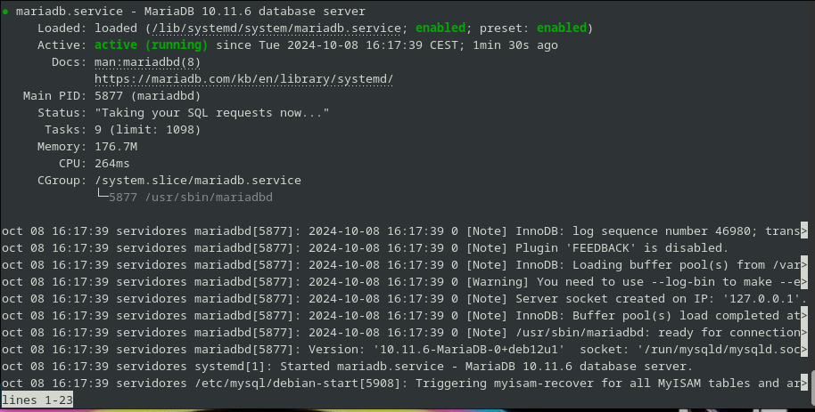
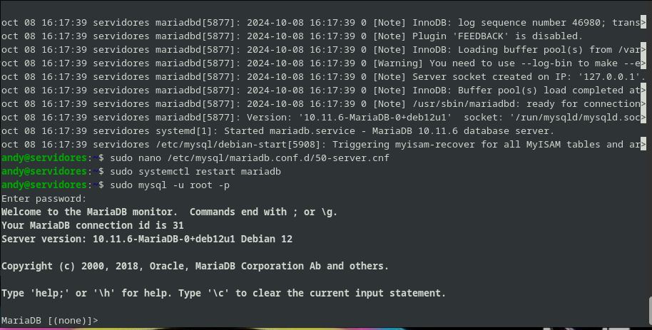
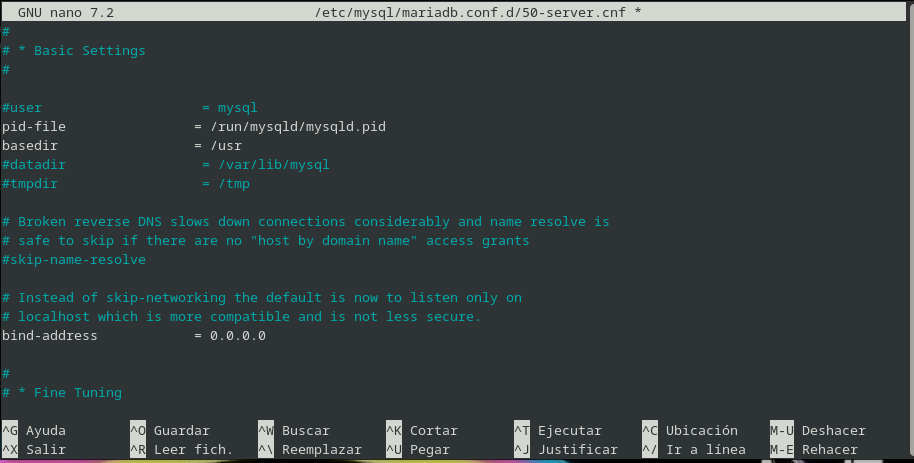

# Instalación de Servidor MySQL en Debian 12


## Autor :computer:
* Andrés Morales González
* :school:I.E.S. Gonzalo Nazareno :round_pushpin:(Dos Hermanas, Sevilla).


<div style="page-break-after: always;"></div>

## Índice

1. [Instalación y configuración de MySQL](#instalación-y-configuración-de-mysql)  
   1.1 [Instalar MySQL](#1-instalar-mysql)  
   1.2 [Iniciar el servidor de MySQL](#2-iniciar-el-servidor-de-mysql)  
   1.3 [Acceder a la consola de MySQL](#3-acceder-a-la-consola-de-mysql)  
   1.4 [Configuración para el acceso remoto](#4-configuración-para-el-acceso-remoto)  
      - [Paso a: Modificar archivo de configuración](#paso-a-modificar-archivo-de-configuración)  
      - [Paso b: Reiniciar el servicio](#paso-b-reiniciar-el-servicio)  
      - [Paso c: Crear un usuario para acceso remoto](#paso-c-crear-un-usuario-para-acceso-remoto)

2. [Creación de un cliente para el acceso remoto](#creación-de-un-cliente-para-el-acceso-remoto)  

3. [Conexión desde un cliente remoto](#conexión-desde-un-cliente-remoto)  
   3.1 [Instalar cliente](#instalar-cliente)  
   3.2 [Conectar remotamente a MySQL](#conectar-remotamente-a-mysql)

<div style="page-break-after: always;"></div>

# Instalacion de servidor mysql en Debian12

Para ello lo primero que haremos sera la creación de una máquina debian, sin entorno gráfico.

Una vez realizada procedermos a la instalación por comandos de dicho servidor:

# Instalación y configuracion de mysql

## 1. Instalar mysql

Para ello tendremos que meter los siguientes comandos:

Este coamndo que meteremos a continuación será para actualizar lo que sera el sistema:

```sudo apt update```

```sudo apt upgrade```

Este comando sera para la instalación de nuestro servidor:

```sudo apt install mariadb-server -y```

## 2. Iniciamos el servido de mysql

Despues de la instalación, iniciarmeos MariaDB y que este sea habilitado para que se inicie de manera *automatica*:

``` 
sudo systemctl start mariadb
sudo systemctl enable mariadb
```



## 3. Acceder a la consola de mysql

Cuando ya hemos instalado podemos entrar a lo que será la consola de MariaDB con el siguiente comando:

```sudo mysql -u root -p```



## 4. Configuracion para el acceso remoto

### Paso a:

Modificamos el archivo de configuración _postgresql.conf_ para permitir conexiones desde la red local:

```sudo nano /etc/mysql/mariadb.conf.d/50-server.cnf```

Tenemos que buscar la linea *bind-address* y le añadiremso la siguiente linea:

```blind-address = 0.0.0.0```




### Paso b:

Reiniciamos el servicio MariaDB:

```sudo systemctl restart mariadb```

### Paso c:

Crear un usuario para el acceso remoto, tendremos que acceder a la consola de MariaDB y crear un usuario como acceso remoto.


# Creación de un cliente para el acceso remoto

Vamos a ver el proceso de creación de un usuario para su conexión remota, se haria de la siguiente manera:

```
andy@servidores:~$ sudo mysql -u root
Welcome to the MariaDB monitor.  Commands end with ; or \g.
Your MariaDB connection id is 33
Server version: 10.11.6-MariaDB-0+deb12u1 Debian 12

Copyright (c) 2000, 2018, Oracle, MariaDB Corporation Ab and others.

Type 'help;' or '\h' for help. Type '\c' to clear the current input statement.

MariaDB [(none)]> 
MariaDB [(none)]> CREATE USER 'andy'@'%' IDENTIFIED BY 'andy';
Query OK, 0 rows affected (0,005 sec)

MariaDB [(none)]> GRANT ALL PRIVILEGES ON *.* TO 'andy'@'%';
Query OK, 0 rows affected (0,004 sec)

MariaDB [(none)]> FLUSH PRIVILEGES;
Query OK, 0 rows affected (0,000 sec)

MariaDB [(none)]> EXIT;
Bye


```
El *%* de este comando:*CREATE USER 'andy'@'%' IDENTIFIED BY 'andy';*, es para que pueda entrar desde cualquier host.


# Conexión desde un cliente remoto

## Instalar cliente

Comando para la instalación:

```sudo apt install mariadb-client```

y se vería de esta manera su instalación:

```
andy@cliente-mariadb:~$ sudo apt install mariadb-client
Leyendo lista de paquetes... Hecho
Creando árbol de dependencias... Hecho
Leyendo la información de estado... Hecho
Se instalarán los siguientes paquetes adicionales:
  libconfig-inifiles-perl libdbd-mariadb-perl libdbi-perl libmariadb3
  libncurses6 libterm-readkey-perl mariadb-client-core mariadb-common
  mysql-common
Paquetes sugeridos:
  libclone-perl libmldbm-perl libnet-daemon-perl libsql-statement-perl
Se instalarán los siguientes paquetes NUEVOS:
  libconfig-inifiles-perl libdbd-mariadb-perl libdbi-perl libmariadb3
  libncurses6 libterm-readkey-perl mariadb-client mariadb-client-core
  mariadb-common mysql-common
....
....
....
```

Comprobamos la versión de la instalación que acabamos de hacer:

```
andy@cliente-mariadb:~$ mariadb --version
mariadb  Ver 15.1 Distrib 10.11.6-MariaDB, for debian-linux-gnu (x86_64) using  EditLine wrapper

```
Y como hemos dicho antes vamos a conectarnos remotamente:

```
andy@cliente-mariadb:~$ mysql -u andy -p -h 192.168.1.159 --port=3306
Enter password: 
Welcome to the MariaDB monitor.  Commands end with ; or \g.
Your MariaDB connection id is 34
Server version: 10.11.6-MariaDB-0+deb12u1 Debian 12

Copyright (c) 2000, 2018, Oracle, MariaDB Corporation Ab and others.

Type 'help;' or '\h' for help. Type '\c' to clear the current input statement.

MariaDB [(none)]> 


```