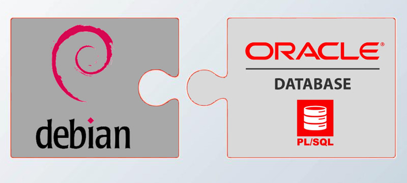
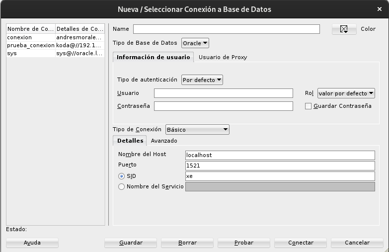
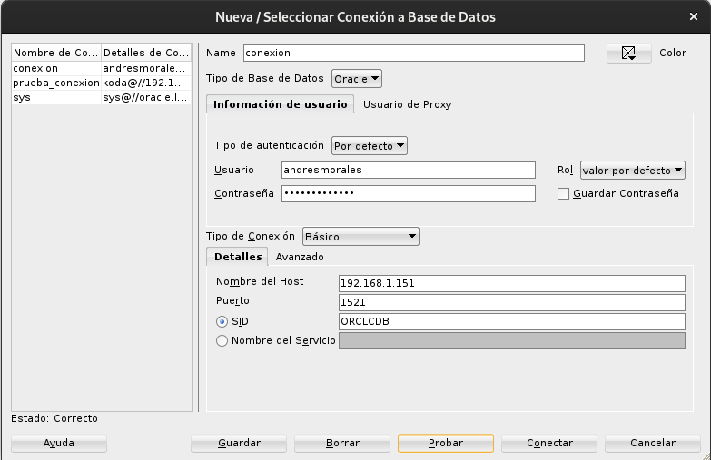
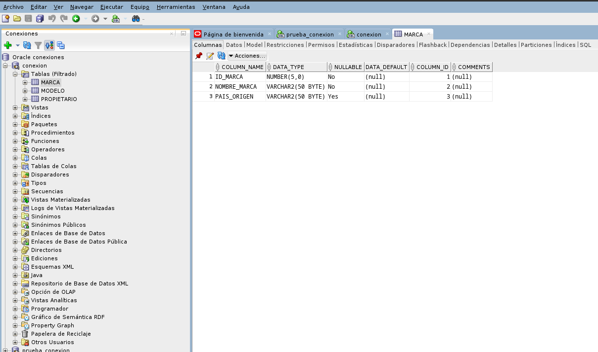
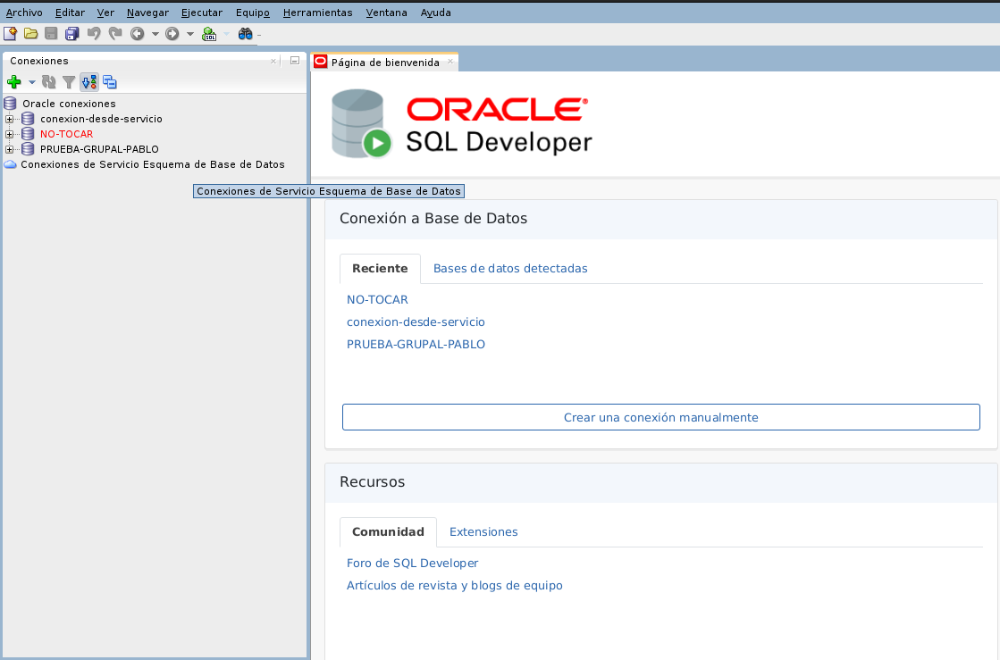

# Instalación de Servidor Oracle en Debian 12



## Autor :computer:
* Andrés Morales González
* :school:I.E.S. Gonzalo Nazareno :round_pushpin:(Dos Hermanas, Sevilla).


<div style="page-break-after: always;"></div>

## Índice

# Índice

- [Instalación de Servidor Oracle en Debian 12](#instalación-de-servidor-oracle-en-debian-12)
  - [Autor :computer:](#autor-computer)
  - [Índice](#índice)
- [Índice](#índice-1)
- [Preparación previa](#preparación-previa)
- [Instalación de Oracle](#instalación-de-oracle)
  - [Creación de tablas:](#creación-de-tablas)
  - [Configuración para acceso en remoto](#configuración-para-acceso-en-remoto)
    - [Modificación de archivos](#modificación-de-archivos)
  - [Conexion a sqldeveloper](#conexion-a-sqldeveloper)
    - [No trabajar desde el SID](#no-trabajar-desde-el-sid)
    - [Trabajar desde Servicios](#trabajar-desde-servicios)
  - [Conexion a cliente por SQLPLUS](#conexion-a-cliente-por-sqlplus)
    - [Descarga de los paquetes:](#descarga-de-los-paquetes)
    - [Descompresión de paquetes](#descompresión-de-paquetes)
    - [Instalacion de dependencias](#instalacion-de-dependencias)
    - [Declaración de variables de entorno](#declaración-de-variables-de-entorno)
    - [Prueba de conexión](#prueba-de-conexión)


<div style="page-break-after: always;"></div>

# Preparación previa

Para la instalación y configuración de lo que es sistema de gestión de bases de datos, en concreto Oracle 21c, lo haremos a través de un máquina virtual, y lo primero que haremos sera hacer una actualización del sistema  (repositorios):

```
andy@oracle-server:~$ sudo apt update && sudo apt upgrade -y
[sudo] contraseña para andy: 
Obj:1 http://security.debian.org/debian-security bookworm-security InRelease
Obj:2 http://deb.debian.org/debian bookworm InRelease
Obj:3 http://deb.debian.org/debian bookworm-updates InRelease
Leyendo lista de paquetes... Hecho
Creando árbol de dependencias... Hecho
Leyendo la información de estado... Hecho
Todos los paquetes están actualizados.
Leyendo lista de paquetes... Hecho
Creando árbol de dependencias... Hecho
Leyendo la información de estado... Hecho
Calculando la actualización... Hecho
0 actualizados, 0 nuevos se instalarán, 0 para eliminar y 0 no actualizados.
andy@oracle-server:~$ 

```

El siguiente paso sera la instalación de las dependencias necesarias de Oracle:

```
andy@oracle-server:~$ sudo apt install libaio1 unixodbc bc ksh gawk -y
Leyendo lista de paquetes... Hecho
Creando árbol de dependencias... Hecho
Leyendo la información de estado... Hecho
Se instalarán los siguientes paquetes adicionales:
  ksh93u+m libltdl7 libmpfr6 libodbc2 libodbcinst2 libsigsegv2 unixodbc-common
Paquetes sugeridos:
  gawk-doc binfmt-support odbc-postgresql tdsodbc
Se instalarán los siguientes paquetes NUEVOS:
  bc gawk ksh ksh93u+m libaio1 libltdl7 libmpfr6 libodbc2 libodbcinst2
  libsigsegv2 unixodbc unixodbc-common
0 actualizados, 12 nuevos se instalarán, 0 para eliminar y 0 no actualizados.
Se necesita descargar 3.079 kB de archivos.
Se utilizarán 8.992 kB de espacio de disco adicional después de esta operación.
Des:1 http://deb.debian.org/debian bookworm/main amd64 libmpfr6 amd64 4.2.0-1 [701 kB]

......
......
......

update-alternatives: utilizando /usr/bin/shcomp93 para proveer /usr/bin/shcomp (
shcomp) en modo automático
Configurando ksh (20230128) ...
Configurando libaio1:amd64 (0.3.113-4) ...
Configurando libodbcinst2:amd64 (2.3.11-2+deb12u1) ...
Configurando unixodbc (2.3.11-2+deb12u1) ...
Procesando disparadores para man-db (2.11.2-2) ...
Procesando disparadores para mailcap (3.70+nmu1) ...
Procesando disparadores para libc-bin (2.36-9+deb12u8) ...

```

Vamos a crear un grupo llamado dba y el usuario oracle:

```
andy@oracle-server:~$ sudo groupadd dba
```
```
andy@oracle-server:~$ sudo adduser --ingroup dba --home /home/oracle --shell /bin/bash oracle
Añadiendo el usuario `oracle' ...
Adding new user `oracle' (1001) with group `dba (1001)' ...
Creando el directorio personal `/home/oracle' ...
Copiando los ficheros desde `/etc/skel' ...
Nueva contraseña: 
Vuelva a escribir la nueva contraseña: 
passwd: contraseña actualizada correctamente
Cambiando la información de usuario para oracle
Introduzca el nuevo valor, o pulse INTRO para usar el valor predeterminado
	Nombre completo []: 
	Número de habitación []: 
	Teléfono del trabajo []: 
	Teléfono de casa []: 
	Otro []: 
¿Es correcta la información? [S/n] s
Adding new user `oracle' to supplemental / extra groups `users' ...
Añadiendo al usuario `oracle' al grupo `users' ...
```
Creaciond e directorio para oracle server

```
andy@oracle-server:~$ mkdir servidor
andy@oracle-server:~$ ls
servidor
andy@oracle-server:~$ cd servidor/
andy@oracle-server:~/servidor$ 


```

Ya hecho esto lo que haremos será bajarnos el paquete de Oracle 21c Enterprise Edition:

```
madandy@toyota-hilux:~/Descargas$ ls 
oracle-database-ee-21c-1.0-1.ol8.x86_64.rpm
```

Ahora lo que haremos sera pasarlo por scp a nuestra máquina virtual:

```
madandy@toyota-hilux:~/Descargas$ scp ~/Descargas/oracle-database-ee-21c-1.0-1.ol8.x86_64.rpm andy@192.168.1.151:/home/andy/abd
andy@192.168.1.151's password: 
oracle-database-ee-21c-1.0-1.ol8.x86_64.rpm   100% 2627MB 358.3MB/s   00:07   
```

Podemos ver como lo tenemos ya pasado:


Como el paquete .rpm que vamnso a instalar pertenece a los paquetes propios de Red Hat, por lo que NO se puede instalar en distribuciones Debian, ya que para eso estan preparadas las máquinas Oracle Linux, tendremos que instalar Alien, el cual es un programa que es capaz de convertir paquetes de Linux a distintos formatos.

```
madandy@toyota-hilux: sudo apt-get  install alien
Leyendo lista de paquetes... Hecho
Creando árbol de dependencias... Hecho
Leyendo la información de estado... Hecho
Se instalarán los siguientes paquetes adicionales:
  autoconf automake autopoint autotools-dev binutils binutils-common
  binutils-x86-64-linux-gnu build-essential cpp cpp-12 debhelper debugedit
  dh-autoreconf dh-strip-nondeterminism dirmngr dpkg-dev dwz fakeroot
  fontconfig-config fonts-dejavu-core g++ g++-12 gcc gcc-12 gettext gnupg
  gnupg-l10n gnupg-utils gpg gpg-agent gpg-wks-client gpg-wks-server gpgconf
  gpgsm intltool-debian libabsl20220623 libalgorithm-diff-perl
  libalgorithm-diff-xs-perl libalgorithm-merge-perl libaom3
  libarchive-cpio-perl libarchive-zip-perl libarchive13 libasan8 libassuan0
  libatomic1 libavif15 libbinutils libc-dev-bin libc-devtools libc6-dev
  libcc1-0 libcrypt-dev libctf-nobfd0 libctf0 libdav1d6 libde265-0
  libdebhelper-perl libdeflate0 libdpkg-perl libdw1 libfakeroot
  libfile-fcntllock-perl libfile-stripnondeterminism-perl libfontconfig1
  libfsverity0 libgav1-1 libgcc-12-dev libgd3 libgomp1 libgprofng0 libheif1
  libisl23 libitm1 libjbig0 libjpeg62-turbo libksba8 liblerc4 liblsan0
  libltdl-dev liblua5...

  .....
  ....
  ....
Configurando dh-autoreconf (20) ...
Configurando g++ (4:12.2.0-3) ...
update-alternatives: utilizando /usr/bin/g++ para proveer /usr/bin/c++ (c++) en modo automático
Configurando build-essential (12.9) ...
Configurando debhelper (13.11.4) ...
Configurando alien (8.95.6) ...
Procesando disparadores para libc-bin (2.36-9+deb12u8) ...
Procesando disparadores para man-db (2.11.2-2) ...
Procesando disparadores para dbus (1.14.10-1~deb12u1) ...

```

Ahora vamos a convertir el paquete desde mi host que meter lo siguiente:
```
madandy@toyota-hilux:~/Documentos/SegundoASIR/Administración bases de datos/ABD$
 sudo alien --to-deb oracle-database-ee-21c-1.0-1.ol8.x86_64.rpm --scripts
warning: oracle-database-ee-21c-1.0-1.ol8.x86_64.rpm: Header V3 RSA/SHA256 Signature, key ID ad986da3: NOKEY
warning: oracle-database-ee-21c-1.0-1.ol8.x86_64.rpm: Header V3 RSA/SHA256 Signature, key ID ad986da3: NOKEY
warning: oracle-database-ee-21c-1.0-1.ol8.x86_64.rpm: Header V3 RSA/SHA256 Signature, key ID ad986da3: NOKEY
warning: oracle-database-ee-21c-1.0-1.ol8.x86_64.rpm: Header V3 RSA/SHA256 Signature, key ID ad986da3: NOKEY
warning: oracle-database-ee-21c-1.0-1.ol8.x86_64.rpm: Header V3 RSA/SHA256 Signature, key ID ad986da3: NOKEY
warning: oracle-database-ee-21c-1.0-1.ol8.x86_64.rpm: Header V3 RSA/SHA256 Signature, key ID ad986da3: NOKEY
warning: oracle-database-ee-21c-1.0-1.ol8.x86_64.rpm: Header V3 RSA/SHA256 Signature, key ID ad986da3: NOKEY
warning: oracle-database-ee-21c-1.0-1.ol8.x86_64.rpm: Header V3 RSA/SHA256 Signature, key ID ad986da3: NOKEY
warning: oracle-database-ee-21c-1.0-1.ol8.x86_64.rpm: Header V3 RSA/SHA256 Signature, key ID ad986da3: NOKEY
warning: oracle-database-ee-21c-1.0-1.ol8.x86_64.rpm: Header V3 RSA/SHA256 Signature, key ID ad986da3: NOKEY
warning: oracle-database-ee-21c-1.0-1.ol8.x86_64.rpm: Header V3 RSA/SHA256 Signature, key ID ad986da3: NOKEY
warning: oracle-database-ee-21c-1.0-1.ol8.x86_64.rpm: Header V3 RSA/SHA256 Signature, key ID ad986da3: NOKEY
warning: oracle-database-ee-21c-1.0-1.ol8.x86_64.rpm: Header V3 RSA/SHA256 Signature, key ID ad986da3: NOKEY
warning: oracle-database-ee-21c-1.0-1.ol8.x86_64.rpm: Header V3 RSA/SHA256 Signature, key ID ad986da3: NOKEY
warning: oracle-database-ee-21c-1.0-1.ol8.x86_64.rpm: Header V3 RSA/SHA256 Signature, key ID ad986da3: NOKEY
warning: oracle-database-ee-21c-1.0-1.ol8.x86_64.rpm: Header V3 RSA/SHA256 Signature, key ID ad986da3: NOKEY
warning: oracle-database-ee-21c-1.0-1.ol8.x86_64.rpm: Header V3 RSA/SHA256 Signature, key ID ad986da3: NOKEY
......
```
Lo que vemos como warning son solo advertencias sobre lo que seria la firma del paquete RPM.


Y nos saldra el siguiente mensaje, al final de este proceso:

```
madandy@toyota-hilux:~/Documentos/SegundoASIR/Administración bases de datos/ABD$
 sudo alien --to-deb oracle-database-ee-21c-1.0-1.ol8.x86_64.rpm --scripts

warning: oracle-database-ee-21c-1.0-1.ol8.x86_64.rpm: Header V3 RSA/SHA256 Signature, key ID ad986da3: NOKEY
warning: oracle-database-ee-21c-1.0-1.ol8.x86_64.rpm: Header V3 RSA/SHA256 Signature, key ID ad986da3: NOKEY
warning: oracle-database-ee-21c-1.0-1.ol8.x86_64.rpm: Header V3 RSA/SHA256 Signature, key ID ad986da3: NOKEY
warning: oracle-database-ee-21c-1.0-1.ol8.x86_64.rpm: Header V3 RSA/SHA256 Signature, key ID ad986da3: NOKEY
warning: oracle-database-ee-21c-1.0-1.ol8.x86_64.rpm: Header V3 RSA/SHA256 Signature, key ID ad986da3: NOKEY
warning: oracle-database-ee-21c-1.0-1.ol8.x86_64.rpm: Header V3 RSA/SHA256 Signature, key ID ad986da3: NOKEY
warning: oracle-database-ee-21c-1.0-1.ol8.x86_64.rpm: Header V3 RSA/SHA256 Signature, key ID ad986da3: NOKEY
warning: oracle-database-ee-21c-1.0-1.ol8.x86_64.rpm: Header V3 RSA/SHA256 Signature, key ID ad986da3: NOKEY
warning: oracle-database-ee-21c-1.0-1.ol8.x86_64.rpm: Header V3 RSA/SHA256 Signature, key ID ad986da3: NOKEY
warning: oracle-database-ee-21c-1.0-1.ol8.x86_64.rpm: Header V3 RSA/SHA256 Signature, key ID ad986da3: NOKEY
warning: oracle-database-ee-21c-1.0-1.ol8.x86_64.rpm: Header V3 RSA/SHA256 Signature, key ID ad986da3: NOKEY
warning: oracle-database-ee-21c-1.0-1.ol8.x86_64.rpm: Header V3 RSA/SHA256 Signature, key ID ad986da3: NOKEY
warning: oracle-database-ee-21c-1.0-1.ol8.x86_64.rpm: Header V3 RSA/SHA256 Signature, key ID ad986da3: NOKEY
warning: oracle-database-ee-21c-1.0-1.ol8.x86_64.rpm: Header V3 RSA/SHA256 Signature, key ID ad986da3: NOKEY
warning: oracle-database-ee-21c-1.0-1.ol8.x86_64.rpm: Header V3 RSA/SHA256 Signature, key ID ad986da3: NOKEY
warning: oracle-database-ee-21c-1.0-1.ol8.x86_64.rpm: Header V3 RSA/SHA256 Signature, key ID ad986da3: NOKEY
warning: oracle-database-ee-21c-1.0-1.ol8.x86_64.rpm: Header V3 RSA/SHA256 Signature, key ID ad986da3: NOKEY
oracle-database-ee-21c_1.0-2_amd64.deb generated
```

Ahora lo que haremos será transferirlo a nuestra maquina virtual, con scp (Secure Copy Protocol) es una herramienta de línea de comandos que permite transferir archivos y directorios de forma segura entre sistemas a través de SSH.

Desde nuestra maquina anfitriona:

```
madandy@toyota-hilux:~$ scp /home/madandy/Documentos/SegundoASIR/Administracion/ABD/oracle-database-ee-21c_1.0-2_amd64.deb andy@192.168.1.151:/home/andy
andy@192.168.1.151's password: 
oracle-database-ee-21c_1.0-2_amd64.deb                                                          100% 2456MB 308.2MB/s   00:07  
```

Y ya la tendremos en nuetsra maquina del servidor oracle:

```
andy@oracle-servidor:~$ ls
oracle-database-ee-21c_1.0-2_amd64.deb

```

# Instalación de Oracle

Para proceder a la instalacion del servidor, lo primero que tendremos que hacer sera poner en nuestro fichero */etc/hosts* con nuetsra direccion privada:
```
ip -c a: 192.168.1.151
```
La he puesto de forma estatica, en el fichero de configuracion de red */etc/network/interfaces*

Ahora procederemos a instalarlo usando el comando dpkg -i, ya que lo tenemos transformado .deb:

```
andy@oracle-server:~$ sudo dpkg -i oracle-database-ee-21c_1.0-2_amd64.deb 
[sudo] contraseña para andy: 
Seleccionando el paquete oracle-database-ee-21c previamente no seleccionado.
(Leyendo la base de datos ... 42951 ficheros o directorios instalados actualmente.)
Preparando para desempaquetar oracle-database-ee-21c_1.0-2_amd64.deb ...
ln: fallo al crear el enlace simbólico '/bin/awk': El fichero ya existe
Desempaquetando oracle-database-ee-21c (1.0-2) ...
Configurando oracle-database-ee-21c (1.0-2) ...
[INFO] Executing post installation scripts...
[INFO] Oracle home installed successfully and ready to be configured.
To configure a sample Oracle Database you can execute the following service configuration script as root: /etc/init.d/oracledb_ORCLCDB-21c configure
Procesando disparadores para libc-bin (2.36-9+deb12u8) ...

```

Como podemos ver en esta linea:

*_To configure a sample Oracle Database you can execute the following service configuration script as root: /etc/init.d/oracledb_ORCLCDB-21c configure_*

>[!WARNING]
>Para que esto salga tienes que tener en el fichero /etc/hosts unia linea tal que asi: 192.168.x.x oracle-server

Tendremos que ejecutar siendo *ROOT*, el siguiente comando,*_/etc/init.d/oracledb_ORCLCDB-21c configure _* que sera para comenzar la instalación:

```
andy@oracle-server:~$ sudo /etc/init.d/oracledb_ORCLCDB-21c configure
Configuring Oracle Database ORCLCDB.
Preparar para funcionamiento de base de datos
8% completado
Copiando archivos de base de datos
31% completado
Creando e iniciando instancia Oracle
32% completado
36% completado
40% completado
43% completado
46% completado
Terminando creación de base de datos
51% completado
54% completado
Creando Bases de Datos de Conexión
58% completado
77% completado
Ejecutando acciones posteriores a la configuración
100% completado
Creación de la base de datos terminada. Consulte los archivos log de /opt/oracle/cfgtoollogs/dbca/ORCLCDB
 para obtener más información.
Información de Base de Datos:
Nombre de la Base de Datos Global:ORCLCDB
Identificador del Sistema (SID):ORCLCDB
Para obtener información detallada, consulte el archivo log "/opt/oracle/cfgtoollogs/dbca/ORCLCDB/ORCLCDB2.log".

Database configuration completed successfully. The passwords were auto generated, you must change them by connecting to the database using 'sqlplus / as sysdba' as the oracle user.

```
Ya tenemos la instalación, ahora que ocurre, que no podemos usarlo como tal, ya que para poder usar lo que es el usuario de ORACLE, habra que exportar las variables de entorno al siguiente directorio */home/oracle/.bashrc* para entrar a este fichero en dicho directorio, tendremso que entarr siendo *ROOT*, al cual le tendremos que poner las siguientes variables de entorno:

```
export ORACLE_HOME=/opt/oracle/product/21c/dbhome_1
export ORACLE_SID=ORCLCDB
export ORACLE_BASE=/opt/oracle
export PATH=$ORACLE_HOME/bin:$PATH
export LD_LIBRARY_PATH=$ORACLE_HOME/lib:$LD_LIBRARY_PATH

```
y a continuación vemos como lo tenemos ya puesto:
```
andy@oracle-servidor:~$ sudo su
root@oracle-servidor:/home/andy# cd /home/oracle/
root@oracle-servidor:/home/oracle# ls
root@oracle-servidor:/home/oracle# nano .bashrc
root@oracle-servidor:/home/oracle# cat .bash
cat: .bash: No existe el fichero o el directorio
root@oracle-servidor:/home/oracle# cat .bash
.bash_logout  .bashrc       
root@oracle-servidor:/home/oracle# cat .bashrc 
# ~/.bashrc: executed by bash(1) for non-login shells.
# see /usr/share/doc/bash/examples/startup-files (in the package bash-doc)
# for examples

# If not running interactively, don't do anything
case $- in
    *i*) ;;
      *) return;;
esac


export ORACLE_HOME=/opt/oracle/product/21c/dbhome_1
export ORACLE_SID=ORCLCDB
export ORACLE_BASE=/opt/oracle
export PATH=$ORACLE_HOME/bin:$PATH
export LD_LIBRARY_PATH=$ORACLE_HOME/lib:$LD_LIBRARY_PATH

# don't put duplicate lines or lines starting with space in the history.
# See bash(1) for more options
HISTCONTROL=ignoreboth

# append to the history file, don't overwrite it
shopt -s histappend
......
.....
```

Una vez configurado lo que es el fichero, tendremos que aplicar los cambios:

```
root@oracle-servidor:/home/oracle# source .bashrc
root@oracle-servidor:/home/oracle# 

```

Y para acceder a la base de datos, como hicimos anteriormente creamos un grupo dba donde pusimos el usuario *oracle*, con lo que tendremos que cambiar de usuario que este tiene los permisos para entrar:

```
andy@oracle-servidor:~$ sudo su - oracle
oracle@oracle-servidor:~$ s
Display all 125 possibilities? (y or n)
oracle@oracle-servidor:~$ sqlplus / as sysdba

SQL*Plus: Release 21.0.0.0.0 - Production on Thu Oct 10 21:15:06 2024
Version 21.3.0.0.0

Copyright (c) 1982, 2021, Oracle.  All rights reserved.

Connected to an idle instance.

SQL> 

```

Como hemos visto podemos entrar a la base de datos, desde el usuario *oracle*, ya que antes le dimos los permisos necesarios pero no vamso a querer acceder a el desde ese usuario a no ser que se nos diga lo contrario, por eso vamos a meter en nuestro usuario principal, por lo que tendremos que añadir al grupo que creamos con anterioridad *dba* y añadir las variables de entorno, esto es para poder acceder al sistema de Oracle Database con aspector de administrador.

Se hará de la siguiente forma:

```
andy@oracle-servidor:~$ sudo usermod -a -G dba andy
      
andy@oracle-servidor:~$ sudo nano .bashrc 

andy@oracle-servidor:~$ source ~/.bashrc

andy@oracle-servidor:~$ sqlplus / as sysdba

SQL*Plus: Release 21.0.0.0.0 - Production on Thu Oct 10 21:32:36 2024
Version 21.3.0.0.0

Copyright (c) 1982, 2021, Oracle.  All rights reserved.

Connected to an idle instance.

SQL> 


```
Vamos a crear un usuario, y darle permisos, y comprobar que tiene acceso, voy a trabajar con el usuario oracle.

Si nos damos cuenta cuando hemos entrado  con el usuario oracle estamso en la instancia, y por mucho que hagamos algo nos dara un error:

```
oracle@oracle-servidor:~$ sqlplus / as sysdba

SQL*Plus: Release 21.0.0.0.0 - Production on Thu Oct 10 21:46:21 2024
Version 21.3.0.0.0

Copyright (c) 1982, 2021, Oracle.  All rights reserved.

Connected to an idle instance.

SQL> 
```
El error que nos dara sera este:

```
SQL> CREATE USER andresmorales IDENTIFIED BY andresmorales;
CREATE USER andresmorales IDENTIFIED BY andresmorales
*
ERROR at line 1:
ORA-01034: ORACLE not available
Process ID: 0
Session ID: 0 Serial number: 0

```
Esto se debe a que tenemos la instancia apagada , para quitar este error, metermos este comando ```STARTUP;```

Lo primero de todo para eviatr errores en la creacion de usuario, tendremso que meter por la consola de aqlplu. el siguiente comando:

```alter session set "_ORACLE_SCRIPT"=True;```

y crearemos el usuario de la siguiente manera:

```CREATE USER andresmorales IDENTIFIED BY andresmorales;```

Y le daremos todos los permisos, ya que trabajaremos con este usuario:

```GRANT ALL PRIVILEGES TO andresmorales;```

Esto lo veremos de la siguiente forma por pantalla:

```
oracle@oracle-servidor:~$ sqlplus / as sysdba

SQL*Plus: Release 21.0.0.0.0 - Production on Thu Oct 10 21:47:33 2024
Version 21.3.0.0.0

Copyright (c) 1982, 2021, Oracle.  All rights reserved.


Conectado a:
Oracle Database 21c Enterprise Edition Release 21.0.0.0.0 - Production
Version 21.3.0.0.0

SQL> alter session set "_ORACLE_SCRIPT"=True;

Sesion modificada.

SQL> CREATE USER andresmorales IDENTIFIED BY andresmorales;

Usuario creado.

SQL> GRANT ALL PRIVILEGES TO andresmorales
  2  ;

Concesion terminada correctamente.

SQL> 

```

Y como hemos hecho hasta ahora nos saldremos de sqlplus, y entrarmeos como el usuario *andresmorales*, se cvera de la siguiente manera:

```
oracle@oracle-servidor:~$ sqlplus andresmorales/andresmorales

SQL*Plus: Release 21.0.0.0.0 - Production on Thu Oct 10 21:54:46 2024
Version 21.3.0.0.0

Copyright (c) 1982, 2021, Oracle.  All rights reserved.


Conectado a:
Oracle Database 21c Enterprise Edition Release 21.0.0.0.0 - Production
Version 21.3.0.0.0

SQL> 

```

>[!CAUTION]
> Siempre que salgamos tendremos que meternos en el usuairo oracle y encender la base de datos, con el comando *STARTUP*

## Creación de tablas:


Ahora vamos a crear tres tablas con sus respectivas insersiones:


```
CREATE TABLE Marca (
    id_marca NUMBER(5) PRIMARY KEY,
    nombre_marca VARCHAR2(50) NOT NULL,
    pais_origen VARCHAR2(50)
);


INSERT INTO Marca (id_marca, nombre_marca, pais_origen) VALUES (1, 'Toyota', 'Japón');
INSERT INTO Marca (id_marca, nombre_marca, pais_origen) VALUES (2, 'Ford', 'Estados Unidos');
INSERT INTO Marca (id_marca, nombre_marca, pais_origen) VALUES (3, 'BMW', 'Alemania');

CREATE TABLE Modelo (
    id_modelo NUMBER(5) PRIMARY KEY,
    nombre_modelo VARCHAR2(50) NOT NULL,
    id_marca NUMBER(5),
    anio NUMBER(4) NOT NULL,
    tipo VARCHAR2(50),
    FOREIGN KEY (id_marca) REFERENCES Marca(id_marca)
);


INSERT INTO Modelo (id_modelo, nombre_modelo, id_marca, anio, tipo) VALUES (1, 'Corolla', 1, 2020, 'Sedán');
INSERT INTO Modelo (id_modelo, nombre_modelo, id_marca, anio, tipo) VALUES (2, 'Camry', 1, 2021, 'Sedán');
INSERT INTO Modelo (id_modelo, nombre_modelo, id_marca, anio, tipo) VALUES (3, 'Mustang', 2, 2019, 'Deportivo');

CREATE TABLE Propietario (
    id_propietario NUMBER(5) PRIMARY KEY,
    nombre VARCHAR2(50) NOT NULL,
    apellido VARCHAR2(50),
    id_modelo NUMBER(5),
    fecha_compra DATE,
    FOREIGN KEY (id_modelo) REFERENCES Modelo(id_modelo)
);


INSERT INTO Propietario (id_propietario, nombre, apellido, id_modelo, fecha_compra) VALUES (1, 'Carlos', 'González', 1, TO_DATE('2020-06-15', 'YYYY-MM-DD'));
INSERT INTO Propietario (id_propietario, nombre, apellido, id_modelo, fecha_compra) VALUES (2, 'Lucía', 'Martínez', 2, TO_DATE('2021-05-10', 'YYYY-MM-DD'));
INSERT INTO Propietario (id_propietario, nombre, apellido, id_modelo, fecha_compra) VALUES (3, 'Pedro', 'Fernández', 3, TO_DATE('2019-09-20', 'YYYY-MM-DD'));


```
Como podemos ver a continuación hemos podido crear las tablas con sus contendido:

```
SQL> SELECT table_name FROM user_tables;

TABLE_NAME
--------------------------------------------------------------------------------
MARCA
MODELO
PROPIETARIO

SQL> SELECT * FROM Propietario;

ID_PROPIETARIO NOMBRE
-------------- --------------------------------------------------
APELLIDO					    ID_MODELO FECHA_CO
-------------------------------------------------- ---------- --------
	     1 Carlos
Gonz??lez						    1 15/06/20

	     2 Luc??a
Mart??nez						    2 10/05/21

	     3 Pedro
Fern??ndez						    3 20/09/19
```

## Configuración para acceso en remoto

Como ya tenemos lo que es la base de nuestra instalación y se puede trabar desde distintos caminos, ya sea por terminal gracias al propio *SQLPlus*, *SQLDeveloper* y *aplicación web*, lo que haremos a continuación sera configurar un acceso remoto, para poder trabajar desde cualquier parte.


### Modificación de archivos

En el caso de oracle vamos a tener que modificar lo que va a ser el archivo listener.ora, el cual va a estar de predeterminado en el directorio */opt/oracle/product/21c/dbhome_1/network/admin/samples/listener.ora*

```
andy@oracle-servidor:/opt/oracle/product/21c/dbhome_1/network/admin/samples$ ls
listener.ora  sqlnet.ora  tnsnames.ora
andy@oracle-servidor:/opt/oracle/product/21c/dbhome_1/network/admin/samples$ nano listener.ora 
andy@oracle-servidor:/opt/oracle/product/21c/dbhome_1/network/admin/samples$ sudo nano listener.ora 

```
>[!NOTE]
>Esto que vamos a poner a continuación se tendra que poner en cada uno de los usuarios que esten dentro de la base de datos

Dentro de este archivo lo que podemos ver reflejado son los punoos de conexión y los propios protocolos que el servidor ORACLE suara para gestionar las conexines de los clientes, cuando nosotros los vemos estaria tal que así:


```
# LISTENER =
#  (ADDRESS_LIST=
#       (ADDRESS=(PROTOCOL=tcp)(HOST=localhost)(PORT=1521))
#       (ADDRESS=(PROTOCOL=ipc)(KEY=PNPKEY)))   
```

Despues del cambio:

```
LISTENER =
  (ADDRESS_LIST =
    (ADDRESS = (PROTOCOL = TCP)(HOST = 192.168.1.151)(PORT = 1521))
    (ADDRESS = (PROTOCOL = IPC)(KEY = PNPKEY))
  )
 
```
Una vez hecho el cambio lo podemos reiniciar:

```
andy@oracle-server:~$ sudo /etc/init.d/oracledb_ORCLCDB-21c restart
```
El cual nos hara lo siguiente:

```
andy@oracle-server:~$ sudo /etc/init.d/oracledb_ORCLCDB-21c restart
Starting Oracle Net Listener.
Oracle Net Listener started.
Starting Oracle Database instance ORCLCDB.
Oracle Database instance ORCLCDB started.

```
Y veremos el estado en el que se encuentra:

```
andy@oracle-server:~$ sudo /etc/init.d/oracledb_ORCLCDB-21c status
Status of the Oracle ORCLCDB 21c service:

LISTENER status: RUNNING
ORCLCDB Database status:   RUNNING


```

## Conexion a sqldeveloper

Para ello lo que haremos sera bajarnoslo desde esta URL: https://www.oracle.com/database/sqldeveloper/technologies/download/ y lo tendremos que extarer donde mejor nos venga.

Una vez hecho esto, tendremos que activarlo por temrinal, y le tendremos que poner por comando *./sqldeveloper.sh*, y ya solo tendremos que hacerlo graficamente, como muestro a continuación:




En esta pantalla tendremos que poner los datos, el nombre que le queremos dar apara ver la conexion, el usuario, en mi caso sera andresmorales, junto a la contraseña, el nombre del host, es decir tu ip estatica, el puerto que por defecto es la 1521, y el SID, que en nuestro caso es ORCLCDB, y quedaría tal que así:


Y ya le dariamos a probar, para ver como esta el estado, y si nos pone estao en la esquina izquierda inferior le dariamos a conectar:



Y ya cuando lo conectamos lo podemos ver como se pone en la parte izquierda, en *conexiones*, y ya tendriamos la s tablas que creamso antes, con todo:




### No trabajar desde el SID

Esto que acabamos de donde hemos entrado es el *SID* y ¿que es el sid?

-*El SID (System Identifier)* en Oracle es un identificador único que asigna un nombre a una instancia de base de datos. Una instancia de base de datos es un conjunto de procesos de servidor y estructuras de memoria que permiten interactuar con los datos almacenados en los archivos físicos de la base de datos. El SID es fundamental para identificar y conectar una instancia de Oracle.

>[!CAUTION]
> Esto no se toca, por eso lo vamos a poner del siguiente color y con el siguiente nombre:


### Trabajar desde Servicios

Si no que lo que haremos será crear un servicio dentro del SID en Oracle para un Usuario y SYSDBA, con los siguientes pasos:

1. Conéctate como SYSDBA
Primero, necesitaremos conectarnos a la base de datos con privilegios de SYSDBA. Esto nos permitira gestionar la base de datos y crear servicios.

```sqlplus / as sysdba```

2. Crear el Servicio
Utiliza el paquete DBMS_SERVICE para crear un servicio dentro de tu SID. En este ejemplo, crearemos un servicio llamado servicio_prueba.

```
BEGIN
    DBMS_SERVICE.CREATE_SERVICE(
        service_name => 'servicio_prueba', 
        network_name => 'servicio_prueba'
    );
END;
/

```

Explicación:
service_name: Este es el nombre del servicio que estás creando (en este caso, servicio_prueba).
network_name: Es el nombre con el que los clientes de red podrán conectarse.

3. Iniciar el Servicio
Después de crear el servicio, debemso iniciarlo para que esté activo y los usuarios puedan conectarse.

```EXEC DBMS_SERVICE.START_SERVICE('servicio_prueba');```

Explicación:
Este comando hace que el servicio que acabas de crear esté disponible para conexiones de red.

4. Crear un Usuario y Asignar Privilegios
Ahora, crea el usuario que va a utilizar este servicio. Si el usuario ya existe, puedes saltar este paso. En este caso, creamos un usuario llamado user_test con la contraseña password.

```CREATE USER paco IDENTIFIED BY paco;```
Dale los privilegios necesarios para conectarse y utilizar los recursos de la base de datos:

```GRANT CONNECT, RESOURCE TO paco;```

Explicación:

- CREATE USER: Crea un nuevo usuario en la base de datos.

- GRANT CONNECT, RESOURCE: Estos son privilegios básicos para permitir al usuario conectarse y crear objetos dentro de la base de datos.

6. Verificar el Servicio
Para confirmar que el servicio se ha creado correctamente y está activo, puedes consultar los servicios registrados en la base de datos:

```SELECT name FROM dba_services;```

Explicación:
Esta consulta te mostrará todos los servicios activos en la base de datos, incluyendo el que acabas de crear.

7. Conectarse al Servicio
Tanto el nuevo usuario como SYSDBA pueden conectarse utilizando el servicio recién creado. Para conectarte desde un cliente como SQL*Plus o SQL Developer, usa la siguiente sintaxis:

```
sqlplus upaco/paco@192.168.1.155:port/servicio_prueba1

Conectarse como SYSDBA:

sqlplus sys/usuario@192.168.1.155:port/servicio_prueba as sysdba

```
Verificación de conexión al servicio:


## Conexion a cliente por SQLPLUS

Para ello lo que haremos será crearnos en una máquina virtual para tener un cliente en forma remota, esta máuqina se llamara *clientes* , en el cual nos vamos a descagar todas la sheramientas necesarias desde la página oficial de Oracle, y lo tendremos que descomrprimir.

### Descarga de los paquetes:

```
andy@clientes:~$ wget https://download.oracle.com/otn_software/linux/instantclient/2350000/instantclient-basic-linux.x64-23.5.0.24.07.zip
--2024-10-11 11:30:27--  https://download.oracle.com/otn_software/linux/instantclient/2350000/instantclient-basic-linux.x64-23.5.0.24.07.zip
Resolviendo download.oracle.com (download.oracle.com)... 23.36.127.75
Conectando con download.oracle.com (download.oracle.com)[23.36.127.75]:443... conectado.
Petición HTTP enviada, esperando respuesta... 200 OK
Longitud: 118888731 (113M) [application/zip]
Grabando a: «instantclient-basic-linux.x64-23.5.0.24.07.zip»

instantclient-basic 100%[===================>] 113,38M  5,25MB/s    en 18s   

2024-10-11 11:30:45 (6,41 MB/s) - «instantclient-basic-linux.x64-23.5.0.24.07.zip» guardado [118888731/118888731]
```
```
andy@clientes:~$ wget https://download.oracle.com/otn_software/linux/instantclient/2350000/instantclient-sqlplus-linux.x64-23.5.0.24.07.zip
--2024-10-11 11:31:28--  https://download.oracle.com/otn_software/linux/instantclient/2350000/instantclient-sqlplus-linux.x64-23.5.0.24.07.zip
Resolviendo download.oracle.com (download.oracle.com)... 23.36.127.75
Conectando con download.oracle.com (download.oracle.com)[23.36.127.75]:443... conectado.
Petición HTTP enviada, esperando respuesta... 200 OK
Longitud: 5479014 (5,2M) [application/zip]
Grabando a: «instantclient-sqlplus-linux.x64-23.5.0.24.07.zip»

instantclient-sqlpl 100%[===================>]   5,22M  6,72MB/s    en 0,8s    

2024-10-11 11:31:30 (6,72 MB/s) - «instantclient-sqlplus-linux.x64-23.5.0.24.07.zip» guardado [5479014/5479014]
```
```
andy@clientes:~$ wget https://download.oracle.com/otn_software/linux/instantclient/2350000/instantclient-tools-linux.x64-23.5.0.24.07.zip
--2024-10-11 11:31:54--  https://download.oracle.com/otn_software/linux/instantclient/2350000/instantclient-tools-linux.x64-23.5.0.24.07.zip
Resolviendo download.oracle.com (download.oracle.com)... 23.36.127.75
Conectando con download.oracle.com (download.oracle.com)[23.36.127.75]:443... conectado.
Petición HTTP enviada, esperando respuesta... 200 OK
Longitud: 1442153 (1,4M) [application/zip]
Grabando a: «instantclient-tools-linux.x64-23.5.0.24.07.zip»

instantclient-tools 100%[===================>]   1,38M  4,43MB/s    en 0,3s    

2024-10-11 11:31:55 (4,43 MB/s) - «instantclient-tools-linux.x64-23.5.0.24.07.zip» guardado [1442153/1442153]

andy@clientes:~$ 

```

### Descompresión de paquetes

```
andy@clientes:~$ sudo unzip instantclient-basic-linux.x64-23.5.0.24.07.zip -d /opt/oracle/
Archive:  instantclient-basic-linux.x64-23.5.0.24.07.zip
  inflating: /opt/oracle/META-INF/MANIFEST.MF  
  inflating: /opt/oracle/META-INF/ORACLE_C.SF  
  inflating: /opt/oracle/META-INF/ORACLE_C.RSA  
  inflating: /opt/oracle/instantclient_23_5/adrci  
  inflating: /opt/oracle/instantclient_23_5/BASIC_LICENSE  
  inflating: /opt/oracle/instantclient_23_5/BASIC_README  
  inflating: /opt/oracle/instantclient_23_5/fips.so  
  inflating: /opt/oracle/instantclient_23_5/genezi  
  inflating: /opt/oracle/instantclient_23_5/legacy.so
```
```
andy@clientes:~$ sudo unzip instantclient-sqlplus-linux.x64-23.5.0.24.07.zip -d /opt/oracle/
Archive:  instantclient-sqlplus-linux.x64-23.5.0.24.07.zip
replace /opt/oracle/META-INF/MANIFEST.MF? [y]es, [n]o, [A]ll, [N]one, [r]ename: y
  inflating: /opt/oracle/META-INF/MANIFEST.MF  
replace /opt/oracle/META-INF/ORACLE_C.SF? [y]es, [n]o, [A]ll, [N]one, [r]ename: a
error:  invalid response [a]
replace /opt/oracle/META-INF/ORACLE_C.SF? [y]es, [n]o, [A]ll, [N]one, [r]ename: A
  inflating: /opt/oracle/META-INF/ORACLE_C.SF  
  inflating: /opt/oracle/META-INF/ORACLE_C.RSA  
  inflating: /opt/oracle/instantclient_23_5/glogin.sql  
  inflating: /opt/oracle/instantclient_23_5/libsqlplusic.so  
  inflating: /opt/oracle/instantclient_23_5/libsqlplus.so  
  inflating: /opt/oracle/instantclient_23_5/sqlplus  
  inflating: /opt/oracle/instantclient_23_5/SQLPLUS_LICENSE  
  inflating: /opt/oracle/instantclient_23_5/SQLPLUS_README  
```
```
andy@clientes:~$ sudo unzip instantclient-tools-linux.x64-23.5.0.24.07.zip -d /opt/oracle/
Archive:  instantclient-tools-linux.x64-23.5.0.24.07.zip
replace /opt/oracle/META-INF/MANIFEST.MF? [y]es, [n]o, [A]ll, [N]one, [r]ename: A
  inflating: /opt/oracle/META-INF/MANIFEST.MF  
  inflating: /opt/oracle/META-INF/ORACLE_C.SF  
  inflating: /opt/oracle/META-INF/ORACLE_C.RSA  
  inflating: /opt/oracle/instantclient_23_5/exp  
  inflating: /opt/oracle/instantclient_23_5/expdp  
  inflating: /opt/oracle/instantclient_23_5/imp  
  inflating: /opt/oracle/instantclient_23_5/impdp  
  inflating: /opt/oracle/instantclient_23_5/libnfsodm.so  
  inflating: /opt/oracle/instantclient_23_5/libopcodm.so  
  inflating: /opt/oracle/instantclient_23_5/sqlldr  
  inflating: /opt/oracle/instantclient_23_5/TOOLS_LICENSE  
  inflating: /opt/oracle/instantclient_23_5/TOOLS_README  
  inflating: /opt/oracle/instantclient_23_5/wrc  


```
Nuestro directorio quedaria tal que así:

```
andy@clientes:/opt/oracle$ ls
instantclient_23_5  META-INF
andy@clientes:/opt/oracle$ cd instantclient_23_5/
andy@clientes:/opt/oracle/instantclient_23_5$ ls
adrci          fips.so     legacy.so              libclntshcore.so.20.1  libclntsh.so.10.1  libclntsh.so.20.1  libnnz.so        libocci.so.18.1  libocci.so.23.1  libsqlplus.so   pkcs11.so        TOOLS_LICENSE  wrc
BASIC_LICENSE  genezi      libclntshcore.so       libclntshcore.so.21.1  libclntsh.so.11.1  libclntsh.so.21.1  libocci.so       libocci.so.19.1  libociei.so      libtfojdbc1.so  sqlldr           TOOLS_README   xstreams.jar
BASIC_README   glogin.sql  libclntshcore.so.12.1  libclntshcore.so.22.1  libclntsh.so.12.1  libclntsh.so.22.1  libocci.so.10.1  libocci.so.20.1  libocijdbc23.so  network         sqlplus          ucp11.jar
exp            imp         libclntshcore.so.18.1  libclntshcore.so.23.1  libclntsh.so.18.1  libclntsh.so.23.1  libocci.so.11.1  libocci.so.21.1  libopcodm.so     ojdbc11.jar     SQLPLUS_LICENSE  ucp.jar
expdp          impdp       libclntshcore.so.19.1  libclntsh.so           libclntsh.so.19.1  libnfsodm.so       libocci.so.12.1  libocci.so.22.1  libsqlplusic.so  ojdbc8.jar      SQLPLUS_README   uidrvci

```

### Instalacion de dependencias

```
andy@clientes:~$ sudo apt-get install libaio1
Leyendo lista de paquetes... Hecho
Creando árbol de dependencias... Hecho
Leyendo la información de estado... Hecho
Se instalarán los siguientes paquetes NUEVOS:
  libaio1
0 actualizados, 1 nuevos se instalarán, 0 para eliminar y 0 no actualizados.
Se necesita descargar 13,4 kB de archivos.
Se utilizarán 37,9 kB de espacio de disco adicional después de esta operación.
Des:1 http://deb.debian.org/debian bookworm/main amd64 libaio1 amd64 0.3.113-4 [13,4 kB]
Descargados 13,4 kB en 0s (248 kB/s)
Seleccionando el paquete libaio1:amd64 previamente no seleccionado.
(Leyendo la base de datos ... 34272 ficheros o directorios instalados actualmente.)
Preparando para desempaquetar .../libaio1_0.3.113-4_amd64.deb ...
Desempaquetando libaio1:amd64 (0.3.113-4) ...
Configurando libaio1:amd64 (0.3.113-4) ...
Procesando disparadores para libc-bin (2.36-9+deb12u8) ...

```

### Declaración de variables de entorno


```
ndy@clientes:~$ cat ~/.bashrc
# ~/.bashrc: executed by bash(1) for non-login shells.
# see /usr/share/doc/bash/examples/startup-files (in the package bash-doc)
# for examples

# If not running interactively, don't do anything
case $- in
    *i*) ;;
      *) return;;
esac

# Variables de entorno

# Establecer la variable TNS_ADMIN para el directorio de configuración de Oracle
export TNS_ADMIN=$ORACLE_HOME/network/admin

# Añadir el cliente Instant Client al PATH
export PATH=$PATH:/opt/oracle/instantclient_23_5

# Establecer el identificador de sistema Oracle
export ORACLE_SID=ORCLCDB

# Establecer la variable de entorno ORACLE_HOME
export ORACLE_HOME='/opt/oracle/product/21c/dbhome_1'

# Establecer la variable de biblioteca compartida
export LD_LIBRARY_PATH=/opt/oracle/instantclient_23_5:$LD_LIBRARY_PATH

```
>[!CAUTION]
>Si el SID es otro habria que cmabiarlo en nuestro fichero ~/.bashrc

### Prueba de conexión

```
andy@clientes:~$ sqlplus andresmorales/andresmorales@//192.168.1.151/ORCLCDB

SQL*Plus: Release 23.0.0.0.0 - for Oracle Cloud and Engineered Systems on Fri Oct 11 12:06:22 2024
Version 23.5.0.24.07

Copyright (c) 1982, 2024, Oracle.  All rights reserved.

Hora de Ultima Conexion Correcta: Vie Oct 11 2024 11:14:07 +02:00

Conectado a:
Oracle Database 21c Enterprise Edition Release 21.0.0.0.0 - Production
Version 21.3.0.0.0

SQL> SELECT table_name FROM user_tables;

TABLE_NAME
--------------------------------------------------------------------------------
MARCA
MODELO
PROPIETARIO

SQL> 


```

Y como podemos ver lo tenemos plenamente conectado con nuestro usuario.

- Aclaración el comando para poner remotamente es: 
  - sqlplus andresmorales/andresmorales@//192.168.1.151/ORCLCDB
1. Donde pondremos el usuario/contraseña
2. @//192.168.1.151:1521/ORCLCDB es la información de conexión.
   1. 192.168.1.151 es la dirección IP del servidor.
   2. 1521 es el puerto del listener.
   3. ORCLCDB es el nombre del servicio de la base de datos.

A la hora de conexion lo que tendremos que hacer es crear *SERVICIOS* desde sys tendremos que crear servicios, para tablas, meter usuariop y dar poder para que puedan hacer cosas.