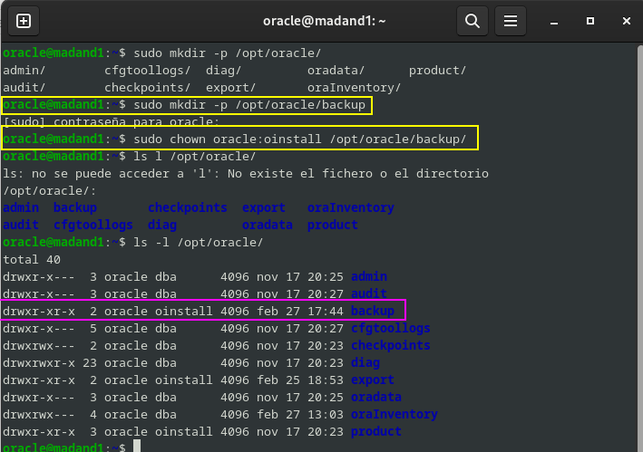

# Copias de seguridad y restauración.

---
# Ejercicio 1

## Realiza una copia de seguridad lógica de tu base de datos completa, teniendo en cuenta los siguientes requisitos:

### ▪ La copia debe estar encriptada y comprimida.
### ▪ Debe realizarse en un conjunto de ficheros con un tamaño máximo de 75 MB.
### ▪ Programa la operación para que se repita cada día a una hora determinada.

Para esta práctica lo que haré será clonar la máquina de Oracle, ya que me fío entre poco y nada de lo que vata a hacer, por lo que más vale prevenir que lamentarme.


Ahora que ya lo tenemos clonardo lo que vamos a hacer es hacer una copia de seguridad lógica, por lo que vamos a utilizar la herramienta **RMAN**, la cual es la herramienta por excelencia de copias de seguridad u restauración en Oracle.

POr lo qu ecrearemos un directorio para su uso exlcusivo, obviamente dentro del usuario oracle, y le daremos sus permisos pertinentes para que pueda hacer lo que quiera con ese directorio.

Dejaré por aqui los comandos:

```bash
oracle@madand1:~$ sudo mkdir -p /opt/oracle/backup
[sudo] contraseña para oracle: 
oracle@madand1:~$ sudo chown oracle:oinstall /opt/oracle/backup/
oracle@madand1:~$ ls -l /opt/oracle/
```

y a continuación como se verá en pantalla:



Ahora nos conectamos a la base de datos de Oracle, como `sysdba` y aquí crearemos un directorio en el que vamos a almacenar lo que son los archivos de la exportación, al cual vamos a asignarle los permisos en nuestro caso a `C###BYRON` para que pueda acceder a él.

```sql
CREATE DIRECTORY EXPORT_DIR AS '/opt/oracle/backup';
GRANT READ, WRITE ON DIRECTORY EXPORT_DIR TO sC###BYRON;
```

Lo que vamos a ver por pantalla:


Tambié le tenemos que dar permios de exportación de sus datos:

```sql
GRANT DATAPUMP_EXP_FULL_DATABASE TO C###BYRON;
```
Y vemos como se da, a nuestro usuario el gran `C###BYRON` por pantalla:


Ahora lo que tenemos que hacer es lo que nos pide el ejercicio, para ello nos vamos a tener que valer de nuetro conocimiento de las clases del gran Rafa, y tendremos que usar lo siguiente que voy a dejar por comando:

```bash
expdp C###BYRON/BYRON DIRECTORY=EXPORT_DIR DUMPFILE=backup`date +%Y%m%d`.dmp FULL=YES LOGFILE=backup`date +%Y%m%d`.log COMPRESSION=ALL DUMPFILE=compress.dmp FILESIZE=75M ENCRYPTION_PASSWORD=BYRON
```

Donde:

- ``expdp C###BYRON/BYRON`` → Ejecuta Data Pump Export en este caso con el usuario ``C###BYRON``.
- ``DIRECTORY=EXPORT_DIR`` → Guarda el backup en la carpeta ``EXPORT_DIR``.
- ```DUMPFILE=backup\date +%Y%m%d`.dmp``` → Que va a crear un archivo con el nombre backupYYYYMMDD.dmp.
- `FULL=YES` → Hace un backup de toda la base de datos.
- `LOGFILE=backup\date +%Y%m%d`.log→ Guarda un registro del proceso `enbackupYYYYMMDD.log`.
- `COMPRESSION=ALL` → Comprime la copia de seguridad para que ocupe menos espacio.
- `FILESIZE=75M` → Divide el backup en archivos de máximo 75 MB.
- `ENCRYPTION_PASSWORD=BYRON` → Cifra los archivos usando la contraseña BYRON para mayor seguridad.

Ahora después de la explicación un poco exhaustiva pero para que quede claro lo qu ehe hecho hasta el momento es hora de ejecutarlo, y obviamente esto lo vamos a ejecutar fuera de lo que la terminal SQL de Oracle, como muestro a continuación , tanto donde y que es lo que va a pasar:

  

Como podemos ver en el último recuadro señalado, la exportación se ha realizado correctamente.  

Ahora, nos dirigimos al directorio que creamos previamente para almacenar los archivos y verificamos lo siguiente:  

- **Tamaño del archivo**  
- **Fecha de creación/modificación**  
- **Propietario y permisos**  

Para ello, utilizamos el siguiente comando:  

```bash
ls -lh /opt/oracle/backup/
```

Ya que el parámetro `-h` nos va a permite visualizar el tamaño en MB en lugar de bytes, facilitando la lectura de la información.

Y ahora lo vemos por pantalla lo que nos ha dado:


Y por último nos quedaría lo que es programar la tarea de realizar una copia de seguridad, para ello nos vamos a valer de lo que va a ser el editor `sudo nano contrab -e`, y vamos a poner esto dentro:


Lo que hemos hecho es programar lo que es la copia de seguridad a las 2 am, he usado esa hora, ya que me he fijado que Whatsapp hace la copia de seguridad sobre esa hora, por lo que he decidido copiar ese método, ya que no molestaría a nadie en sus uso de la base de datos.

Si quisieramos otra hora solo tendriamos que modificar la linea los números.

# Ejercicio 2

## Restaura la copia de seguridad lógica creada en el punto anterior.

Para este ejercicio lo que voy a hacer es borrar todas las tablas de `C###BYRON` e importar lo que es el backup que acabamos de hacer, por lo que vamos a ver que tablas tenemos y proceder a borrarlas.

- Vemos las tablas:

```sql
SELECT table_name FROM user_tables;
```


- Borramos las tablas:

```sql
DROP TABLE BONUS;
DROP TABLE SALGRADE;
DROP TABLE EMP_VIEW;
DROP TABLE EMP;
DROP TABLE DEPT;
DROP TABLE DEPT_VIEW;
```


- Comprobamso que no existen las tablas después de borrarlas:

```sql
SELECT table_name FROM user_tables;
```


Ahora que tenemos la base de datos de `C###BYRON` completamente limpia, vamos a restaurarla con lo que hicimos ante, es decir, usar la copia de seguridad.

Por lo que vamos a usar el siguiente comando, en la terminal del usuario oracle, y no dentro de las sentencias SQL de Oracle.

```bash
impdp C###BYRON/BYRON DIRECTORY=EXPORT_DIR DUMPFILE=backup20250227.dmp FULL=YES ENCRYPTION_PASSWORD=BYRON
```

 

Y ahora entramos dentro y vemos las tablas:


Y como podemos ver se han vueklto a ver las tablas que hemos eliminado con anterioridad, y sus datos con integridad.

