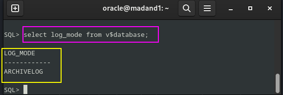

# Copias de seguridad y restauración.

---
# Ejercicio 1

## Realiza una copia de seguridad lógica de tu base de datos completa, teniendo en cuenta los siguientes requisitos:

### ▪ La copia debe estar encriptada y comprimida.
### ▪ Debe realizarse en un conjunto de ficheros con un tamaño máximo de 75 MB.
### ▪ Programa la operación para que se repita cada día a una hora determinada.

Para esta práctica lo que haré será clonar la máquina de Oracle, ya que me fío entre poco y nada de lo que vata a hacer, por lo que más vale prevenir que lamentarme.


Ahora que ya lo tenemos clonardo lo que vamos a hacer es hacer una copia de seguridad lógica, por lo que vamos a utilizar la herramienta **RMAN**, la cual es la herramienta por excelencia de copias de seguridad u restauración en Oracle.

POr lo qu ecrearemos un directorio para su uso exlcusivo, obviamente dentro del usuario oracle, y le daremos sus permisos pertinentes para que pueda hacer lo que quiera con ese directorio.

Dejaré por aqui los comandos:

```bash
oracle@madand1:~$ sudo mkdir -p /opt/oracle/backup
[sudo] contraseña para oracle: 
oracle@madand1:~$ sudo chown oracle:oinstall /opt/oracle/backup/
oracle@madand1:~$ ls -l /opt/oracle/
```

y a continuación como se verá en pantalla:


Ahora nos conectamos a la base de datos de Oracle, como `sysdba` y aquí crearemos un directorio en el que vamos a almacenar lo que son los archivos de la exportación, al cual vamos a asignarle los permisos en nuestro caso a `C###BYRON` para que pueda acceder a él.

```sql
CREATE DIRECTORY EXPORT_DIR AS '/opt/oracle/backup';
GRANT READ, WRITE ON DIRECTORY EXPORT_DIR TO sC###BYRON;
```

Lo que vamos a ver por pantalla:


Tambié le tenemos que dar permios de exportación de sus datos:

```sql
GRANT DATAPUMP_EXP_FULL_DATABASE TO C###BYRON;
```
Y vemos como se da, a nuestro usuario el gran `C###BYRON` por pantalla:


Ahora lo que tenemos que hacer es lo que nos pide el ejercicio, para ello nos vamos a tener que valer de nuetro conocimiento de las clases del gran Rafa, y tendremos que usar lo siguiente que voy a dejar por comando:

```bash
expdp C###BYRON/BYRON DIRECTORY=EXPORT_DIR DUMPFILE=backup`date +%Y%m%d`.dmp FULL=YES LOGFILE=backup`date +%Y%m%d`.log COMPRESSION=ALL DUMPFILE=compress.dmp FILESIZE=75M ENCRYPTION_PASSWORD=BYRON
```

Donde:

- ``expdp C###BYRON/BYRON`` → Ejecuta Data Pump Export en este caso con el usuario ``C###BYRON``.
- ``DIRECTORY=EXPORT_DIR`` → Guarda el backup en la carpeta ``EXPORT_DIR``.
- ```DUMPFILE=backup\date +%Y%m%d`.dmp``` → Que va a crear un archivo con el nombre backupYYYYMMDD.dmp.
- `FULL=YES` → Hace un backup de toda la base de datos.
- `LOGFILE=backup\date +%Y%m%d`.log→ Guarda un registro del proceso `enbackupYYYYMMDD.log`.
- `COMPRESSION=ALL` → Comprime la copia de seguridad para que ocupe menos espacio.
- `FILESIZE=75M` → Divide el backup en archivos de máximo 75 MB.
- `ENCRYPTION_PASSWORD=BYRON` → Cifra los archivos usando la contraseña BYRON para mayor seguridad.

Ahora después de la explicación un poco exhaustiva pero para que quede claro lo qu ehe hecho hasta el momento es hora de ejecutarlo, y obviamente esto lo vamos a ejecutar fuera de lo que la terminal SQL de Oracle, como muestro a continuación , tanto donde y que es lo que va a pasar:

  

Como podemos ver en el último recuadro señalado, la exportación se ha realizado correctamente.  

Ahora, nos dirigimos al directorio que creamos previamente para almacenar los archivos y verificamos lo siguiente:  

- **Tamaño del archivo**  
- **Fecha de creación/modificación**  
- **Propietario y permisos**  

Para ello, utilizamos el siguiente comando:  

```bash
ls -lh /opt/oracle/backup/
```

Ya que el parámetro `-h` nos va a permite visualizar el tamaño en MB en lugar de bytes, facilitando la lectura de la información.

Y ahora lo vemos por pantalla lo que nos ha dado:


Y por último nos quedaría lo que es programar la tarea de realizar una copia de seguridad, para ello nos vamos a valer de lo que va a ser el editor `sudo nano contrab -e`, y vamos a poner esto dentro:


Lo que hemos hecho es programar lo que es la copia de seguridad a las 2 am, he usado esa hora, ya que me he fijado que Whatsapp hace la copia de seguridad sobre esa hora, por lo que he decidido copiar ese método, ya que no molestaría a nadie en sus uso de la base de datos.

Si quisieramos otra hora solo tendriamos que modificar la linea los números.

# Ejercicio 2

## Restaura la copia de seguridad lógica creada en el punto anterior.

Para este ejercicio lo que voy a hacer es borrar todas las tablas de `C###BYRON` e importar lo que es el backup que acabamos de hacer, por lo que vamos a ver que tablas tenemos y proceder a borrarlas.

- Vemos las tablas:

```sql
SELECT table_name FROM user_tables;
```


- Borramos las tablas:

```sql
DROP TABLE BONUS;
DROP TABLE SALGRADE;
DROP TABLE EMP_VIEW;
DROP TABLE EMP;
DROP TABLE DEPT;
DROP TABLE DEPT_VIEW;
```


- Comprobamso que no existen las tablas después de borrarlas:

```sql
SELECT table_name FROM user_tables;
```


Ahora que tenemos la base de datos de `C###BYRON` completamente limpia, vamos a restaurarla con lo que hicimos ante, es decir, usar la copia de seguridad.

Por lo que vamos a usar el siguiente comando, en la terminal del usuario oracle, y no dentro de las sentencias SQL de Oracle.

```bash
impdp C###BYRON/BYRON DIRECTORY=EXPORT_DIR DUMPFILE=backup20250227.dmp FULL=YES ENCRYPTION_PASSWORD=BYRON
```

 


Si nos detenemos a la hora de leer es que el usuario no tiene ciertos permisos, por lo que habrá objetos que no se restauren.

Y ahora entramos dentro y vemos las tablas:


Y como podemos ver se han vuelto a ver las tablas que hemos eliminado con anterioridad, y sus datos con integridad.


---

# Ejercicio 3
## Pon tu base de datos en modo ArchiveLog y realiza con RMAN una copia de seguridad física en caliente.

Anteriormente hemos realizado lo que es una copia de seguridad, por lo que nos valimos del comando:

```bash
expdp C###BYRON/BYRON DIRECTORY=EXPORT_DIR DUMPFILE=backup`date +%Y%m%d`.dmp FULL=YES LOGFILE=backup`date +%Y%m%d`.log COMPRESSION=ALL DUMPFILE=compress.dmp FILESIZE=75M ENCRYPTION_PASSWORD=BYRON
```

Bien, ¿y ahora que tenemos que hacer?

Pues debemos de poner la base de datos en el ***modo ArchiveLog***, pero os estareis preguntando que es ese modo, y no es una nueva evolución del superaiyan.

El ***modo ArchiveLog*** es un modo de operación que tiene nuestro SGBD Oracle el cual nos permite que nuestra base de datos pueda recuperarse de un fallo, da igual el fallo. Por lo que este SGBD guarda los cambios que se han realizado en la base de datos en un fichero log, que se llama `ArchiveLog`.
Es decir, cuando falla para poder recuperar la base, lo hace a aprtir de ese archivo de logs.

Y, ¿como lo podemos activar? PUes para esta pregunta lo que tenemos que hacer es son unos simples pasos, los cuales los voy a dejar por aquí.

1. Parar la base de datos.

```sql
sqlplus / as sysdba
SHUTDOWN IMMEDIATE;
```

Dejo por aquí lo que se ve por pantalla:


2. Iniciamos la base de datos.

```sql
STARTUP MOUNT;
```


3. Modificaremos la base de datos para que se ejecute en este modo anteriormente descrito `ArchiveLog`.

```sql
ALTER DATABASE ARCHIVELOG;
```


4. Inicaremos la base de datos en dicho modo.

```sql
ALTER DATABASE OPEN;
```


Después de todo esto, lo que haremos será ceriorarnos de que de verdad esto esta funcionando, por lo que si ejecutamos el siguiente comando, y nos da la respuesta `ARCHIVELOG` hemos triunfado, que no nos la da, pues esta industria no es la nuestra...

Asi que sin más dilanción nos la vamos a jugar:

```sql
select log_mode from v$database;
```



Como nos ha devuelto lo que nos tenia que dar, seguimos vivos de momento, por lo que ahora si, **ya podemos realizar la copia de seguridad**.

Lo primero antes de nada lo que haré será crear un usuario **RMAN** que pueda administrar un **catálogo de recuperación.**

Por lo que haremos lo siguiente:

```sql
alter session set "_ORACLE_SCRIPT"=true;
CREATE USER RMAN IDENTIFIED BY RMAN;
GRANT CONNECT, RESOURCE TO RMAN;
GRANT RECOVERY_CATALOG_OWNER TO RMAN;
```

Esto se vería por pantalla de la siguiente manera:


Luego de esto lo que tendremos que hacer es crearle un tablespace para el usuario que acabamos de crear `RMAN`.

```sql
CREATE TABLESPACE TS_RMAN_DATA DATAFILE '/opt/oracle/oradata/ORCLCDB/ts_rman_data.dbf' SIZE 500M AUTOEXTEND ON NEXT 10M MAXSIZE UNLIMITED;
ALTER USER RMAN DEFAULT TABLESPACE TS_RMAN_DATA QUOTA UNLIMITED ON TS_RMAN_DATA;
```


Una vez hecho esto tendremos que hacer lo siqguientes que será la copia de seguridad, la cual lo tendremos que hacer desde la terminal de **RMAN**, la cual  es una herramienta de Oracle para hacer copias de seguridad y restaurar bases de datos. Garantiza alta disponibilidad y recuperación ante desastres, detecta corrupción de datos, optimiza el rendimiento con compresión y multiplexación, y es compatible con Oracle Secure Backup y otros sistemas de almacenamiento en cinta. 

También  gestiona todo el proceso de copia de seguridad y restauración sin depender del sistema operativo ni de scripts SQL*Plus. Ofrece una interfaz unificada (línea de comandos y Enterprise Manager), permite paralelización, aplica políticas de retención y mantiene un historial detallado de copias de seguridad.

Ahora lo que haremos será lo siguiente, vamos a salir a la terminal del usuario oracle y vamos a hacer lo siguiente:

```bash
rman
```

Y luego una vez entre en lo que es la terminal de SGBD Oracle, poner lo siguinte, lo cual es conectarnos al usuario que creamos con anterioridad.

```sql
connect CATALOG RMAN/RMAN; 
```


Ahora creamos un catalogo donde nos vamos a basar del tablespace que creamos anteriormente.

```sql
CREATE CATALOG TABLESPACE TS_RMAN_DATA;
```


Ahora nos saldremos a la terminal de normal, y conectaremos RMAN al catalogo.

```sql
rman target =/ catalog RMAN/RMAN
```


Ahora registraremos nuestra base de datos en el catálogo de RMAN y posteriormente realizamos la copia en caliente.

```sql
REGISTER DATABASE;
BACKUP DATABASE PLUS ARCHIVELOG;
```


Lo que acabamos de hacer es realización de una copia de seguridad de datos completa, inckuyendose los resgustro de ArchiLog,
si queremos comprobar que se ha hecho dicha copia de seguridad, lo que tendremos que meter por comandos es lo siguiente:

```sql
RESTORE DATABASE PREVIEW;
```

Esto nos mostrara por pantalla lo siguiente, que es lo que se restaurará en la base de dtaos a partir de la copia de seguridad creada.


Por lo que ya hemos realizado la copia de seguridad.

# Ejercicio 4

##  Borra un fichero de datos de un tablespace e intenta recuperar la instancia de la base de datos a partir de la copia de seguridad creada en el punto anterior.

Ahora esto es una prueba de vida o muerte, la cual es borrar un fichero, yo me he decantado por uno del tablespace USERS, o salimos cortando rabo y oreja, o nos vamos con los pies por delante.

Por lo que voy a entrar en sqlplus como admin, y voy a ver los dicheros que tengo, por lo que dejo el comando:

```sql
SELECT FILE_NAME FORM DBA_DATA_FILES;
```


Ahora lo que hare será copiar `/opt/oracle/oradata/ORCLCDB/users01.dbf` a nuestro `/`, donde tenemos todo ahora mismo, bastante cosas.

```bash
sudo cp /opt/oracle/oradata/ORCLCDB/users01.dbf ./

ls -l

sudo rm /opt/oracle/oradata/ORCLCDB/users01.dbf
```


Una vez que ya lo hemos copiado y borrado de su directorio original, lo que hare será volver a entrar en la terminal de sqlplus, y ver si estan los empleados de C###BYRON.


COmo podemos observar este nos da el error de que no encuentra el fichero, por lo que nos vamos a conectar a lo que será **RMAN** para restaurar dicho fichero a partir de la copia de seguridad que hicimos con anterioridad.

Por lo que lo que haremos será conectarnos con el usuario que hicimos con anterioridad, dejo el comando por aquí:

```bash
rman target =/ catalog RMAN/RMAN
```

Y una vez dentro lo que haremos será listar dentro del backup el fichero que no encuentra la base de datos:

```sql
list backup of datafile '/opt/oracle/oradata/ORCLCDB/users01.dbf';
```

Por aquí dejo lo que sale en la terminal:


Y como nos muetsra en la salida, el fichero que eliminamos si que se encuenrra en nuestra copia de seguridad, por lo que vamos a restaurarla.

Estos son los coanos que tenemos que usar:

```sql
SQL "ALTER TABLESPACE USERS OFFLINE IMMEDIATE";
RESTORE TABLESPACE USERS;
RECOVER TABLESPACE USERS;
SQL "ALTER TABLESPACE USERS ONLINE";
```

Donde:

- Pone el tablespace en estado offline inmediatamente, evitando más modificaciones.
- Restaura el tablespace USERS desde una copia de seguridad.
- Aplica los archivos de redo logs necesarios para dejar el tablespace en un estado consistente.
- Vuelve a poner el tablespace online, permitiendo su uso nuevamente.


Ahora ya que ha puesto las cosas en su sitio, lo que voy a comprobar es que el fichero este en su directorio:

```bash
sudo ls /opt/oracle/oradata/ORCLCDB/
```


Y ahora lo que haremos será verificar de este todo cargado en usuario `C###BYRON`.


Esto es una bomba, que nos ha funcionado, y vemos como esta todo restaurado.

Nota:

Dejo por aqui los comandos para que se vea bonito:

```sql
SQL> set linesize 200;
SQL> SET PAGESIZE 50;
SQL> COLUMN ENAME FORMAT A10;
SQL> COLUMN JOD FORMAT A10;
SQL> COLUMN HIREDATE FORMAT A10;
```
