# Copias de seguridad y restauración.


La copias de seguridad, o backups, son de lo más útil, ya que si pasa algo en una base de dtaos, tenemos un técnico que ha borrado algo y no queria, podemos hacer una restauracioón, por lo que a continuación muetsro como hacerlo en los SGBD tantl relacionales, como no relacional en este caso MOngoDB, así que sin más preambuelo empecemos.

---
# Oracle
---
# Ejercicio 1

## Realiza una copia de seguridad lógica de tu base de datos completa, teniendo en cuenta los siguientes requisitos:

### ▪ La copia debe estar encriptada y comprimida.
### ▪ Debe realizarse en un conjunto de ficheros con un tamaño máximo de 75 MB.
### ▪ Programa la operación para que se repita cada día a una hora determinada.

Para esta práctica lo que haré será clonar la máquina de Oracle, ya que me fío entre poco y nada de lo que vata a hacer, por lo que más vale prevenir que lamentarme.


Ahora que ya lo tenemos clonardo lo que vamos a hacer es hacer una copia de seguridad lógica, por lo que vamos a utilizar la herramienta **RMAN**, la cual es la herramienta por excelencia de copias de seguridad u restauración en Oracle.

POr lo qu ecrearemos un directorio para su uso exlcusivo, obviamente dentro del usuario oracle, y le daremos sus permisos pertinentes para que pueda hacer lo que quiera con ese directorio.

Dejaré por aqui los comandos:

```bash
oracle@madand1:~$ sudo mkdir -p /opt/oracle/backup
[sudo] contraseña para oracle: 
oracle@madand1:~$ sudo chown oracle:oinstall /opt/oracle/backup/
oracle@madand1:~$ ls -l /opt/oracle/
```

y a continuación como se verá en pantalla:


Ahora nos conectamos a la base de datos de Oracle, como `sysdba` y aquí crearemos un directorio en el que vamos a almacenar lo que son los archivos de la exportación, al cual vamos a asignarle los permisos en nuestro caso a `C###BYRON` para que pueda acceder a él.

```sql
CREATE DIRECTORY EXPORT_DIR AS '/opt/oracle/backup';
GRANT READ, WRITE ON DIRECTORY EXPORT_DIR TO sC###BYRON;
```

Lo que vamos a ver por pantalla:


Tambié le tenemos que dar permios de exportación de sus datos:

```sql
GRANT DATAPUMP_EXP_FULL_DATABASE TO C###BYRON;
```
Y vemos como se da, a nuestro usuario el gran `C###BYRON` por pantalla:


Ahora lo que tenemos que hacer es lo que nos pide el ejercicio, para ello nos vamos a tener que valer de nuetro conocimiento de las clases del gran Rafa, y tendremos que usar lo siguiente que voy a dejar por comando:

```bash
expdp C###BYRON/BYRON DIRECTORY=EXPORT_DIR DUMPFILE=backup`date +%Y%m%d`.dmp FULL=YES LOGFILE=backup`date +%Y%m%d`.log COMPRESSION=ALL DUMPFILE=compress.dmp FILESIZE=75M ENCRYPTION_PASSWORD=BYRON
```

Donde:

- ``expdp C###BYRON/BYRON`` → Ejecuta Data Pump Export en este caso con el usuario ``C###BYRON``.
- ``DIRECTORY=EXPORT_DIR`` → Guarda el backup en la carpeta ``EXPORT_DIR``.
- ```DUMPFILE=backup\date +%Y%m%d`.dmp``` → Que va a crear un archivo con el nombre backupYYYYMMDD.dmp.
- `FULL=YES` → Hace un backup de toda la base de datos.
- `LOGFILE=backup\date +%Y%m%d`.log→ Guarda un registro del proceso `enbackupYYYYMMDD.log`.
- `COMPRESSION=ALL` → Comprime la copia de seguridad para que ocupe menos espacio.
- `FILESIZE=75M` → Divide el backup en archivos de máximo 75 MB.
- `ENCRYPTION_PASSWORD=BYRON` → Cifra los archivos usando la contraseña BYRON para mayor seguridad.

Ahora después de la explicación un poco exhaustiva pero para que quede claro lo qu ehe hecho hasta el momento es hora de ejecutarlo, y obviamente esto lo vamos a ejecutar fuera de lo que la terminal SQL de Oracle, como muestro a continuación , tanto donde y que es lo que va a pasar:

  

Como podemos ver en el último recuadro señalado, la exportación se ha realizado correctamente.  

Ahora, nos dirigimos al directorio que creamos previamente para almacenar los archivos y verificamos lo siguiente:  

- **Tamaño del archivo**  
- **Fecha de creación/modificación**  
- **Propietario y permisos**  

Para ello, utilizamos el siguiente comando:  

```bash
ls -lh /opt/oracle/backup/
```

Ya que el parámetro `-h` nos va a permite visualizar el tamaño en MB en lugar de bytes, facilitando la lectura de la información.

Y ahora lo vemos por pantalla lo que nos ha dado:


Y por último nos quedaría lo que es programar la tarea de realizar una copia de seguridad, para ello nos vamos a valer de lo que va a ser el editor `sudo nano contrab -e`, y vamos a poner esto dentro:


Lo que hemos hecho es programar lo que es la copia de seguridad a las 2 am, he usado esa hora, ya que me he fijado que Whatsapp hace la copia de seguridad sobre esa hora, por lo que he decidido copiar ese método, ya que no molestaría a nadie en sus uso de la base de datos.

Si quisieramos otra hora solo tendriamos que modificar la linea los números.

---
# Ejercicio 2

## Restaura la copia de seguridad lógica creada en el punto anterior.

Para este ejercicio lo que voy a hacer es borrar todas las tablas de `C###BYRON` e importar lo que es el backup que acabamos de hacer, por lo que vamos a ver que tablas tenemos y proceder a borrarlas.

- Vemos las tablas:

```sql
SELECT table_name FROM user_tables;
```


- Borramos las tablas:

```sql
DROP TABLE BONUS;
DROP TABLE SALGRADE;
DROP TABLE EMP_VIEW;
DROP TABLE EMP;
DROP TABLE DEPT;
DROP TABLE DEPT_VIEW;
```


- Comprobamso que no existen las tablas después de borrarlas:

```sql
SELECT table_name FROM user_tables;
```


Ahora que tenemos la base de datos de `C###BYRON` completamente limpia, vamos a restaurarla con lo que hicimos ante, es decir, usar la copia de seguridad.

Por lo que vamos a usar el siguiente comando, en la terminal del usuario oracle, y no dentro de las sentencias SQL de Oracle.

```bash
impdp C###BYRON/BYRON DIRECTORY=EXPORT_DIR DUMPFILE=backup20250227.dmp FULL=YES ENCRYPTION_PASSWORD=BYRON
```

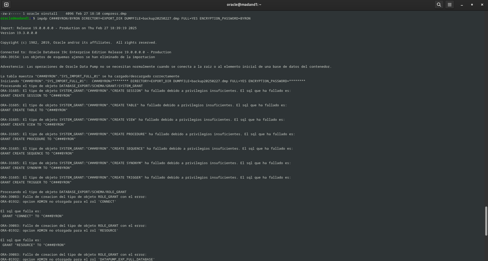 


Si nos detenemos a la hora de leer es que el usuario no tiene ciertos permisos, por lo que habrá objetos que no se restauren.

Y ahora entramos dentro y vemos las tablas:


Y como podemos ver se han vuelto a ver las tablas que hemos eliminado con anterioridad, y sus datos con integridad.


---

# Ejercicio 3
## Pon tu base de datos en modo ArchiveLog y realiza con RMAN una copia de seguridad física en caliente.

Anteriormente hemos realizado lo que es una copia de seguridad, por lo que nos valimos del comando:

```bash
expdp C###BYRON/BYRON DIRECTORY=EXPORT_DIR DUMPFILE=backup`date +%Y%m%d`.dmp FULL=YES LOGFILE=backup`date +%Y%m%d`.log COMPRESSION=ALL DUMPFILE=compress.dmp FILESIZE=75M ENCRYPTION_PASSWORD=BYRON
```

Bien, ¿y ahora que tenemos que hacer?

Pues debemos de poner la base de datos en el ***modo ArchiveLog***, pero os estareis preguntando que es ese modo, y no es una nueva evolución del superaiyan.

El ***modo ArchiveLog*** es un modo de operación que tiene nuestro SGBD Oracle el cual nos permite que nuestra base de datos pueda recuperarse de un fallo, da igual el fallo. Por lo que este SGBD guarda los cambios que se han realizado en la base de datos en un fichero log, que se llama `ArchiveLog`.
Es decir, cuando falla para poder recuperar la base, lo hace a aprtir de ese archivo de logs.

Y, ¿como lo podemos activar? PUes para esta pregunta lo que tenemos que hacer es son unos simples pasos, los cuales los voy a dejar por aquí.

1. Parar la base de datos.

```sql
sqlplus / as sysdba
SHUTDOWN IMMEDIATE;
```

Dejo por aquí lo que se ve por pantalla:


2. Iniciamos la base de datos.

```sql
STARTUP MOUNT;
```


3. Modificaremos la base de datos para que se ejecute en este modo anteriormente descrito `ArchiveLog`.

```sql
ALTER DATABASE ARCHIVELOG;
```


4. Inicaremos la base de datos en dicho modo.

```sql
ALTER DATABASE OPEN;
```


Después de todo esto, lo que haremos será ceriorarnos de que de verdad esto esta funcionando, por lo que si ejecutamos el siguiente comando, y nos da la respuesta `ARCHIVELOG` hemos triunfado, que no nos la da, pues esta industria no es la nuestra...

Asi que sin más dilanción nos la vamos a jugar:

```sql
select log_mode from v$database;
```


Como nos ha devuelto lo que nos tenia que dar, seguimos vivos de momento, por lo que ahora si, **ya podemos realizar la copia de seguridad**.

Lo primero antes de nada lo que haré será crear un usuario **RMAN** que pueda administrar un **catálogo de recuperación.**

Por lo que haremos lo siguiente:

```sql
alter session set "_ORACLE_SCRIPT"=true;
CREATE USER RMAN IDENTIFIED BY RMAN;
GRANT CONNECT, RESOURCE TO RMAN;
GRANT RECOVERY_CATALOG_OWNER TO RMAN;
```

Esto se vería por pantalla de la siguiente manera:


Luego de esto lo que tendremos que hacer es crearle un tablespace para el usuario que acabamos de crear `RMAN`.

```sql
CREATE TABLESPACE TS_RMAN_DATA DATAFILE '/opt/oracle/oradata/ORCLCDB/ts_rman_data.dbf' SIZE 500M AUTOEXTEND ON NEXT 10M MAXSIZE UNLIMITED;
ALTER USER RMAN DEFAULT TABLESPACE TS_RMAN_DATA QUOTA UNLIMITED ON TS_RMAN_DATA;
```


Una vez hecho esto tendremos que hacer lo siqguientes que será la copia de seguridad, la cual lo tendremos que hacer desde la terminal de **RMAN**, la cual  es una herramienta de Oracle para hacer copias de seguridad y restaurar bases de datos. Garantiza alta disponibilidad y recuperación ante desastres, detecta corrupción de datos, optimiza el rendimiento con compresión y multiplexación, y es compatible con Oracle Secure Backup y otros sistemas de almacenamiento en cinta. 

También  gestiona todo el proceso de copia de seguridad y restauración sin depender del sistema operativo ni de scripts SQL*Plus. Ofrece una interfaz unificada (línea de comandos y Enterprise Manager), permite paralelización, aplica políticas de retención y mantiene un historial detallado de copias de seguridad.

Ahora lo que haremos será lo siguiente, vamos a salir a la terminal del usuario oracle y vamos a hacer lo siguiente:

```bash
rman
```

Y luego una vez entre en lo que es la terminal de SGBD Oracle, poner lo siguinte, lo cual es conectarnos al usuario que creamos con anterioridad.

```sql
connect CATALOG RMAN/RMAN; 
```


Ahora creamos un catalogo donde nos vamos a basar del tablespace que creamos anteriormente.

```sql
CREATE CATALOG TABLESPACE TS_RMAN_DATA;
```


Ahora nos saldremos a la terminal de normal, y conectaremos RMAN al catalogo.

```sql
rman target =/ catalog RMAN/RMAN
```


Ahora registraremos nuestra base de datos en el catálogo de RMAN y posteriormente realizamos la copia en caliente.

```sql
REGISTER DATABASE;
BACKUP DATABASE PLUS ARCHIVELOG;
```


Lo que acabamos de hacer es realización de una copia de seguridad de datos completa, inckuyendose los resgustro de ArchiLog,
si queremos comprobar que se ha hecho dicha copia de seguridad, lo que tendremos que meter por comandos es lo siguiente:

```sql
RESTORE DATABASE PREVIEW;
```

Esto nos mostrara por pantalla lo siguiente, que es lo que se restaurará en la base de dtaos a partir de la copia de seguridad creada.


Por lo que ya hemos realizado la copia de seguridad.

---
# Ejercicio 4

##  Borra un fichero de datos de un tablespace e intenta recuperar la instancia de la base de datos a partir de la copia de seguridad creada en el punto anterior.

Ahora esto es una prueba de vida o muerte, la cual es borrar un fichero, yo me he decantado por uno del tablespace USERS, o salimos cortando rabo y oreja, o nos vamos con los pies por delante.

Por lo que voy a entrar en sqlplus como admin, y voy a ver los dicheros que tengo, por lo que dejo el comando:

```sql
SELECT FILE_NAME FORM DBA_DATA_FILES;
```


Ahora lo que hare será copiar `/opt/oracle/oradata/ORCLCDB/users01.dbf` a nuestro `/`, donde tenemos todo ahora mismo, bastante cosas.

```bash
sudo cp /opt/oracle/oradata/ORCLCDB/users01.dbf ./

ls -l

sudo rm /opt/oracle/oradata/ORCLCDB/users01.dbf
```


Una vez que ya lo hemos copiado y borrado de su directorio original, lo que hare será volver a entrar en la terminal de sqlplus, y ver si estan los empleados de C###BYRON.


COmo podemos observar este nos da el error de que no encuentra el fichero, por lo que nos vamos a conectar a lo que será **RMAN** para restaurar dicho fichero a partir de la copia de seguridad que hicimos con anterioridad.

Por lo que lo que haremos será conectarnos con el usuario que hicimos con anterioridad, dejo el comando por aquí:

```bash
rman target =/ catalog RMAN/RMAN
```

Y una vez dentro lo que haremos será listar dentro del backup el fichero que no encuentra la base de datos:

```sql
list backup of datafile '/opt/oracle/oradata/ORCLCDB/users01.dbf';
```

Por aquí dejo lo que sale en la terminal:


Y como nos muetsra en la salida, el fichero que eliminamos si que se encuenrra en nuestra copia de seguridad, por lo que vamos a restaurarla.

Estos son los coanos que tenemos que usar:

```sql
SQL "ALTER TABLESPACE USERS OFFLINE IMMEDIATE";
RESTORE TABLESPACE USERS;
RECOVER TABLESPACE USERS;
SQL "ALTER TABLESPACE USERS ONLINE";
```

Donde:

- Pone el tablespace en estado offline inmediatamente, evitando más modificaciones.
- Restaura el tablespace USERS desde una copia de seguridad.
- Aplica los archivos de redo logs necesarios para dejar el tablespace en un estado consistente.
- Vuelve a poner el tablespace online, permitiendo su uso nuevamente.


Ahora ya que ha puesto las cosas en su sitio, lo que voy a comprobar es que el fichero este en su directorio:

```bash
sudo ls /opt/oracle/oradata/ORCLCDB/
```


Y ahora lo que haremos será verificar de este todo cargado en usuario `C###BYRON`.


Esto es una bomba, ya que vemos como nos ha funcionado, y vemos como esta todo restaurado.

Nota:

Dejo por aqui los comandos para que se vea bonito:

```sql
SQL> set linesize 200;
SQL> SET PAGESIZE 50;
SQL> COLUMN ENAME FORMAT A10;
SQL> COLUMN JOD FORMAT A10;
SQL> COLUMN HIREDATE FORMAT A10;
```
---
# Ejercicio 5
##  Borra un fichero de control e intenta recuperar la base de datos a partir de la copia de seguridad creada en el punto anterior.

Como hemos hecho anteriormente, es decir en el ejercicio anterior es ver si existe un fichero de control en nuestro backup, por lo qe nos vamos a conectar a **RMAN** y meteremos los siguientes comandos:

```bash
rman target =/ catalog RMAN/RMAN
```
y una vez dentro meteremos el siguiente para liostar si existe en nuestra copia de seguridad el fichero de control.

```sql
list backup of controlfile;
```


Y como podemos observar tenemos 3 copias de seguridad las cuales encuentran este fichero, por lo que como la última copia de seguridad es esta `/opt/oracle/product/19c/dbhome_1/dbs/c-2956370217-20250228-02`, es la que voy a restaurar.

⚠️ **Importante:**Es crucial guardar esta ruta, ya que si el archivo de control se elimina, la base de datos no podrá montarse correctamente y RMAN no podrá acceder al catálogo creado previamente. Por ello, es necesario especificar la ruta completa del archivo para restaurar la copia.

Si nos vamos al siguiente directorio `/opt/oracle/oradata/ORCLCDB` encontraremos dos ficheros de control, por lo que voy a mover uno de ellos como anteriormente hice con el users, dejo por aquí los comandos:


Ahora despues de esto borramos el control, que movimos y nos meteremos en sqlplus, y haremos lo siguiente:

```sql
SHUTDOWN ABORT;
STARTUP NOMOUNT;
```


Luego de esto y en la misma sesión lo que hacemos es pregunbtar por lo empleados del usuario `C###BYRON`:


Y como podemos observar estos no responde y nos da el fallo `ORA-01219`

Ahora salimos de la sesión de sqlplus, y nos conectamos con nuestro usuario a `NRAM`:

```bash
rman target =/ catalog RMAN/RMAN
```

Pero este nos va a decir que no se puede conectar al catalogo:

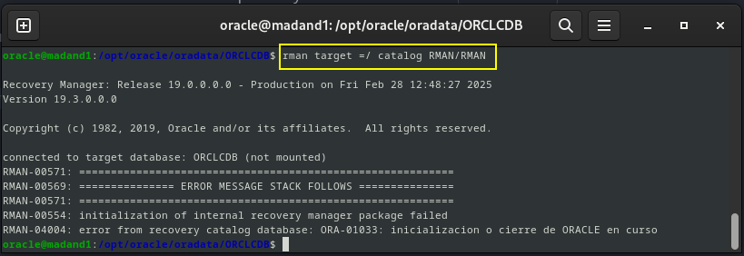

Por lo que para poder hacer la restauración lo que haremos sera conectanor a `RMAN` de una forma nomral, y ejecutar el siguiente comando, para el cual vamos a hacer uso de la ruta del fichero que dijimos con anterioridad.

```bash
rman target =/
```

Y donde haremos uso del siguinete comando:

```sql
restore controlfile from '/opt/oracle/product/19c/dbhome_1/dbs/c-2956370217-20250228-02';
```


Ahora una vez listo, lo que haremos siguiendo en la misma terminal es lo siguiente, es recuperar la base de datos, volver a montarla, una recuperación y resetar los logs.

```sql
alter database mount;
recover database;
alter database open resetlogs;
```

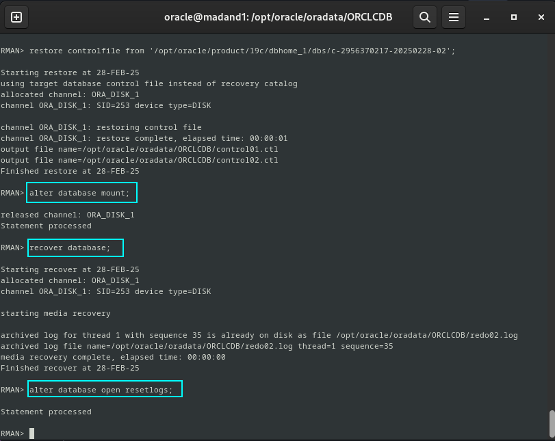

Y ahora lo que tendriamos que hacer es una comprobación como antes:

- Vemos como entra con nuetsro usuario `RMAN/RMAN`


- Como al meternos como sysdba, nos sale las tablas del usuario `C###BYRON`


---
# PostgreSQL

---
# Ejercicio 6

## Documenta el empleo de las herramientas de copia de seguridad y restauración de Postgres.

Para esta parte al igual que en el anterior caso, lo que haré será una clonación de la máquina de PostgreSQL, y una vez hecho esto, empezaremos a trabajar en este ejercicio.

Lo primero que vamos a hacer es listar las bases de datos que tenemos en este SGBD, para ello nos vamos a valer del comando una vez dentro de postgres.

```bash
sudo -u postgres psql
```
Y una vez dentro listamos las bases de datos:

```sql
\l
```
Y nos ofrece por pantalla lo siguiente:


Y también todos los usuarios que tenemos, con el siguiente comando:

```sql
select * form pg_user;
```
Y lo vemos por pantalla:


Por lo que vamos a crear una copia de seguridad, pero lo primero que tenemos que hacer es crear el directorio, o más bien ruta, donde queremos que se guarde todo lo relacionado con las copia de seguridad, todo esto lo tenemos qu ehacer siendo usuario postgres.

- Ser usuario postgres.

```bash
sudo -i -u postgres
```

- Creación del directorio.

```bash
sudo mkdir -p /var/lib/postgresql/backup
```

- Guardado de la copia de seguridad.

```bash
pg_basebackup -D /var/lib/postgresql/backup
```

Si lo has hecho como otro usuario cambia los permiso, y el propietario.


Para restaurarla, será necesario detener el servicio, ya que la restauración se realizará copiando los archivos directamente.

Por lo que dejamos ya el usuario postgresm y nos vamos a nuetsro usuario, y ejecutamos lo siguiente:

```bash
sudo systemctl stop postgresql
sudo systemctl ststus postgresql
```


Ahora borrare todos los ficheros, y le rezamos a dios en los siguientes pasos.

1. Borrado de los ficheros en la siguiente ruta.

```bash
sudo rm -fr /var/lib/postgresql/15/main/*
```
2. Comprobar que lo hemos borrado.

```bash
sudo ls -l
```


Ahora intentare meterme en la base de datos ydeberia de fallar.

```bash
sudo -u postgres psql
```

Y como vemos a continuación no xiste el fichero.


A continuación, copiaremos los archivos desde el directorio donde realizamos el backup y asignaremos los permisos adecuados, incluyendo el cambio de propietario si es necesario.

Por lo que ahora entramos como el usuario postrgres:

```bash
su postgres
```
Y entramos en el directorio backup, y copiamos todos los ficheros, a directorio `/var/lib/postgresql/15/main/`, a continuación dejo los comandos:

```bash
su postgres
cd
cd backup/
ls
cp -r * /var/lib/postgresql/15/main/
ls -l /var/lib/postgresql/15/main/
```


Una vez hecho esto, lo que tendremos que hacer es iniciar el servicio de postgres y verificar su estad, en mi casdo me sali del usuario postgres, pero lo podeis hacer desde donde querais:

```bash
sudo systemctl start postgresql
 sudo systemctl status postgresql
```


Ahora lo que vamos a hacer es coger y entrar y ver que esten las bases de datos, con sus usuario y demas.

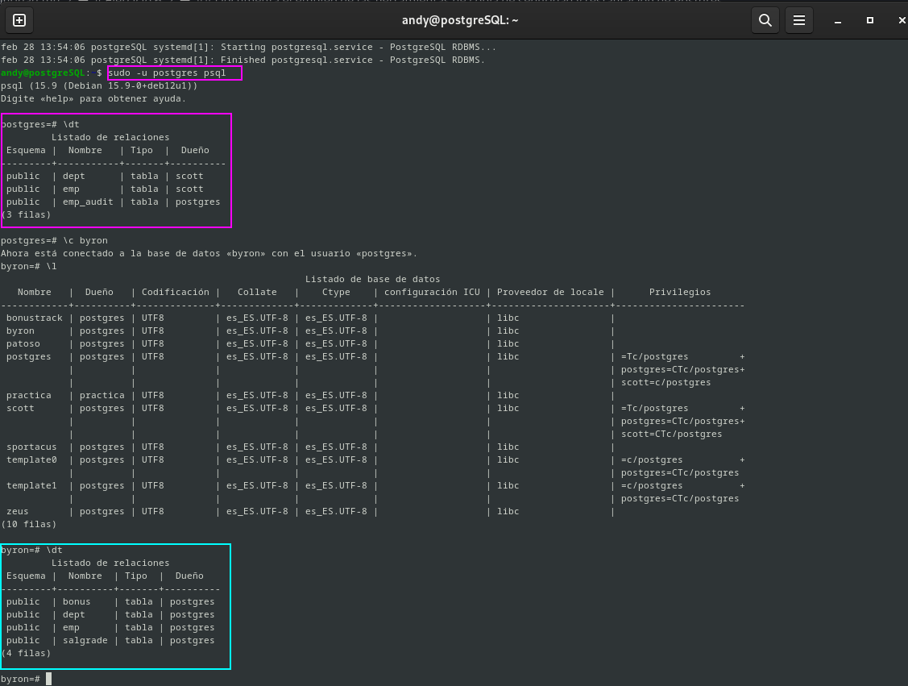

COmo vimos en Oracle en esta misma práctica, podemos programar lo que es la copia de seguirdad con la herramienta **contrab -e**, ya que es más útil.

Por lo que si queremos hacer una copia a las dos de la mañana tendremos que añadir al fichero la siguiente linea:

```bash

0 2 * * * pg_basebackup -D /var/lib/postgresql/backup
```

Y con esto ya estaría este ejercicio.

---

# MariaDB 
---

# Ejercicio 7
## Documenta el empleo de las herramientas de copia de seguridad y restauración de MySQL.

En este **SGBD relacional**, podemos encontrar varias herramientas para hacer lo que es las copias de seguridad o backup, por lo que os voy a mostrar algunas de ellas.

- `mysqldump`:Es una herramienta que permite generar copias de seguridad de bases de datos MySQL en formato de texto plano. Puede utilizarse para respaldar una base de datos completa, una o varias tablas específicas. Los archivos generados contienen las instrucciones SQL necesarias para recrear tanto la estructura de la base de datos como sus datos.
- `MySQL Enterprise Backup`: Forma parte de MySQL Enterprise Edition y ofrece una solución avanzada para la copia de seguridad y restauración de bases de datos MySQL. Permite realizar copias de seguridad en caliente mediante snapshots, así como respaldos incrementales y restauraciones en un punto específico en el tiempo, optimizando la disponibilidad y el rendimiento del sistema.
- `Percona XtraBackup`:Es una herramienta de respaldo y recuperación diseñada para bases de datos MySQL y Percona Server. Permite realizar copias de seguridad en caliente mediante snapshots, minimizando el tiempo de inactividad. A pesar de ser una solución robusta y ampliamente utilizada, ha quedado algo rezagada en comparación con alternativas más recientes.

Nosotros nos vamos a centrar en la herramienta `mysqldump` para poder hacer lo que son las copias de seguridad o backup, por lo que usaremos el siguiente comando:

```bash 
sudo mysqldump -u root -p --all-databases > backup/copia_seguridad-mariadb.sql
```

Lo que hacemos con esto es coger y hacer una copia de seguridad con dicho comando, en el cual se va a guardar todo en `copia_seguridad-mariadb.sql` el cual va a estar todo en el directorio `backup`.

Dejo por aquí la comprobación:

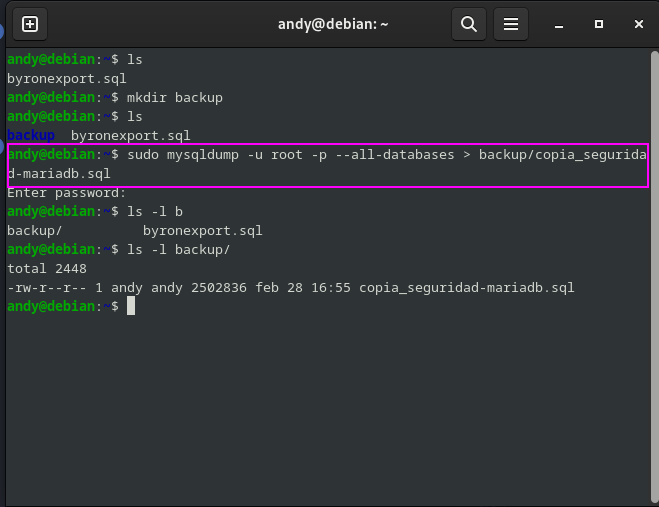

Y si queremos ver que se hizo realmente podemos hacer un **cat** del fichero que acabamos de hacer:


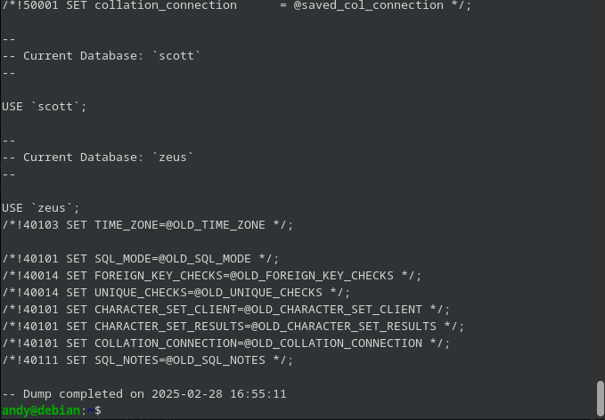

No lo he puesto todo ya que es demasiada información, por lo que dejo solo un troo de la salida.

Ahora lo que haré sera borrar la base de datos tanto de byron como la de zeus, y poder entrar con nuestro usuario root, a ver si nos deja después.

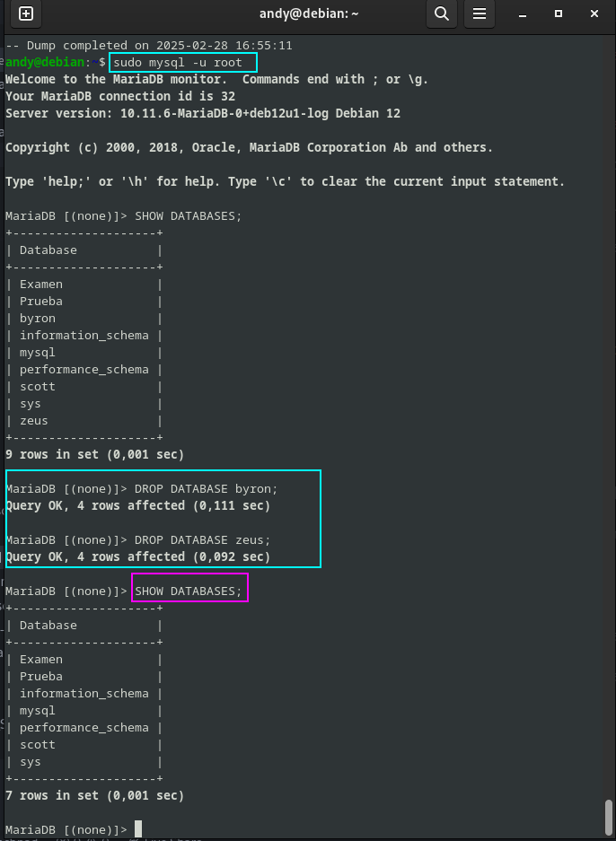

Ahora lo que hago es intentar entrar en una de las que he borrado:

```sql
use byron;

use zeus;
```

Y como podemos ver este nos dice que es una base de datos desconocida:

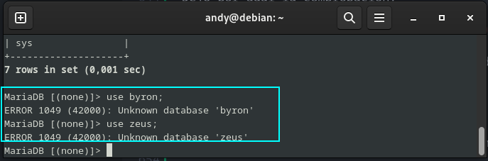

AHora lo que tenemos que hacer para poder hacer una restauración es usar la copia de seguridad la cual hicimos antes, la que se llama `copia_seguridad-mariadb.sql`, la cual vamos a usar havciendo lo siguiente:

```bash
sudo mysql -u root -p < backup/copia_seguridad-mariadb.sql
```

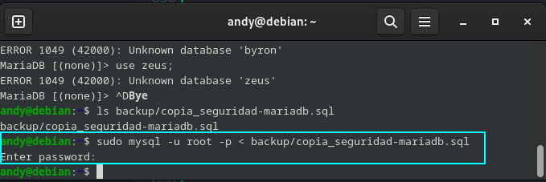

Y ahora entramos dentro directamenre de una de las que antes borramos, por ejemlo zeus, por lo que usaremos el siguiente comando:

```bash
sudo mysql -u root -p zeus 
```

Y como podemos ver, esta todo totalmente restaurado:

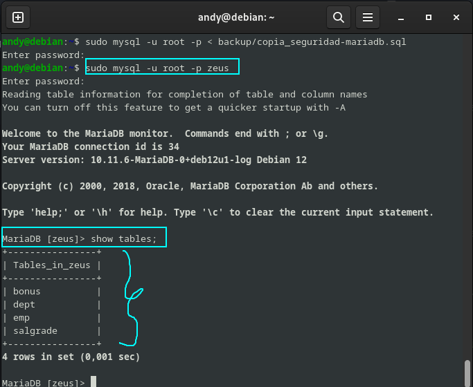

Esto tambien podria bien servir a la hora de recuperar usuarios, el cual dejo por aquí un ejemplo:


Y ahora procedemos a restaurarlo como anterioremnete:

```bash
sudo mysql -u root -p < backup/copia_seguridad-mariadb.sql
```

Y lo comprobamos:


Y como podemos observar ya esta restaurado.

Tambien como en los casos anteriores podemos hacer una programación de una copia de seguridad diaria, por lo que usaremos al igual que antes `contrab -e`, y tendriamos que poner la siguiente linea en el caso de que lo queramos a las 2 de la mañana:

```bash
0 2 * * * sudo mysqldump -u root -p --all-databases > backup/copia_seguridad-mariadb_$(date +%Y-%m-%d).sql
```

Y con esto tendriamos programada las copias de seguridad a diarias y aqu enos saliera con la fecha en la que se hace.

---

# MongoDB
##  Documenta el empleo de las herramientas de copia de seguridad y restauración de MongoDB.

Para este ejercicio lo que vamos a hacer uso de la herramienta `mongodump` para crear lo que es la copia de seguridad , por lo que vamos a ver en que bases de datos tenemos en nuestro **Mongo**.

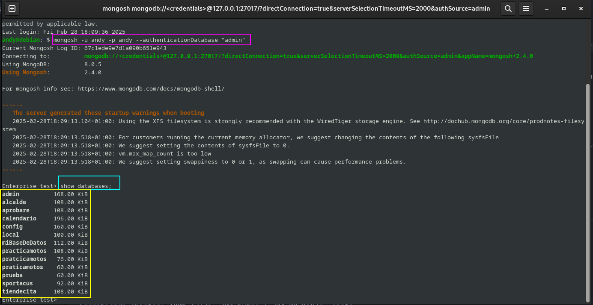

Y voy a hacer una copia de seguridad sobre una base de datos, en este caso usare la de `practicamotos`, ya que es la que tengo especial cariño.

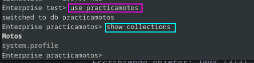

Ya que con esta herramienta lo que hacemos son backup de bases de datos en concreto, por lo que el coamdno será el siguiente:ç

```bash
mongodump -u andy -p andy --db practicamotos --authenticationDatabase admin --out backups
```

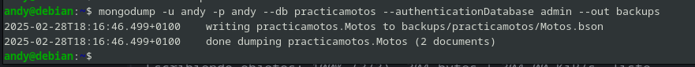

Esto lo que ha hecho es crear un directorio de copias de seguridad y si entarmos dentro estara la base de datos `practicamotos`, y podemos ver su contenido de la siguiente manera:

```bash 
bsondump practicamotos/motos.bson | jq
```

Lo podemos ver a continuación:

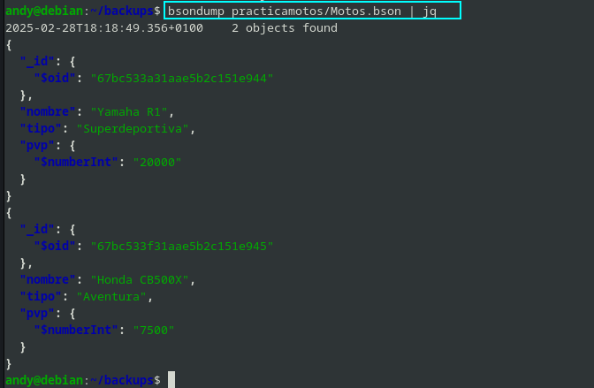

Ahora lo que tendremos que hacer es borrar la base de datos, por lo que vamos a entrar en dicha base de datos y borrar las coleciones, y tal.

```sql 
use practicamotos --O cualquier base de datos que queramos eliminar.
db.dropDatabase()
```
Esto no se verá en el momento, pero ya nop está.

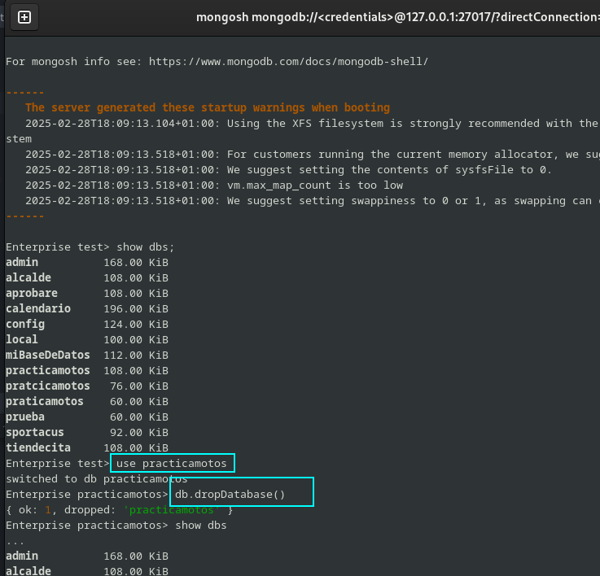

Ahora que lo he borrado, lo que haremos será restaurarlo con la copia que hicimos con anterioridad, por lo que usare el siguiente comando, el cual tiene que ser usado dentro del directorio de backups:

```bash
mongorestore -u andy -p andy --db practicamotos --authenticationDatabase admin practicamotos
```

Y asi lo vemos por pantalla:

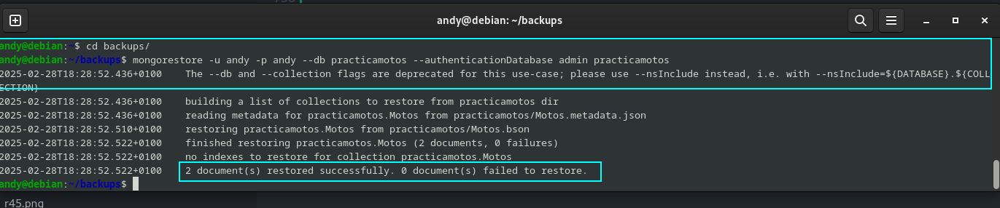

Y ahora lo que haremos será entrar en dicha base de datos y comprobarlo.

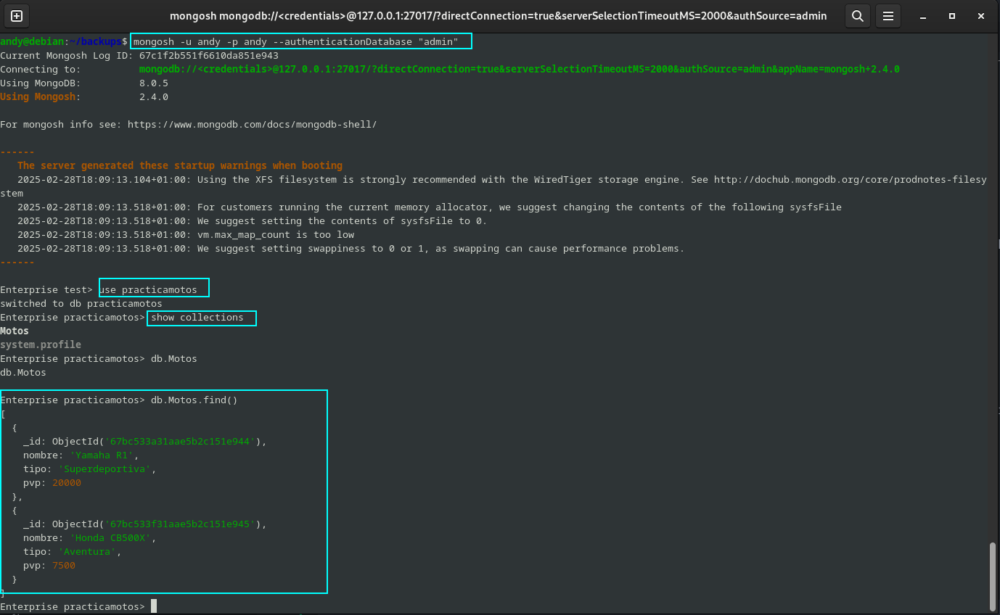


Si observamos esto se ha hecho de escandalo, es decir, la restauración ha sido todo un exito, pero esto como siempre hay cierto margen de mejora, por lo que podemos al igual que las demás herramientas, automatizar este proceso haciendo uso de lo que es `contra -e` para su uso diario.

Por lo que abriendo el editor, lo pondriamos a las dos de la mañana, y se haria de forma automatica, dejo el comando por aqui:

```bash
0 2 * * * mongodump -u andy -p andy --db practicamotos --authenticationDatabase admin --out backups
```
---

# Área de descanso del aventurero.

Después de todo este camino, espero que hayais tenido un gran viaje, asi que [descansa viajero](https://www.youtube.com/watch?v=1Sq4cD5ib2U&ab_channel=ChillCartoonVibes)

**¡Buena suerte, aventurero!** 🚀🗺️⚔️

