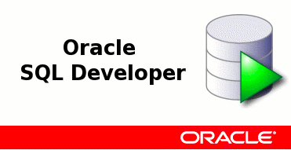
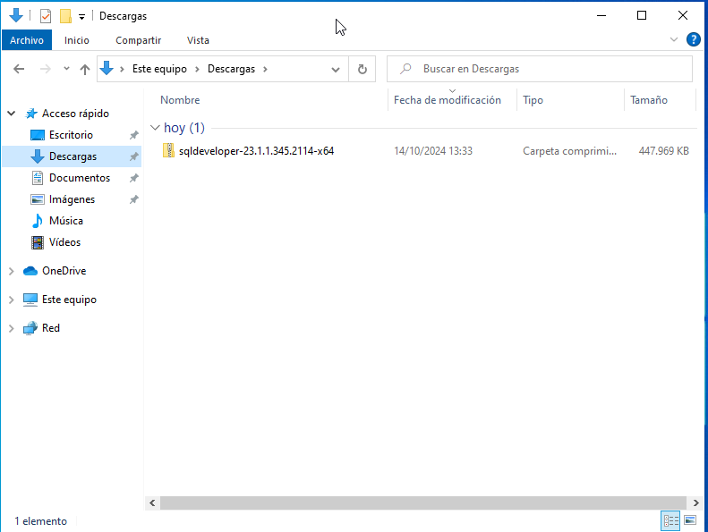
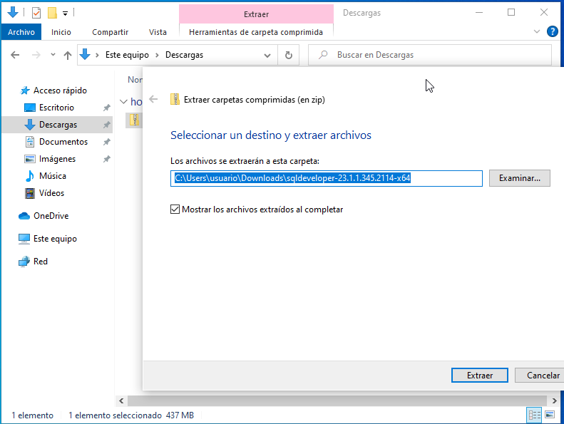
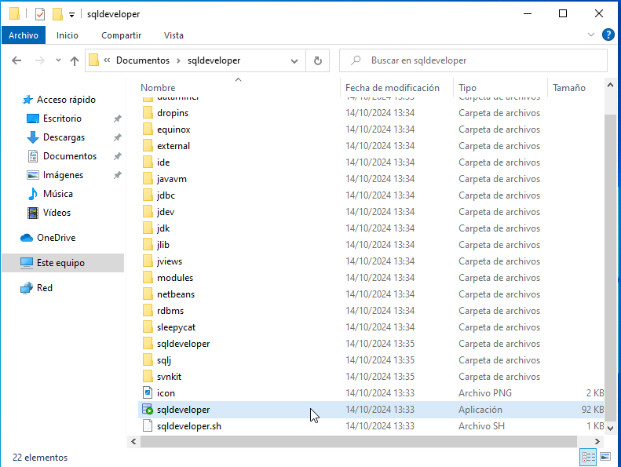
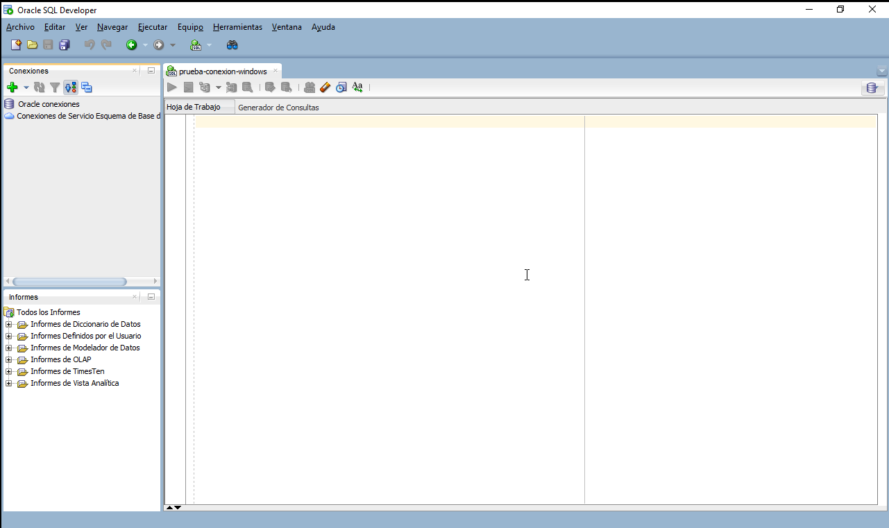
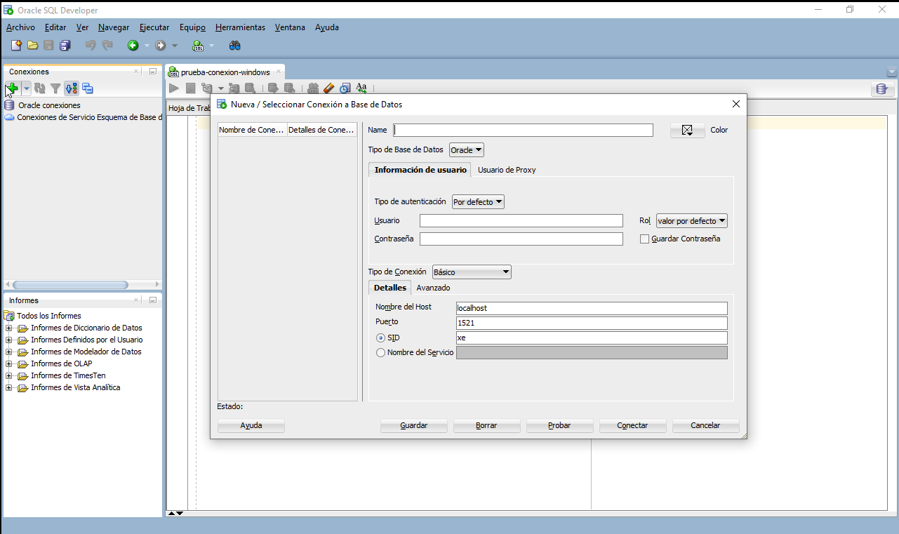
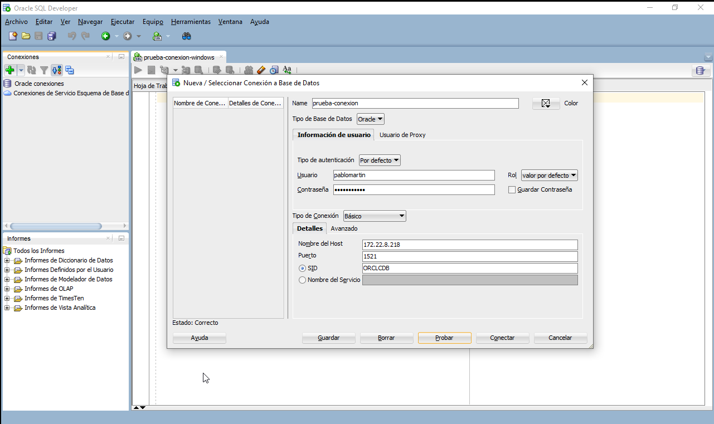
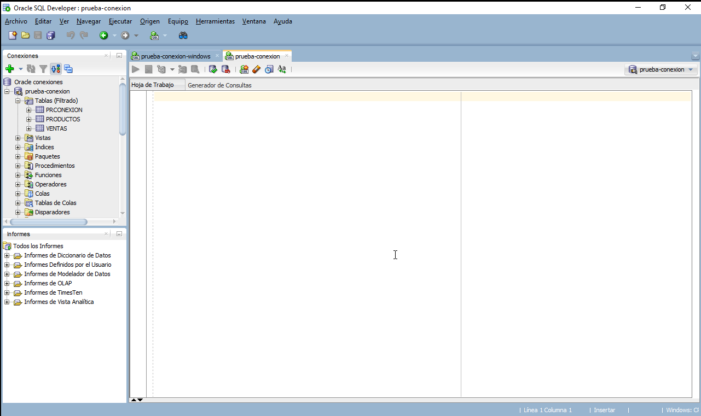
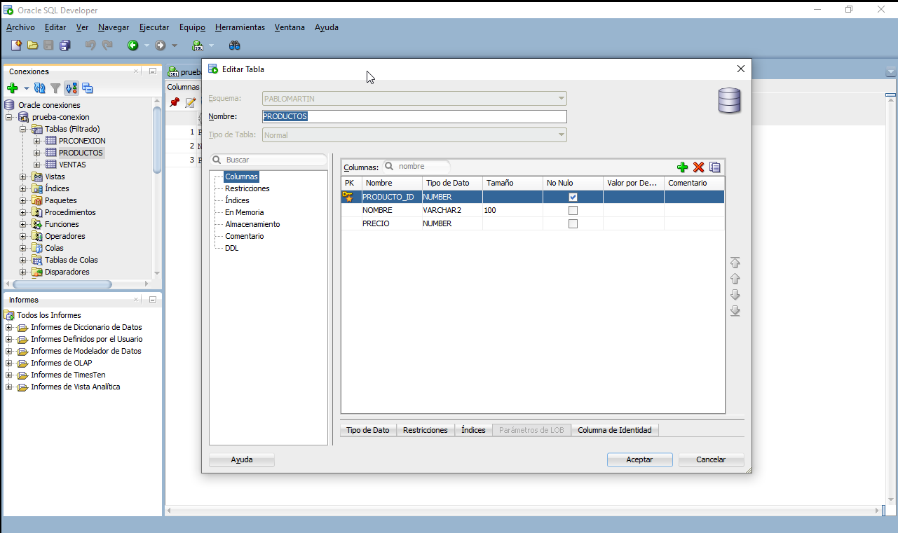
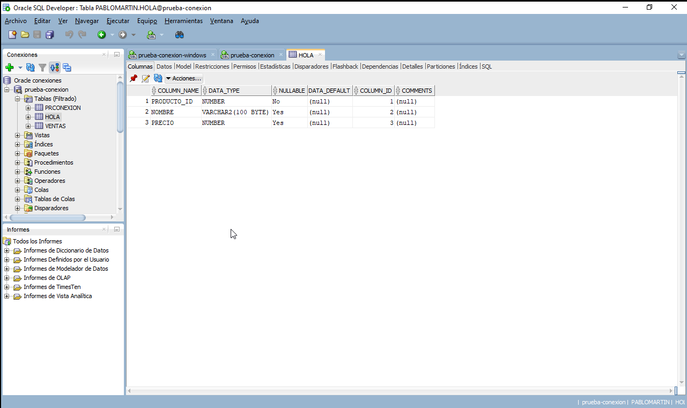

# Instalación de Servidor MySQL en Debian 12

## Autor :computer:

* Alejandro Herrera Jiménez
* Raúl Herrera Ruiz
* Pablo Martin Hidalgo
* Andrés Morales González
* :school:I.E.S. Gonzalo Nazareno :round_pushpin:(Dos Hermanas, Sevilla).

# Descarga de SQLDeveloper

Para proceder a la instalacón de SQLDeveloper, tendremos que irnos al siguiente URL [Descara SQLDeveloper](https://www.oracle.com/database/sqldeveloper/technologies/download/), en esta páguina descargaremos el que sera el siguiente:

- Windows 64-bit with JDK 11 included
  
Ya que tendrá los requisitos que necesitamos:

- MD5: 3dc07aff110632a9e83189e7e689f279
- SHA1: 59aa51cc318a32c4ddbac9f4c0b8ae12d6871cbd

Una vez descagado desde nuestro Windows:

Una vez aqui lo que tendremos que hacer es descomprimirlo, usando el botón derecho y le damos a extraer todo, donde queramos:

 

Una vez dentro de la carpeta donde estan todos los archivo descomprimidos, procederemos a ejecutar su ejecutables, cuyo nombre es *sqldeveloper* y cuyo tipo es una *aplicación*:

 

# Configuración de SQLDeveloper

Cuando ejecutamos la apliación etse nos mostrara por pantalla lo siguiente:

 

El cual tendremos que rellenar de la siguiente manera:

1. Iremos a la cruz verde, y haremos una nueva conexión, por lo que n os sladra la siguiente pantalla emergente:

 

El cual por orden descente se rellenaria de la siguiente manera:

- Name: Sera el nombre que le otorgaremos a la conexión que estamos a punto de realizar
- Usuario y contraseña: Rellenaremos este campo con el usuario y su contraseña en concreto, para la base de datos que queramos.
- Nombre del host: En este caso como estamos trabajando en un entorno que noe s real, este host tendremos que modificarlo cada vez que nos conectemos, o bien en el server modificar el /etc/hosts para poner por nombre la dirección ip.
- Puerto de conexión del servidor de Oracle Database.
- SID : Es la clave especifica de nuestra base de cd atos.

Esto se veria tal que así:

 

Si le damos al boton d eprueba y sale correcto (margen izquierdo abajo), y sale correcto nos saldra que podemos establecer la conexión sin problemas:

 

Ya qu etenemos la aconexión establecida con exito, lo que haremso ahora será por ejemplo cambiar el nombre de alguna de las tablas estas se llaman ahora mismo :

- PRCONEXION
- PRODUCTOS
- VENTAS

 

Y como podemos ver a continuación le hemos podido cambair el nombre a la tabla, que se llama producto:

 
